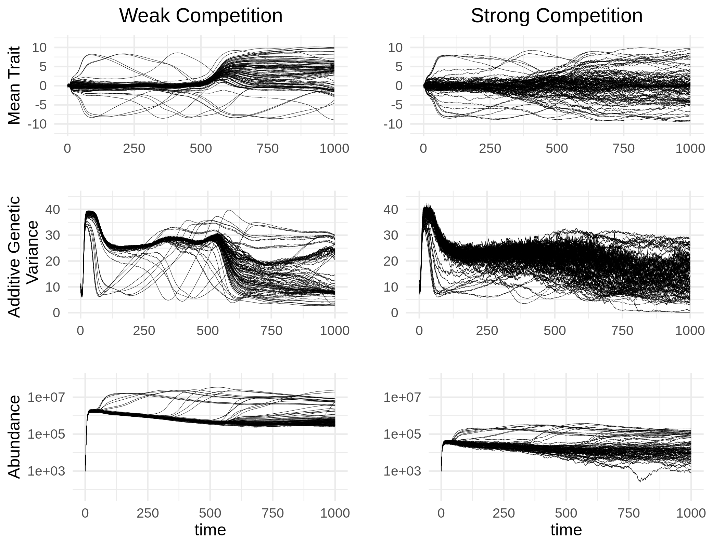
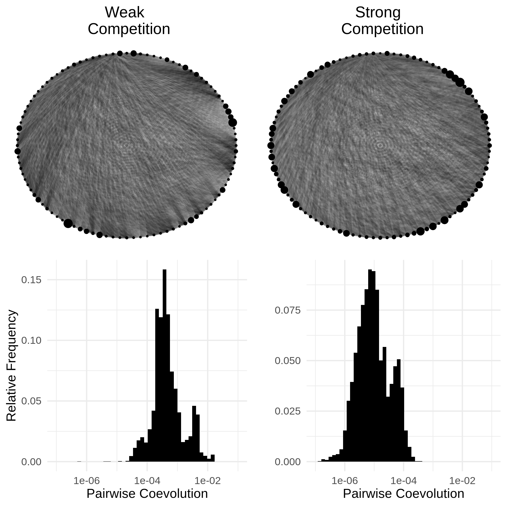
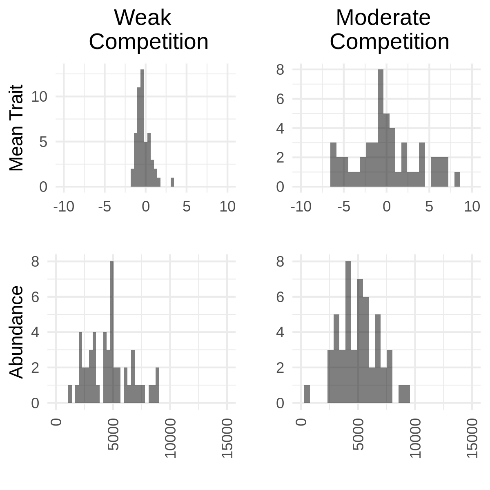
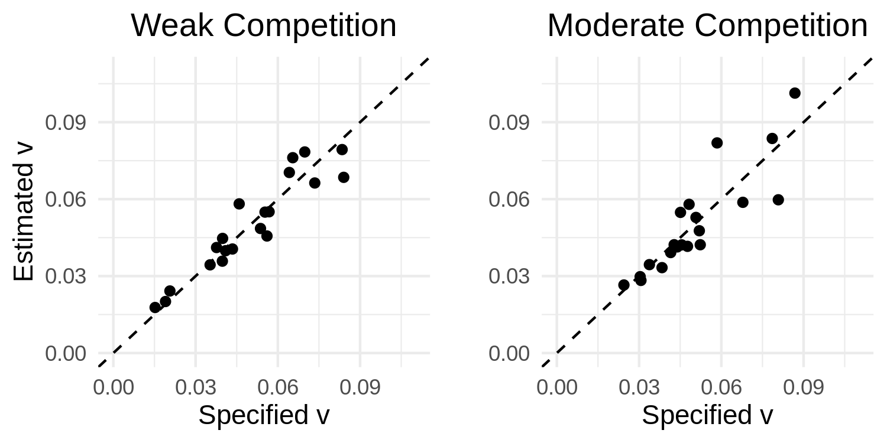

```{r global_options, include=FALSE}
knitr::opts_chunk$set(fig.pos = 'H')
```

# Introduction

A primary aim of theoretical evolutionary ecology is the development of mathematical approaches to describe the evolution of biological populations and their interactions with both the biotic and abiotic environments in which they are embedded. Given this consideration a natural scope for such an approach centers on quantifying the abundance dynamics of populations and the evolution of traits mediating their interactions as functions of relevant abiotic factors. Although taking into account abundance, phenotype and environment provides the basis for a partial understanding of the complex nature of biological communities, for a deeper understanding one must account for the effects of contemporary dispersal and the phylogeographic history of interacting lineages [@Kraft2007; @Hickerson2010; @Manceau2016; @markmcpeek2017] along with the genetic basis of ecologically relevant traits [@jeffreyconner2004; @FUSSMANN2007] and feedbacks between populations and the biogeochemical cycles they ultimately depend on [@michelloreau2010; @9781107648258]. It is therefore ideal that the development of any such mathematical approach anticipates extensions to account for these important factors shaping ecological communities, especially as empirical and conceptual work in these directions continues to grow [@AbdalaRoberts2014; @Klzsch2015; @Crutsinger2015; @Fitzpatrick2015; @Fitzpatrick2017; @Marx2017; @Rudman2017; @Skovmand2018; @VanNuland2019; @Harmon2019]. Furthermore, the approach should have a stochastic component to capture the chance nature of biological reality [@Lande2003; @DeMeester2018; @Mubayi2019] and serve as a basis for the construction of statistical methods that measure evolutionary and ecological processes occuring in the wild. Such methods will tether theory to reality and allow for rigorous tests of hypotheses on the structure and behavior of ecological communities. In this paper we take one small step in this direction by establishing a formal connection between the continuous-time dynamics of abundance and quantitative traits in stochastically evolving populations and introduce some statistical methods based on this connection.

Current theoretical approaches to synthesize evolution and ecology have capitalized on the fact that biological fitness plays a key role in determining both sets of dynamics. While correlation of fitness and genotype is the basis of evolution by natural selection, the mean fitness across all individuals in a population determines the growth, stasis or decline of abundance. In section \ref{deterministic} we review the mathematical formalization of this connection, which has been established in the contexts of population genetics [@9781932846126], evolutionary game theory [@9780674023383] and quantitative genetics [@Lion2018]. Although reviewing these accomplishments reveals a beautiful synthesis of evolution and population ecology, it also reveals a gap in theoretical approaches to incorporate the intrinsically random nature of populations. Specifically, in theoretical quantitative genetics the derivation of a populations' response to random genetic drift is derived in discrete time under the assumption of constant population (or effective population) size [@Lande1976]. Although this approach conveniently mimics the formalism provided by the Wright-Fisher model of population genetics, real population sizes fluctuate over time. Furthermore, since these fluctuations are themselves stochastic, it seems natural to derive expressions for the evolutionary response to demographic stochasticity and consider how the results relate to characterizations of random genetic drift. This can be done in continuous time for population genetic models without too much technical overhead, assuming a finite number of alleles. However, for populations with a continuum of types, such as a quantitative trait, this becomes a serious mathematical endeavor. Here we close this gap by applying some theory of stochastic partial differential equations (SPDE). Our goal is two-fold: 1) Communicate some useful results of SPDE to as wide of audience as possible. With this goal in mind we will not provide a rigorous treatment of SPDE. Instead, we introduce a set of heuristics that only require the basic concepts of Reimann integration, partial differentiation and some exposure to stochastic ordinary differential equations (SDE). For a concise introduction to SDE, we recommend the primer by Evans [-@9781470410544]. 2) Establish a novel synthetic approach to theoretical evolutionary ecology. To demonstrate that our approach can yield important statistical tools for the inference of evolutionary and ecological processes, we derive a model of coevolution in an ecological network and outline some methods of inference based on this model.

We begin in section \ref{deterministic} with a brief review of progress in modelling the deterministic dynamics of populations. Section \ref{wnc} then introduces a useful set of mathematical tools based on the calculus of white noise. In section \ref{stochastic} we outline how to employ these tools to derive a system of SDE modelling abundance dynamics and the evolution of the mean and variance of a quantitative trait. In section \ref{particular} we derive particular results under the assumption of a normally distributed trait. Section \ref{inheritance} extends the previous results under the condition of imperfect inheritance. Section \ref{coev} demonstrates the utility of our framework through a derivation of a model of coevolution across a guild of $S$ species competing along a common resource axis. We numerically compute distributions of traits and abundances along with interaction networks under the scenarios of weak and moderate competition. In section \ref{stats} we discuss an approach to develop statistical methods based on our framework for the inference of evolutionary and ecological processes using trait, abundance and network data. Finally, section \ref{conclusion} concludes with a few remarks on the limits of this approach along with future directions to incorporate more explicitly the genetic architecture of populations and feedbacks with ecosystem processes.

# The framework

At the core of our approach is a stochastic analog of the replicator equation with mutation in continuous time and phenotypic space [@Taylor1978; @Schuster1983]. From this stochastic replicator-mutator equation we derive a system of SDE for the dynamics of abundance, mean trait and additive genetic variance of a population. Hence, our approach develops a quantitative genetic theory of evolutionary ecology. A popular alternative to quantitative genetics is the theory of adaptive dynamics. As demonstrated by Page and Nowak [-@PAGE2002], the canonical equation of adaptive dynamics can be derived from the replicator-mutator equation. Thus, one could start from the atomic roots of our approach and pursue a stochastic adaptive dynamic theory instead. We choose the former in anticipation of an extension of our approach that explicitly models the genetic details of populations.

In this section we review the derivations of the replicator-mutator equation and trait dynamics from abundance dynamics and extend these formulae along with related results to the stochastic case. The results established in this section provide the framework from which larger scale ecological stuctures, such as species abundance distributions and interaction networks, can be derived.

## Deterministic dynamics \label{deterministic}

The connection between the deterministic dynamics of the abundance of a population and the frequencies of discrete phenotypes within it is well established via heterogeneity in the vital rates of differing phenotypes [ie, demographic heterogeneity, @Mubayi2019]. This is particularly evident in the derivation of the evolution of allele frequencies due to natural selection provided by Crow and Kimura [-@9781932846126, \S 5.3]. Specifically, denoting $N$ the abundance of the population, $m_i$ the growth rate [called the Malthusian parameter in @9781932846126] of allele $i$ and $p_i$ the frequency of this allele, we find (using their numbering scheme)

\begin{equation}
\dot N=N\sum_ip_im_i=\bar mN,\tag{5.3.3}
\end{equation}

\begin{equation}\label{popgen}
\dot p_i=(m_i-\bar m)p_i.\tag{5.3.5}
\end{equation}

Equation (\ref{popgen}) is known in the field of evolutionary game theory as the replicator equation [@9780674023383; @Lion2018]. Instead of being explicitly focused on alleles, the replicator equation describes the fluctuations of relative abundances of various _types_ in a population in terms of the vital rates of each type [@Taylor1978; @Schuster1983]. It is straight-forward to extend the replicator equation to include mutation, which is known as the replicator-mutator equation [@9780674023383]. To derive the replicator-mutator equation one can take the same steps to derive (\ref{popgen}) and inject a model of mutation via a matrix of transition rates [@9780674023383, eqn. 13.25]. Building on these insights, we derive an analog of the replicator-mutator equation for a continuum of types (that is, for a quantitative trait). In particular, for a continuously reproducing population at time $t$ with trait values $x\in\mathbb{R}$ and an abundance density $n(t,x)$, the demographic dynamics can be modelled by the general PDE

\begin{equation}\label{eq1}
\dot n(t,x)=F(n,x).
\end{equation}

More specifically, assuming selection is determined by the growth rate $m(n,x)$ (which we assume to be continuous in $n$ and smooth in $x$), mutation is captured by diffusion with coefficient $\frac{\mu}{2}$, and ignoring all other processes, we set

\begin{equation}
F(n,x)=m(n,x)n(t,x)+\frac{\mu}{2}\frac{\partial^2}{\partial x^2}n(t,x).
\end{equation}

In this case equation (\ref{eq1}) becomes a reaction-diffusion equation. As an example, logistic growth combined with stabilizing selection can be captured using the growth rate $m(n,x)=r-\frac{a}{2}(\theta-x)^2-n(t,x)$ where $r>0$ determines the carrying capacity and $a\geq0$ determines the strength of stabilizing selection around the phenotypic optimum $\theta\in\mathbb{R}$.

To derive a replicator-mutator equation from (\ref{eq1}), we employ the chain rule from elementary calculus. Defining $N(t)=\int_\mathbb{R}n(t,x)dx$ as the total abundance of the population and $p(t,x)=n(t,x)/N(t)$ as the relative density of trait $x$ at time $t$, we have

\begin{equation}
\dot N(t)=\frac{d}{dt}\int_\mathbb{R}n(t,x)dx=\int_\mathbb{R}\dot n(t,x)dx
\end{equation}

$$=\int_\mathbb{R}m(n,x)n(t,x)+\frac{\mu}{2}\frac{\partial^2}{\partial x^2}n(t,x)dx$$

$$=N(t)\int_\mathbb{R}m(n,x)p(t,x)+\frac{\mu}{2}\frac{\partial^2}{\partial x^2}p(t,x)dx=\bar m(t) N(t)$$

where, for $f:\mathbb{R}\to\mathbb{R}$, we define (when it exists) $\bar f(t)=\int_\mathbb{R}f(x)p(t,x)dx$. In particular $\bar m(t)$ is the mean fitness across all trait values in the population. Assuming $n(t,x)>0$  for all $(t,x)\in(0,\infty)\times\mathbb{R}$ (which, given $n(0,x)\geq0$ for all $x$ and $n(t,x)>0$ for some $x$, we expect due to the infinite-propagation property of diffusion [@lawrenceevans2010]), and assuming $\int_\mathbb{R}n(t,x)dx<\infty$ (which requires $m(n,x)$ to not grow too fast in either of its arguments), the result $\int_\mathbb{R}\frac{\partial^2}{\partial x^2}n(t,x)dx=0$ can be derived from the fundamental theorem of calculus. Biological intuition agrees with this result since mutation neither creates nor destroys individuals, but merely changes their type from their parental type. Taking the same appraoch, we derive the dynamics of $p(t,x)$ as

\begin{equation}
\dot p(t,x)=\frac{\partial}{\partial t}\frac{n(t,x)}{N(t)}=\frac{N(t)\dot n(t,x)-n(t,x)\dot N(t)}{N^2(t)}
\end{equation}

$$=\frac{1}{N(t)}\Big(m(n,x)n(t,x)+\frac{\mu}{2}\frac{\partial^2}{\partial x^2}n(t,x)-\bar m(t)n(t,x)\Big)$$

$$=(m(n,x)-\bar m(t)) p(t,x)+\frac{\mu}{2}\frac{\partial^2}{\partial x^2}p(t,x).$$

This result closely resembles Kimura's continuum-of-alleles model [@Kimura1965]. The primary difference being that our model utilizes diffusion instead of convolution with an arbitrary mutation kernel. Of course, our model can be derived as an approximation to Kimura's model, which has been referred to as the Gaussian allelic approximation [@9780471986539], the infinitesimal model [@Barton2017] and the Gaussian descendants approximation [@Turelli2017]. Alternatively, since diffusion is the continuous-time equivalent to convolution against a Gaussian kernel (SM \S\ref{diffconvequiv}), our model can also be seen as a special case of the continuum-of-alleles model. The dynamics of the mean trait $\bar x(t)$ are derived as

\begin{equation}\label{detmean}
\dot{\bar x}(t)=\frac{d}{dt}\int_\mathbb{R}x p(t,x)dx=\int_\mathbb{R}x\dot p(t,x)dx
\end{equation}

$$=\int_\mathbb{R}x\big(m(n,x)-\bar m(t)\big) p(t,x)+x\frac{\mu}{2}\frac{\partial^2}{\partial x^2} p(t,x)dx,$$

$$=\mathrm{Cov}_ p\Big(x,m(n,x)\Big)+\frac{\mu}{2}\int_\mathbb{R} x\frac{\partial^2}{\partial x^2} p(t,x)dx,$$

where, for $f,g:\mathbb{R}\to\mathbb{R}$, we define (when it exists)

\begin{equation}
\mathrm{Cov}_ p\Big(f(x),g(x)\Big)=\int_\mathbb{R}\big(f(x)-\bar f(t)\big)\big(g(x)-\bar g(t)\big)p(t,x)dx.
\end{equation}

Equation (\ref{detmean}) is a special case of the well known Robertson-Price equation [@Robertson1966; @PRICE1970; @FRANK2012; @Queller2017; @Lion2018]. Conveniently, when $p$ is Gaussian $\int_\mathbb{R}x\frac{\partial^2}{\partial x^2}p(t,x) dx=0$. Following this approach, in SM \S\ref{var_deriv} we derive the dynamics of the variance $\sigma^2(t)=\mathrm{Cov}_p(x,x)$ as

\begin{equation}\label{vardyn_det}
\dot{\sigma}^2(t)=\mathrm{Cov}_p\big((x-\bar x)^2,m\big)+\frac{\mu}{2}\int_\mathbb{R}(x-\bar x)^2\frac{\partial^2}{\partial x^2}p(t,x)dx.
\end{equation}

In the absence of mutation equation (\ref{vardyn_det}) agrees with the result derived by Lion [-@Lion2018] for discrete phenotypes. When $p$ is Gaussian the increase in variance due to mutation simplifies to $\mu$. 

In the following sections we extend these results to the case when PDE (1) is driven by a space-time white noise process $\dot\xi(t,x)$. We begin by defining space-time white noise and illustrating its relevant properties. We then introduce a set of heuristics for performing calculations with respect to $\dot\xi(t,x)$. Since our aim is to present this material to as wide of audience as possible, our approach deviates from standard definitions to remove the need for a detailed technical treatment. For those not interested in the white noise calculus and would rather jump straight into more biologically relevant results, we recommend skipping to \S\ref{particular}.

## White noise calculus \label{wnc}

### Definition and basic properties \label{wnc_intro}

We define $L^2_C$ to be the set of functions $f:[0,\infty)\times\mathbb{R}\to\mathbb R$ that are continuous in their first argument (time) and satisfy $\|f\|_2(t)=\sqrt{\int_\mathbb R f^2(t,x)dx}<\infty$. We define a generalized stochastic process $\Xi$ that maps functions $f\in L^2_C$ to real-valued stochastic processes. More specifically, for any $f,g\in L^2_C$, we define $\Xi_f$ and $\Xi_g$ as Gaussian processes satisfying, for any $t,t_1,t_2\geq0$,

\begin{equation}\label{exp_WN}
\mathbb{E}\big(\Xi_f(t)\big)=\mathbb{E}\big(\Xi_g(t)\big)=0,
\end{equation}

\begin{equation}\label{cov_WN}
\mathbb{C}\big(\Xi_f(t_1),\Xi_g(t_2)\big)=\int_0^{t_1\wedge t_2}\int_\mathbb{R} f(s,x)g(s,x)dxds,
\end{equation}

where $t_1\wedge t_2=\min(t_1,t_2)$ and $\mathbb{E},\mathbb{C}$ denote expectation and covariance with respect to the underlying probability space. These operators are to be distinguished from $\bar f$ and $\mathrm{Cov}_ p(f,g)$ which denote expectation and covariance with respect to phenotypic diversity. 

Since Gaussian processes are characterized by their expectations and covariances, the processes $\Xi_f$ and $\Xi_g$ are well defined (under the convention $f=g$ whenever $\|f-g\|_2(t)=0$ for each $t>0$). In particular, if $f\in L^2_C$ is independent of time, then $\Xi_f$ is a Brownian motion with variance $t\|f\|_2^2$. With the generalized process $\Xi$ defined, we define the space-time white noise $\dot\xi(t,x)$ implicitly via 

\begin{equation}
``\int_0^t\int_\mathbb{R}f(s,x)\dot\xi(s,x)dxds"=\Xi_f(t), \ \forall \ f\in L^2_C.
\end{equation}

We place quotations around the left-hand side of the above expression to emphasize its informal nature. Since space-time white noise, represented by the symbol $\dot\xi(t,x)$, does not exist as a function in the classical sense it cannot be integrated as suggested above. However, similar to the approach taken here, space-time white noise can be made sense of in a more abstract setting as a _measure_-valued process [@Dawson1975; @vladimirbogachev1998]. Hence, our use of integral notation is merely symbolic to provide intuition and should not be confused with classical Riemann integrals. One can think of $\dot\xi(t,x)$ as the static seen on old television sets or infinitely detailed random dust spread across both time and space. Figure \ref{wn} illustrates sample paths of white noise in one (left) and two (right) dimensions. 

```{r, include=F, eval=F}
require("ggplot2")
require("ggthemes")
require("plot3D")
require("gridExtra")

num1 = 1e4
num2 = 1e4

xi_1 = rnorm(num1)
xi_2 = rnorm(num2)

x1 = seq(0,1,length.out = num1)
x2 = seq(0,1,length.out = sqrt(num2))

M = expand.grid(x=x2,y=x2)
M$value = xi_2

df_1 = data.frame(xi=xi_1,x=x1)

wn1d = ggplot(df_1)+geom_point(aes(x=x,y=xi),size=0.05)+theme_bw()+xlab("Time")+ylab("Value")
wn2d = ggplot(M, aes(x, y, color = value))+scale_color_gradient(low="black", high="white")+geom_point(size=0.001, shape=22, show.legend = FALSE)+theme_bw()+xlab("Time")+ylab("Space")

wn = grid.arrange(wn1d,wn2d,nrow=1)

ggsave("~/Research/WNEE/wn.png",wn,width=5,height=2.5)
```

```{r, echo=F, fig.align='center', fig.cap='\\label{wn}Approximations of sample paths of temporal white noise (left) and space-time white noise (right) with brightness scaled to value.'}
knitr::include_graphics('wn.png')
```

Following our definition of white noise, when attempting to measure the value of this random field we sample it using $L^2_C$ functions. For example, integrating white noise over a region $[0,t]\times D$, with $t>0$ and $D$ a bounded subset of $\mathbb{R}$, is equivalent to evaluating $\Xi_{I_{[0,\infty)\times D}}(t)$ where

\begin{equation}
I_{[0,\infty)\times D}(t,x)=\left\{\begin{matrix}
0, & x\notin D \\
1, & x\in D
\end{matrix}\right..
\end{equation}

Since $\int_\mathbb{R}{I_{[0,\infty)\times D}}^2(t,x)dx=\int_Ddx=|D|$, where $|D|$ denotes the length of $D$, $I_{[0,\infty)\times D}\in L^2_C$. Thus, by equations (\ref{exp_WN}) and (\ref{cov_WN}), we have 

\begin{equation}
\mathbb{E}\left(\int_0^t\int_D\dot\xi(s,x)dxds\right)=0,
\end{equation}

\begin{equation}
\mathbb{V}\left(\int_0^t\int_D\dot\xi(s,x)dxds\right)=t|D|,
\end{equation}

where $\mathbb{V}$ denotes the variance operator with respect to the underlying probability space. Following this notation, equations (\ref{exp_WN}) and (\ref{cov_WN}) can be rewritten as

\begin{equation}\label{exp_WN_xi}
\mathbb{E}\left(\int_0^t\int_\mathbb{R}f(s,x)\dot\xi(s,x)dxds\right)=0,
\end{equation}

\begin{equation}\label{cov_WN_xi}
\mathbb{C}\left(\int_0^{t_1}\int_\mathbb{R}f(s,x)\dot\xi(s,x)dxds,\int_0^{t_2}\int_\mathbb{R}g(s,x)\dot\xi(s,x)dxds\right)
=\int_0^{t_1\wedge t_2}\int_\mathbb{R}f(s,x)g(s,x)dxds.
\end{equation}

We write $d\hat\Xi_f(t)=\frac{1}{\|f\|_2(t)}\left(\int_\mathbb{R}f(t,x)\dot\xi(t,x)dx\right)dt$ (and typically suppress the dependency on $t$) so that

\begin{equation}
\int_0^td\hat\Xi_f(s)=\int_0^t\int_\mathbb{R}\frac{f(s,x)}{\sqrt{\int_\mathbb{R}f^2(s,y)dy}}\dot\xi(s,x)dxds.
\end{equation}

It follows that $\mathbb{E}\big(\int_0^td\hat\Xi_f\big)=0$ and $\mathbb{C}\big(\int_0^{t_1}d\hat\Xi_f,\int_0^{t_2}d\hat\Xi_f\big)=t_1\wedge t_2$. This implies that, as a function of $t$, $\int_0^td\hat\Xi_f(s)$ is a standard Brownian motion for any $f\in L^2_C$. Hence, $d\hat\Xi_f$ is analogous to the traditional shorthand used to denote stochastic differentials. Thus, equation (\ref{cov_WN_xi}) effectively extends It&ocirc;'s multiplication table to:

\begin{table}[H]
\centering\caption{An extension of It\^o's multiplication table.}\vspace{0.2cm}
\begin{tabular}{l|lll}
             & $d\hat\Xi_f$                 & $d\hat\Xi_g$                 & $dt$ \\ \hline
             &                            &                            &      \\
$d\hat\Xi_f$ & $dt$                       & $\frac{\left(\int_\mathbb{R}f \ g \ dx\right)dt}{\|f\|_2\|g\|_2}$ & $0$  \\
             &                            &                            &      \\
$d\hat\Xi_g$ & $\frac{\left(\int_\mathbb{R}f \ g \ dx\right)dt}{\|f\|_2\|g\|_2}$ & $dt$                       & $0$  \\
             &                            &                            &      \\
$dt$         & $0$                        & $0$                        & $0$
\end{tabular}\label{mult}
\end{table}

### Interpretation of SPDE

Since $\dot\xi(t,x)$ is only well defined with respect to the generalized stochastic process $\Xi$, SPDE such as

\begin{equation}\label{SPDE}
\dot n(t,x)=m(n,x)n(t,x)+\frac{\mu}{2}\frac{\partial^2}{\partial x^2}n(t,x)+\sqrt{V(n,x)n(t,x)}\dot\xi(t,x)
\end{equation}

should be understood more precisely as a shorthand for defining the generalized stochastic process $n$. However, although $\Xi$ maps $L^2_C$ functions to real-valued processes, the generalized process $n$ maps bounded countinuous functions to real-valued processes [@zeng1998absolute]. For more on solutions of SPDE as generalized processes see Walsh [-@Walsh]  and Dawson [-@dawson1993measure]. When $m(n,x)$ and $V(n,x)$ are bounded across all $n$ and $x$, the generalized solution $n$ can be represented by a legitimate function, which we denote by $n(t,x)$, that is non-negative, continous in both $t$ and $x$ and integrable in $x$ for any $t>0$ [@zeng1998absolute]. More specifically, for any bounded continuous function $f$,

\begin{equation}\label{SOLUTION}
\int_\mathbb{R}\big(n(t,x)-n(0,x)\big)f(x)dx=\int_0^t\int_\mathbb{R}n(s,x)\left(m(n,x)f(x)+\frac{\mu}{2}\frac{\partial^2}{\partial x^2}f(x)\right)dxds
\end{equation}

\begin{equation*}
+\int_0^t\int_\mathbb{R}\sqrt{V(n,x)n(s,x)}f(x)\dot\xi(s,x)dxds.
\end{equation*}

In particular, setting $f(x)=1$ allows us to derive to total mass process, which we refer to as the 

This property of solutions turns out to be quite useful in our situation. In particular, setting $h(x)=1,x,$ or $x^2$ provides the first steps to derive a system of SDE to track the total abundance, mean trait or phenotypic variance respectively. We demonstate the utility of this definition in the next section.

## Stochastic dynamics of abundance, mean trait and phenotypic variance \label{stochastic}

We base our formulation on the SPDE (\ref{SPDE}). A special case of this SPDE with $m(n,x)\equiv0$ was suggested by Dawson [-@Dawson1975] to be satisfied by the diffusion limit of a branching Brownian motion, which itself was initially studied by Watanabe [-@Watanabe1968]. The solution $n$ is referred to as a Dawson-Watanabe superprocess [@alisonetheridge2000]. This connection was made rigorous for spatial dimension $d=1$ by Konna and Shiga [-@Konno1988] and Reimers [-@Reimers1989]. Furthermore, the Dawson-Watanabe superprocess is closely related to the $\Lambda$-Fleming-Viot process introduced by Bertoin and Le Gall [-@Bertoin2003] and used by Etheridge [-@Etheridge2008] to resolve some technical challenges in modelling isolation by distance [@Felsenstein1975; see also @Barton2013; and @Barton2019].

The branching Brownian motion process is, essentially, a birth-death process with spatial structure. It has three main components: spatial movement, branching rate and branching mechanism. Individuals are born at the current location of their mothers and then move around geographic space according to Brownian motion. Lifetimes of these individuals are typically assumed to be exponentially distributed. The branching mechanism describes the distribution of offspring left by the parent. For more information on branching Brownian motion and an introduction to superprocesses see Etheridge [-@alisonetheridge2000]. In our context we replace geographic space with phenotypic space where movement is reinterpreted as mutation. To make this intepretation more rigorous, we require the duration of movement to be non-random $1/N$ units of time so that mutation rates remain equal across individuals. We take $N\to\infty$ in the diffusion limit. In this case the only difference between life-histories of organisms is the number of offspring left. Selection can be imposed by allowing the mean number of offspring produced to vary with phenotype.

A more general version of the Dawson-Watanabe superprocess that includes interactions, which can represent, among other phenomena, density-dependent growth rates and frequency-dependent selection, was studied by Perkins [-@Perkins1992; -@edwinarendperkins1995]. When the interactions occur only at branching events, which in our case translates to independence of mutation and selection, the superprocess with interactions on one dimensional trait space corresponds to a generalization of SPDE (\ref{SPDE}) [@zeng1998absolute]. As noted above, equation (\ref{SPDE}) has been shown to admit function-valued solutions that are positive, integrable and continuous in time and space. Hence, SPDE (\ref{SPDE}) provides a very natural and mathematically convenient candidate to base our framework on.

### Derivation of SDE for $N$, $\bar x$ and $\sigma^2$

The dynamics of abundance (referred to in the superprocess literature as the total mass process) is obtained by defining the process $N(t)=\int_{\mathbb{R}}n(t,x)dx$ and evaluating expression (\ref{SOLUTION}) with $h(x)=1$ to obtain

\begin{equation}
N(t)-N(0)=\bar m(t)N(t)+\int_0^t\int_\mathbb{R}\sqrt{V(n,x)n(s,x)}\dot\xi(s,x)dxds.
\end{equation}

By equation (\ref{cov_WN_xi}) we have

\begin{equation}
\mathbb{V}\left(\int_0^t\int_\mathbb{R}\sqrt{V(n,x)n(s,x)}\dot\xi(s,x)dxds\right)=\int_0^t\int_\mathbb{R}V(n,x)n(s,x)dxds=\int_0^t\bar V(s)N(s)ds,
\end{equation}

where $\bar V(t)=\int_\mathbb{R}V(n,x)p(t,x)dx$. Following the notation introduced in \S\ref{wnc_intro}, we have

\begin{equation}
\int_0^td\hat\Xi_{\sqrt{Vn}}=\int_0^t\int_\mathbb{R}\frac{\sqrt{V(n,x)n(s,x)}}{\sqrt{\bar V(s)N(s)}}\dot\xi(s,x)dxds
\end{equation}

is, as a function of $t$, a standard Brownian motion. To clean up notation set $d\xi_1=d\hat\Xi_{\sqrt{Vn}}$. Then we can write the SDE for $N(t)$ as

\begin{equation}
dN=\bar mNdt+\sqrt{\bar VN}d\xi_1.
\end{equation}

Defining the process $p(t,x)=n(t,x)/N(t)$, in SM \S\ref{SDE_DERIV} we extend this approach to derive SDE for $\bar x(t)$ and $\sigma^2(t)$ which provides

\begin{equation}
d\bar x=\left(\mathrm{Cov}_ p(x,m)+\frac{\mu}{2}\int_\mathbb{R}x\frac{\partial^2}{\partial x^2}p(t,x)dx-\mathrm{Cov}_ p\Big(x,\frac{V}{N}\Big)\right)dt+\sqrt{\frac{\sigma^2\bar V+\mathrm{Cov}_p\left((x-\bar x)^2,V\right)}{N}}d\xi_2,
\end{equation}

\begin{equation}
d\sigma^2=\left(\mathrm{Cov}_ p\Big((x-\bar x)^2,m\Big)+\frac{\mu}{2}\int_\mathbb{R}(x-\bar x)^2\frac{\partial^2}{\partial x^2}p(t,x)dx-\frac{\sigma^2\bar V}{N}\right)dt
\end{equation}

\begin{equation}
+\sqrt\frac{\left(\mathrm{Cov}_p\big((x-\bar x)^4,V\big)+\overline{(x-\bar x)^4}\bar V-2\sigma^2\mathrm{Cov}_p\big((x-\bar x)^2,V\big)-\sigma^4\bar V\right)}{N}d\xi_3
\end{equation}

where $\xi_2$ and $\xi_3$ are standard Brownian motions and derivatives with respect to $x$ are taken in the weak sense [for more on weak derivatives see @lawrenceevans2010]. In SM \S\ref{SDE_DERIV} we show that in general $\xi_1$ is independent of both $\xi_2$ and $\xi_3$, but $\xi_2$ and $\xi_3$ covary. We simpify these results by assuming $\sqrt{V(n,x)}\equiv\nu>0$ so that

\begin{equation}\label{N}
dN=\bar mNdt+\nu\sqrt{N}d\xi_1,
\end{equation}

\begin{equation}\label{xbar_gen}
d\bar x=\mathrm{Cov}_ p(x,m)dt+\frac{\mu}{2}\int_\mathbb{R}x\frac{\partial^2}{\partial x^2}p(t,x)dx+\frac{\nu\sigma}{\sqrt N}d\xi_2,
\end{equation}

\begin{equation}\label{sig2_gen}
d\sigma^2=\left(\mathrm{Cov}_ p\Big((x-\bar x)^2,m\Big)+\frac{\mu}{2}\int_\mathbb{R}(x-\bar x)^2\frac{\partial^2}{\partial x^2}p(t,x)dx-\frac{\nu^2\sigma^2}{N}\right)dt+\nu\sqrt{\frac{\overline{(x-\bar x)^4}-\sigma^4}{N}}d\xi_3.
\end{equation}

The expressions derived can be used to investigate the dynamics of the mean and variance for general $n$. However, in the next section we further simplify these expressions by approximating $n$ with a Gaussian curve. In SM \S\ref{SDE_DERIV} we show that under the Gaussian case $\xi_1,\xi_2$ and $\xi_3$ are independent.

## Particular results assuming a Gaussian phenotypic distribution \label{particular}

Gaussian phenotypic distributions are often obtained through Gaussian, exponential or weak selection approximations together with a simplified model of inheritance and random mating [@pmid17248993; @Turelli1984; @Turelli1986; @Turelli2017; @9780471986539]. Alternatively, it has been shown that a Gaussian distribution can provide a reasonable approximation even when selection is strong and non-Gaussian [@pmid7851785]. However, our approach adds an additional layer of difficulty. Even with Gaussian selection, the resulting solution to SPDE (\ref{SPDE}) will only be Gaussian in expectation, assuming a Gaussian initial condition. Yet this difficulty is not as challenging as it may first appear. Indeed, since SPDE (\ref{SPDE}) can be derived as a diffusion limit we know that, under the appropriate assumptions on selection, genetic architecture and reproduction, the stochastic departure from a Gaussian curve is negligible when the ratio $\nu^2/N$ is small (ie, when the variance in reproductive output is much smaller than the population size). Mathematically, this requirement restricts model parameters to regions that maintain large population sizes. Biologically, this implies populations are not at risk of extinction. Hence, models developed in this framework are not suitable for studying colonization-extinction dynamics or evolutionary rescue. Allowing for these restrictions, we may safely assume that $n$ is approximately Gaussian and justify writing

\begin{equation}
n(t,x)=\frac{N(t)}{\sqrt{2\pi\sigma^2(t)}}\exp\left(-\frac{\big(x-\bar x(t)\big)^2}{2\sigma^2(t)}\right).
\end{equation}

Under this assumption we find (suppressing the dependency on $t$)

\begin{equation}
\mathrm{Cov}_ p(x,m)=\sigma^2\left(\frac{\partial\bar m}{\partial\bar x}-\overline{\frac{\partial m}{\partial\bar x}}\right),
\end{equation}

\begin{equation}
\mathrm{Cov}_ p\Big((x-\bar x)^2,m\Big)=2\sigma^4\left(\frac{\partial\bar m}{\partial\sigma^2}-\overline{\frac{\partial m}{\partial\sigma^2}}\right)
\end{equation}

and $\overline{(x-\bar x)^4}=3\sigma^4$. In particular, this implies

\begin{equation}\label{xbar}
d\bar x=\sigma^2\left(\frac{\partial\bar m}{\partial\bar x}-\overline{\frac{\partial m}{\partial\bar x}}\right)dt+\frac{\nu\sigma}{\sqrt N}d\xi_2,
\end{equation}

\begin{equation}\label{G}
d\sigma^2=2\sigma^4\left(\frac{\partial\bar m}{\partial\sigma^2}-\overline{\frac{\partial m}{\partial\sigma^2}}\right)dt +\left(\mu-\frac{\nu^2\sigma^2}{N}\right)dt +\nu\sigma^2\sqrt{\frac{2}{N}}d\xi_3.
\end{equation}

## The evolution of additive genetic variance \label{inheritance}

To model imperfect heritability we consider the relationship between the expressed phenotype $x$ and its genetic component $g\in\mathbb{R}$ known as the _breeding value_ [@michaellynch1998]. For any given individual with breeding value $g$, we assume the expressed phenotype is normally distributed around $g$ with variance $\eta$. We denote the density of this distribution by $\psi$ so that

\begin{equation}
\psi(x|g)=\frac{1}{\sqrt{2\pi\eta}}\exp\left(-\frac{(x-g)^2}{2\eta}\right).
\end{equation}

In terms of classical quantitative genetics $\eta$ is the _variance of environmental deviation_ and $\psi$ plays a similar role as the _segregation kernel_ [@michaellynch1998;@jonathanroughgarden1979]. To include this relationship in our framework, we write $\gamma(t,g)$ as the abundance density of breeding values at time $t$. In an actual population with a finite number of individuals $\gamma(t,g)$ can be written as a sum of point masses. In particular, denoting $\delta$ the Dirac distribution having unit mass centered at zero, for a population with breeding values $g_1,\dots,g_{N(t)}$ at time $t$ we have

\begin{equation}
\gamma(t,g)=\sum_{i=1}^{N(t)}\delta(g-g_i).
\end{equation}

Denoting by $X_i$ the normally distributed expressed phenotype for individual $i$, $n(t,x)$ can be written as

\begin{equation}
n(t,x)=\sum_{i=1}^{N(t)}\delta(x-X_i).
\end{equation}

The random variables $X_1-g_1,\dots,X_{N(t)}-g_{N(t)}$ are identically and independently distributed with mean zero and variance $\eta$. Hence, as $N(t)\to\infty$

\begin{equation}
n(t,x)\to\sum_{i=1}^{N(t)}\int_\mathbb{R}\delta(g-g_i)\psi(x|g)dg=\sum_{i=1}^{N(t)}\frac{1}{\sqrt{2\pi\eta}}\exp\left(-\frac{(x-g_i)^2}{2\eta}\right)
\end{equation}

$$
=\int_\mathbb{R}\gamma(t,g)\frac{1}{\sqrt{2\pi\eta}}\exp\left(-\frac{(x-g)^2}{2\eta}\right)dg.
$$

Note that when $\gamma$ converges to a Gaussian distribution in the diffusion limit its mode coincides with $\bar x$ and, denoting $G$ the variance of breeding values (ie, the additive genetic variance), $\sigma^2=G+\eta$. Hence, narrow sense heritability can be computed as $h^2=G/(G+\eta)$. Using the assumed relationship between expressed phenotypes and breeding values, we can compute the net Malthusian fitness of a breeding value $g$ via

\begin{equation}
m^*(\gamma,g)=\int_\mathbb{R}m(n,x)\frac{1}{\sqrt{2\pi\eta}}\exp\left(-\frac{(x-g)^2}{2\eta}\right)dg.
\end{equation}

This is similar to the approach taken by Kimura and Crow [-@Kimura1978] to calculate the overall effects of selection for expressed characters onto the changes in the distribution of alleles encoding those characters. With $m^*$ defined, the evolution of $\gamma$ is then captured by

\begin{equation}
\dot\gamma(t,g)=m^*(\gamma,g)\gamma(t,g)+\frac{\mu}{2}\frac{\partial^2}{\partial g^2}\gamma(t,g)+\nu\sqrt{\gamma(t,g)}\dot\xi(t,g).
\end{equation}

Futhermore, since 

\begin{equation}
\bar m(t)= \int_\mathbb{R}m(n,x) p(t,x)dx
\end{equation}

$$=\int_\mathbb{R}\int_\mathbb{R}m^*(\gamma,g) p(t,x)\frac{1}{\sqrt{2\pi\eta}}\exp\left(-\frac{(x-g)^2}{2\eta}\right)dgdx$$

$$=\frac{1}{N(t)}\int_\mathbb{R}m^*(\gamma,g)\gamma(t,g)dg = \bar m^*(t),$$

equations (\ref{xbar}) and (\ref{G}) become

\begin{equation}\label{xbarfinal}
\dot{\bar x}=G\left(\frac{\partial\bar m}{\partial\bar x}-\overline{\frac{\partial m}{\partial\bar x}}\right)+\nu\sqrt{\frac{G}{N}}\dot\xi_2,
\end{equation}

\begin{equation}\label{Gfinal}
\dot G=2G^2\left(\frac{\partial\bar m}{\partial G}-\overline{\frac{\partial m}{\partial G}}\right)+\mu-\frac{\nu^2G}{N}+\nu G\sqrt{\frac{2}{N}}\dot\xi_3.
\end{equation}

# A model of diffuse coevolution \label{coev}

## Formulation

In this section we demonstrate the use of our framework by formulating a model of diffuse coevolution across a guild of $S$ species whose interactions are mediated by resource competition along a single niche axis. Our approach mirrors closely the theory developed by MacArthur and Levins [-@Macarthur1967], Levins [-@9780691080628] and MacArthur [-@Arthur1969; -@MacArthur1970; -@9780691023823]. The most significant difference, aside from allowing evolution to occur, is the treatment of resource quality, which we replace with a model of abiotic stabilizing selection. A derivation is provided in SM \S\ref{diffuse}.

For species $i$ we inherit the above notation for trait value, distribution, average, variance, abundance, etc except with an $i$ in the subscript. Real world examples of niche axes include the body size of prey for lizard predators and the date of activity in a season for pollinators competing for floral resources. For mathematical convenience, we model the axis of resources by the real line $\mathbb{R}$. The value of a resouce along this axis is denoted by the symbol $\zeta$. For an individual in species $i$, we assume the resource utilization curve $u_i$ can be written as

\begin{equation}
u_i(\zeta,x_i)=\frac{U_i}{\sqrt{2\pi w_i}}\exp\left(-\frac{(x_i-\zeta)^2}{2w_i}\right).
\end{equation}

We further assume the niche center $x_i$ is normally distributed among individuals in species $i$, but the niche breadth $w_i$ and total niche utilization $U_i$ are constant across individuals in species $i$ and therefore cannot evolve. Suppose $\theta_i\in\mathbb R$ is the optimal location along the niche axis for species $i$ such that, in the absence of competition, individuals leave on average $W_i$ offspring when concentrated at $\theta_i$. We capture the rate by which the fitness falls as niche location $\zeta$ leaves the optimum $\theta_i$ by the parameter $A_i\geq0$. Hence, abiotic stabilizing selection along the resource axis can be modelled by the curve

\begin{equation}
e_i(\zeta)=W_i\exp\left(-\frac{A_i}{2}(\theta_i-\zeta)^2\right).
\end{equation}

The effect of abiotic stabilizing selection on the fitness for an individual of species $i$ with niche location $x_i$ is then given by

\begin{equation}
\int_\mathbb{R}e_i(\zeta)u_i(\zeta,x_i)d\zeta=\frac{W_iU_i}{\sqrt{A_iw_i+1}}\exp\left(-\frac{A_i}{2(A_iw_i+1)}(\theta_i-x_i)^2\right).
\end{equation}

To determine the potential for competition between individuals with niche locations $x_i$ and $x_j$, belonging to species $i$ and $j$ respectively, we compute the niche overlap

\begin{equation}
\mathcal O_{ij}(x_i,x_j)=\int_\mathbb{R}u_i(\zeta,x_i)u_j(\zeta,x_j)d\zeta=\frac{U_iU_j}{\sqrt{2\pi(w_i+w_j)}}\exp\left(-\frac{(x_i-x_j)^2}{2(w_i+w_j)}\right).
\end{equation}

Relating our treatment of the niche to classic competition theory [@michelloreau2010], the competition coefficient $\alpha_{ij}$ becomes a dynamical quantity that can be written as

\begin{equation}
\alpha_{ij}(t)=\frac{\int_{\mathbb R}\int_{\mathbb R}p_i(t,x_i)p_j(t,x_j)\mathcal O_{ij}(x_i,x_j) dx_idx_j}{\int_{\mathbb R}\int_{\mathbb R}p_i(t,x_i)p_i(t,x_i')\mathcal O_{ii}(x_i,x_i') dx_idx_i'}
\end{equation}

$$=\frac{U_j}{U_i}\sqrt{\frac{2(w_i+{\sigma_i}^2(t))}{w_i+w_j+{\sigma_i}^2(t)+{\sigma_j}^2(t)}}\exp\left(-\frac{(\bar x_i(t)-\bar x_j(t))^2}{2(w_i+w_j+{\sigma_i}^2(t)+{\sigma_j}^2(t))}\right).$$

In SM \S\ref{diffuse} we combine this niche model with equations (\ref{N}), (\ref{xbarfinal}) and (\ref{Gfinal}) to find

\begin{subequations}\label{comm_dynamics}
\begin{align}
\dot N_i = & \left\{r_i-\frac{a_i}{2}\Big((\bar x_i-\theta_i)^2+G_i+\eta_iN_i\Big) + c_i\left(\sqrt{\frac{b_{ii}}{2\pi}}-\sum_{j=1}^SN_j\sqrt{\frac{b_{ij}}{2\pi}}e^{-\frac{b_{ij}}{2}(\bar x_i-\bar x_j)^2}\right)\right\}N_i+\nu_i\sqrt{N_i}\dot\xi_1, \\
\dot{\bar x}_i = & \ a_iG_i(\theta_i-\bar x_i)-c_iG_i\left(\sum_{j=1}^SN_jb_{ij}(\bar x_j-\bar x_i)\sqrt{\frac{b_{ij}}{2\pi}}e^{-\frac{b_{ij}}{2}(\bar x_i-\bar x_j)^2}\right)+\nu_i\sqrt{\frac{G_i}{N_i}}\dot\xi_2, \\
\dot G_i = & \ \mu_i-a_i{G_i}^2+c_i{G_i}^2\left(\sum_{j=1}^SN_jb_{ij}\left(1-b_{ij}(\bar x_i-\bar x_j)^2\right)\sqrt{\frac{b_{ij}}{2\pi}}e^{-\frac{b_{ij}}{2}(\bar x_i-\bar x_j)^2}\right)-\frac{\nu_i^2G_i}{N_i}+\nu_iG_i\sqrt{\frac{2}{N_i}}\dot\xi_3,
\end{align}
\end{subequations}

where

\begin{subequations}
\begin{align}
r_i = & \ \ln \left(\frac{W_iU_i}{\sqrt{1+A_iw_i}}\right), \\
a_i = & \ \frac{A_i}{1+A_iw_i}, \\
b_{ij}(t) = b_{ji}(t) = & \ \frac{1}{w_i+w_j+\sigma_i^2(t)+\sigma_j^2(t)}, \\
c_i \geq & \ 0.
\end{align}
\end{subequations}

### The Strength of Pairwise Coevolution

In Week and Nuismer [-@Week2019], the strength of pairwise coevolution was defined in terms of the offset-matching model, given by the difference equation

\begin{equation}
\begin{matrix}
\Delta\bar x_1(t) = G_1A_1(\theta_1-\bar x_1(t))+G_1B_1(\bar x_2(t) +\delta_1-\bar x_1(t)) + \frac{G_1}{N_1}\xi_1(t) \\
\Delta\bar x_2(t) = G_2A_2(\theta_2-\bar x_2(t))+G_2B_2(\bar x_1(t) +\delta_2-\bar x_2(t)) + \frac{G_2}{N_2}\xi_2(t)
\end{matrix}
\end{equation}

where $t=0,1,2,\dots$, $A_i$ denotes the strength of abiotic selection, $\theta_i$ is the abiotic phenotypic optimum, $B_i$ is the strength of biotic selection, $\delta_i$ is the optimal offset and $\xi_i$ is a sequence of independent unit normal random variables for species $i$. With respect to the offset-matching model, the strength of pairwise coevolution was defined as $\sqrt{B_iB_j}$. Motivated by this definition, we define the strength of pairwise coevolution between species $i$ and $j$ with respect to our model of diffuse coevolution by

\begin{equation}
\mathfrak{C}_{ij}=\sqrt{\frac{c_ic_jG_iG_jN_iN_jb_{ij}b_{ji}\sqrt{b_{ij}b_{ji}}}{2\pi}}\exp\left(-\frac{b_{ij}+b_{ji}}{4}(\bar x_j-\bar x_i)^2\right)
\end{equation}

$$=b_{ij}\sqrt{\frac{c_ic_jG_iG_jN_iN_jb_{ij}}{2\pi}}\exp\left(-\frac{b_{ij}}{2}(\bar x_j-\bar x_i)^2\right).$$

This fundamentally differs from the definition given in Week and Nuismer [-@Week2019] by including the additive genetic variance of both species, which both must be positive numbers for coevolution to occur.

## Community dynamics

For the sake of illustration we numerically integrated system (\ref{comm_dynamics}) for a richness of $S=50$ species under two scenarios. For the first scenario of weak competition we randomly chose $c_i\approx$\texttt{0.0} for each $i=1,\dots,S$ and for the second scenario of moderately strong competition we randomly chose $c_i\ll$\texttt{1.0} for each $i=1,\dots,S$. Background parameters are drawn independently for each species from a common distribution. Specifically, we set model parameters according to Table \ref{par_vals}.

\begin{table}[H]
\centering\caption{Distributions of model parameters under the scenarios of weak and moderate competition. The index $i$ runs through all $1,\dots, S$ species.}\vspace{0.2cm}
\begin{tabular}{l|l|l}
Parameter   & Weak Competition             & Moderate Competition     \\ \hline
$r_i$       & $\mathrm{Unif}(\mathtt{0.0},\ \mathtt{1.0})$   & \text{same}        \\
$\theta_i$  & $\mathrm{Unif}(\mathtt{-1.0},\ \mathtt{1.0})$  & \text{same}        \\
$a_i$       & $\mathrm{Exp}(\mathtt{0.01})$         & \text{same}        \\
$c_i$       & $\mathrm{Exp}(\mathtt{0.01})$         & $\mathrm{Exp}(\mathtt{0.1})$ \\
$w_i$       & $\mathrm{Unif}(\mathtt{0.01},\ \mathtt{1.0})$  & \text{same}        \\
$U_i$       & $\mathrm{Unif}(\mathtt{0.01},\ \mathtt{1.0})$  & \text{same}        \\
$\eta_i$    & $\mathrm{Unif}(\mathtt{1.0e-5}, \ \mathtt{1.0e-3})$         & \text{same}        \\
$\mu_i$     & $\mathrm{Exp}(\mathtt{0.01})$         & \text{same}        \\
$\nu_i$     & $\mathrm{Exp}(\mathtt{0.01})$         & \text{same}
\end{tabular}\label{par_vals}
\end{table}

With these two sets of model parameters, we simulated our model for \texttt{1.0e3} units of time. Whether or not the units of time reflect years, months or even hours depends on the life cycles of the species involved. For both scenarios, we initialized the abundances to $N_i=$\texttt{5.0e3}, trait means to $\bar x_i=$\texttt{0.0} and heritability to $h^2_i=$\texttt{0.5} for each $i=1,\dots,S$. Temporal dynamics for each scenario are provided in Figure \ref{temporal}. Interaction networks and the distribution of coevolution at $t=$\texttt{1e3} for each scenario are displayed in Figure \ref{net}.

```{r, message=FALSE, echo=F, fig.align='center', fig.cap='\\label{temporal}Temporal dynamics of mean trait (top), heritability (middle) and abundance (bottom) for the scenario of weak competition (left) and strong competition (right). Red lines indicate average trend across species.'}

```

```{r, echo=F, fig.align='center', fig.cap='\\label{net}Networks of interspecific interactions (top row) and distributions of pairwise coevolution (bottom row) under the scenarios of weak competition (left) and moderate competition (right) at time $t=$\\texttt{1.0e3}. Node sizes are proportional to population sizes. Edge widths and shade are monotonically increasing functions of pairwise coevolution.'}

```

# Tying theory to data \label{stats}

The focus of this paper thusfar has been centered on the introduction of white noise calculus and its use in deriving stochastic models of evolutionary ecology. However, this stochasticity is meant to reflect the intrinsically random nature of populations and does not account for the additional layer of sampling effects that blur empirical observations. In this section we introduce a simple model that mimics the sampling of ecological communities conducted by field ecologists. This sampling model provides the crucial mapping that connects theoretical results to real world data and hence is key to the creation of statistical methods. For the sake of clarity, we develop this model with respect to our model of diffuse coevolution. We show that the cross-sectional data of trait distributions, abundance distributions and interaction networks provide only partial information for directly inferring model parameters from equations relating these data. The remaining parameters must be inferred indirectly by numerically integrating the model. We therefore split this section into two subsections. The first covers parameters that can be inferred directly from cross-sectional data, which happen to be niche breadth and relative niche use. The second outlines a numerical approach to approximating the posterior distribution of the remaining model parameters.

## Inference of niche parameters

We treat estimates of trait distributions, abundances, and interaction counts independently. To model the collection of abundance data in the field, we assume individuals are sampled at random from the entire community so that a randomly drawn individual will belong to species $i$ with probability $s_i=N_i/\sum_jN_j$. Traits are assumed to be drawn independently. For each species $i$, a sample of size $K_i$ is drawn from a normal distribution with mean $\bar x_i$ and variance ${\sigma_i}^2=G_i+\eta_i$. Examples of trait and abundance distributions sampled at $t=$\texttt{1.0e3} from the community depicted in Figure \ref{temporal} are presented in Figure \ref{smpl_dists}.

```{r, echo=F, fig.align='center', fig.cap='\\label{smpl_dists}Histograms of mean trait (top row) and abundance distributions (bottom row) drawn from the communities in Figure \\ref{temporal} at time $t=$\\texttt{1.0e3} under weak competition (left column) and moderate competition (right column) for a sample size of \\texttt{1e3}.'}

```


We assume the rate of interactions between species $i$ and $j$ is given by their total niche overlap 

\begin{equation}
R_{ij}=\int_\mathbb{R}\int_\mathbb{R}\mathcal{O}_{ij}(x_i,x_j)n_i(x_i)n_j(x_j)dx_idx_j=N_iN_jU_iU_j\sqrt{\frac{b_{ij}}{2\pi}}\exp\left(-\frac{b_{ij}}{2}(\bar x_i-\bar x_j)^2\right).
\end{equation}

Ignoring intraspecific interactions, the relative rate of interaction between species $i$ and $j$ is defined as

\begin{equation}
\rho_{ij}=\frac{R_{ij}}{\sum_{k=1}^S\sum_{l>k}R_{kl}}.
\end{equation}

We assume $\rho_{ij}$ is also the probability that, given an interaction is observed, the species involved are $i$ and $j$. Hence, observed interactions are modelled as being drawn independently from the same distribution defined by $\rho$. In turn, a randomly drawn sample of interactions provides estimates of the relative rates of interactions $\hat\rho_{ij}$. 

<!-- 

Examples of empirical networks predicted by our model are displayed in Figure \ref{sample_net}.

```{r, echo=F, fig.align='center', fig.cap='\\label{sample_net}Sample networks of interspecific interactions drawn from the networks found in Figure \\ref{net} for a sample size of \\texttt{1e3}.'}
knitr::include_graphics('sample_networks.png')
```

-->

With the estimates $\hat\rho_{ij}$, $\hat s_i$, $\hat{\bar x}_i$ and ${\hat\sigma_i}^2$, we can directly calculate estimates for the niche breadth $w_i$ and the relative niche use $v_i=U_i/\sum_lU_l$ for each species $i$ under consideration. In particular, we define the function

\begin{equation}\label{rho_est}
\tilde\rho_{ij}(w_1,\dots,w_S,v_1,\dots,v_S)=\frac{\tilde{R}_{ij}}{\sum_{k=1}^S\sum_{l>k}\tilde{R}_{kl}},
\end{equation}

where

\begin{equation}
\tilde{R}_{ij}=\hat s_i\hat s_jv_iv_j\sqrt{\frac{\hat b_{ij}}{2\pi}}\exp\left(-\frac{\hat b_{ij}}{2}(\hat {\bar x}_j-\hat {\bar x}_i)^2\right),
\end{equation}

\begin{equation}
\hat b_{ij}=\hat b_{ji}=\frac{1}{w_i+w_j+{\hat \sigma_i}^2+{\hat \sigma_j}^2}.
\end{equation}

Note that the absolute total niche use $U_i$ cannot be inferred from interactions rates since the sum $\Omega=\sum_iU_i$ disappears from the quotient defining $\rho_{ij}$. However, the parameter $\Omega$ scales the amount of niche overlap between species which then dictates the strength of biotic selection. Hence, $\Omega$ will need to be inferred later when we develop an approach to inferring remaining model parameters.

The estimates $\hat w_i$ and $\hat v_i$ can then be found by minimizing the Kullback-Liebler divergence from $\hat\rho$ to $\tilde\rho$, given by

\begin{equation}
\mathcal{D}_{\mathrm{KL}}(\hat\rho\|\tilde\rho)=\sum_{i=1}^S\sum_{j>i}\hat\rho_{ij}\ln\left(\frac{\hat\rho_{ij}}{\tilde\rho_{ij}}\right),
\end{equation}

across all $w_1,\dots,w_S,v_1,\dots,v_S>0$ with $\sum_iv_i=1$. Since $\tilde\rho_{ij}>0$ for all $w_1,\dots,w_S,v_1,\dots,v_S>0$ with $\sum_iv_i=1$ and $i,j=1,\dots,S$, $i\neq j$, the quantity $\mathcal{D}_{\mathrm{KL}}(\hat\rho\|\tilde\rho)$ is well-defined under the convention $0\ln(0)=0$. However, since we may observe $\hat\rho_{ij}=0$ for some $i,j$, the quantity $\mathcal{D}_{\mathrm{KL}}(\tilde\rho\|\hat\rho)$ is not well-defined and thus we exclude it from our objective function.

<!--

either a metric, such as an $l^p$ metric defined by

\begin{equation}
\|\hat\rho-\tilde\rho\|_p=\left(\sum_{i=1}^S\sum_{j>i}|\hat\rho_{ij}-\tilde\rho_{ij}|^p\right)^{1/p}
\end{equation}

with $p\geq1$, or other measures such as 

-->

From a purely algebraic perspective, we note that inference of the $w_i$ and $v_i$ using the general approach outlined above constrains the minimal number of species included in the community. In particular, with $S$ species, the above method attempts to infer $2S$ parameters from $S(S-1)/2$ relationships (which is just the number of interspecific interactions possible between $S$ species) given by minimizing <!-- either $\|\hat\rho-\tilde\rho\|_p$ or --> $\mathcal{D}_{KL}(\hat\rho\|\tilde\rho)$. Hence, for inferring all the $w_i$ and $v_i$, we require $S\geq5$. However, by assuming ${\sigma_i}^2\gg w_i$ so that ${\sigma_i}^2+w_i\approx{\sigma_i}^2$, we can form the approximation

\begin{equation}
b_{ij}\approx\frac{1}{{\sigma_i}^2+{\sigma_j}^2}
\end{equation}

to relax the constraint on species richness to $S\geq3$. Biologically, this assumes that individuals are far more specialized in their niche-use than the species they belong to. For example, conspecifics may focus solely on prey body sizes within very narrow ranges that have little overlap as a result of intraspecific competition. While certainly not the rule, support for this assumption has been produced from previous studies [@Bolnick2003 and references therein].

Mathematically, this approximation reduces the number of parameters inferred to $S$ and thereby provides an enormous simplification by halving the dimension of the inference problem. Given the ubiquitous curse of dimensionality among statistical methods and their numerical implementations [@Wainwright2019; @Vershynin2018; @1701.02434], any opportunity to reduce the dimensionality of a problem without making a fatal sacrifice to its empirical relevance is worth taking, at least as a first step. Furthermore, by omitting the $w_i$'s one can transform the system defined by equation (\ref{rho_est}) into a linear system with respect to the $v_i$'s. Because of these benefits, for the remainder of this paper, we adopt the assumption ${\sigma_i}^2\gg w_i$.

### Implementation

As a proof of concept, we implemented this approach in the programming language _Julia_ [Version 1.3.0, @bezanson2017julia]. Code for this solution is available at \texttt{\url{https://github.com/bobweek/WNEE}}. Setting $S=20$, we integrated the model for $\tau=$\texttt{1e6} units of time to compute the simulated interaction distribution $\rho$. We drew \texttt{1e4} interactions at random weighted by $\rho$ to calculate $\hat\rho$, \texttt{100} traits for each species from normal distributions defined by $\bar x_i$ and ${\sigma_i}^2$ to calculate $\hat{\bar x}_i$ and ${\hat\sigma_i}^2$, and \texttt{1e3} individuals from across the community, weighted by $s$, to estimate the relative abundances $\hat s$. Scatter plots of estimated relative niche-use parameters against specified parameters for the two scenarios of weak and moderate competition are shown in Figure \ref{sctr}.

```{r, include=F, eval=F}
require("ggplot2")
require("gridExtra")
ecol_reg1 = read.csv("/home/bob/Research/WNEE/ecol_reg1.csv")
ecol_reg2 = read.csv("/home/bob/Research/WNEE/ecol_reg2.csv")
ecol_plt1 = ggplot(ecol_reg1)+geom_point(aes(x=actual,y=inferred))+xlim(0,.11)+ylim(0,.11)+
  geom_abline(intercept=0,slope=1,linetype="dashed")+theme_minimal()+xlab("Specified v")+ylab("Estimated v")+
  ggtitle("Weak Competition")+theme(plot.title = element_text(hjust = 0.5))
ecol_plt2 = ggplot(ecol_reg2)+geom_point(aes(x=actual,y=inferred))+xlim(0,.11)+ylim(0,.11)+
  geom_abline(intercept=0,slope=1,linetype="dashed")+theme_minimal()+xlab("Specified v")+ylab("")+
  ggtitle("Moderate Competition")+theme(plot.title = element_text(hjust = 0.5))
ecol_plt = grid.arrange(ecol_plt1,ecol_plt2,nrow=1)
ggsave("~/Research/White Noise/ecol_plt.png",ecol_plt,width=5,height=2.5)
```

```{r, echo=F, fig.align='center', fig.cap='\\label{sctr} Two examples of inferring species specific relative niche use parameters. Dashed lines with zero-intercept and unit-slope are provided for reference.'}

```


The results found in Figure \ref{sctr} demonstrate that our method can accurately infer species specific niche-use parameters. However, although this method provides important information about ecological parameters, it is insufficient to measure the distribution of coevolution. In the following section we outline a numerical method to calculate the likelihood of our model and a Markov Chain Monte Carlo (MCMC) based on this method to estimate posterior distributions of the remaining model parameters. Remaining parameters include absolute niche use scaling $\Omega$, intrinsic rates of growth $r_i$, phenotypic optima $\theta_i$, strengths of abiotic selection $a_i$, strengths of competition $c_i$, segregation variances $\eta_i$, mutation rates $\mu_i$ and magnitudes of demographic stochasticity $\nu_i$ for $i=1,\dots,S$.

## Inference of remaining parameters

The direct inference of niche use for each species depends on the explicit relationships between these parameter values and the collected data predicted by our model. However, assuming the community has reached approximate statistical equilibrium with respect to our model, we demonstrate that remaining model parameters can be inferred from the distributions of mean traits, trait variances and relative abundances. In principle one could derive the equilibrium distribution of system (\ref{comm_dynamics}) as the likelihood of the remaining model parameters given the data in order to harness the latent statistical power of our model. However, given the non-linearity and high dimensionality of system (\ref{comm_dynamics}) even for modestly sized communities, deriving an analytical expression for the likelihood surface is at best difficult, but likely impossiple. Instead, we take an alternative approach to approximate this likelihood surface. This approach makes use of the property that the temporal fluctuations of system (\ref{comm_dynamics}) will converge in distribution to the equilibrium distribution across states. Viewing the equilibrium distribution of (\ref{comm_dynamics}) as a function of model parameters conditioned on the state of the system, we see this distribution coincides with the likelihood surface mentioned above. Hence, this approach provides a numerical solution for approximating the likelihood surface. 

To implement this approach, for each set of model parameters, we numerically integrated the deterministic component of system (\ref{comm_dynamics}) for $\tau=$\texttt{1.0e6} units of time initialized with $\bar x_i(0)=\theta_i$, $\ln{\sigma_i}^2(0)\sim\mathrm{Unif}(\mathtt{0.0},\mathtt{2.0})$ and $\ln N_i(0)\sim\mathrm{Unif}(\mathtt{3.0},\mathtt{10.0})$. We denote the solution to the deterministic system by the $\mathbb{R}^{3S}$-valued function $X(t)$, $0\leq t\leq \tau$ with components given by

\begin{equation}
X_i(t) = \left\{\begin{matrix}
\bar x_i(t) , & 1\leq i\leq S \\
{\sigma_i}^2(t), & (S+1)\leq i \leq 2S \\
N_i(t), & (2S+1)\leq i\leq 3S.
\end{matrix}\right.
\end{equation}

We checked for equilibrium by calculating the greatest difference 

\begin{equation}
\delta=\max_{i=1,\dots,3S}\Big(X_i(\tau)-X_i(\tau-\Delta\tau)\Big)
\end{equation}

among state variables between $\Delta\tau=$\texttt{100.0} units of time. If $\delta<\varepsilon=$\texttt{1.0e-3} we assumed $X(\tau)$ approximates the deterministic equilibrium, which in turn we assumed to also approximate the expected state at equilibrium of the stochastic system (\ref{comm_dynamics}). Keeping the same set of parameters, we numerically integrated system (\ref{comm_dynamics}) using $X(\tau)$ as the initial condition for $\tau^*=$\texttt{1.0e3} units of time. Denoting this numerical solution by $X^*(t)$, $\tau\leq t\leq\tau+\tau^*$, we assume the distribution of the random variable defined by $X^*(T)$, $T\sim\mathrm{Unif}(\tau,\tau+\tau^*)$, approximates the equilibrium distribution of system (\ref{comm_dynamics}) and therefore approximates the likelihood of our model. However, using the sample path of $X^*$ to compute likelihood requires a method to aggregate the simulated time-series into either a smooth density function using kernel density estimation or binned discretely into a histogram. Either of these objects become costly to compute in high dimensions. We therefore utlize a pseudo-likelihood approximation. In particular, denoting $x$ the $3S$-dimensional vector of state variables and $\Theta$ the $(7S+1)$-dimensional vector of remaining model parameters, we compute (normalized) histograms $H_i(x|\Theta)$ of the marginal equilibrium distributions for each component $X^*_i$ and approximate likelihood as $L(\Theta|x)\approx\prod_iH_i(x|\Theta)$.

Since our model assumes patterns of interaction are completely described by niche use and breadth parameters along with phenotype and abundance data, the interaction data provides no further information to infer evolutionary parameters. This leaves $7S+1$ parameters to infer from $3S$ data points. Unless the parameter values exhibit significant interdependence, we cannot expect the $3S$ data points to uniquely define the values of the $7S+1$ parameters. We overcome this dilemma by assuming these evolutionary parameters are equivalent across species. That is, we assume $\mu=\mu_1=\mu_2=\dots$, $\theta=\theta_1=\theta_2=\dots,$ and so on. This simplifying assumption leaves just eight parameters to infer. With an approximation of likelihood in hand we develop a Bayesian approach to infer posterior distributions of the eight remaining model parameters. In particular, we implement an MCMC approach to sample values from the posteriors.

Our MCMC approach utilizes the Metropolis-Hastings algorithm to exlore parameter space. For parameters taking positive values, we set the jump distributions to log-normal with mean zero and variance \texttt{1.0}. For $\theta$, the only parameter that can be any real number, we set the jump distribution to a standard normal distribution. We assumed each of these jump distributions to be independent of the others.

### Implementation

To demonstrate our approach to inference we implemented a solution using the programming language _Julia_ [Version 1.3.0, @bezanson2017julia]. Code for this solution is available along with code for inferring niche-use parameters at \texttt{\url{https://github.com/bobweek/WNEE}}. 

# Conclusion \label{conclusion}

We have introduced an approach to derive models of evolutionary ecology using the calculus of white noise, demonstrated our approach by deriving a model of diffuse coevolution and outlined methods of statistical inference based on this model. Although our approach has the merit of rigorously synthesizing the dynamics of abundance and phenotypic evolution of populations, there remains nuance details and important limitations that have yet to be confronted for gaining a more thorough and rigorous understanding of ecological communities. We touch on just five of them here.

__Limitations of diffusion limits__

As noted by Feller [-@feller1951], although diffusion limits provide reasonable approximations for large populations, relatively small populations require discrete models. Hence, as a diffusion limit, SPDE (\ref{SPDE}) restricts parameter values to regions that maintain large population sizes. This puts an important restriction on any model developed under this framework by implying populations are not at risk of extinction. Hence, studies of evolutionary rescue and colonization-extinction dynamics must be pursued via a different approach. A natural alternative can be developed utilizing the underlying branching Brownian motion process that SPDE (\ref{SPDE}) is a diffusion limit of [@Perkins1992; @Mlard1993; @zhao1997interacting; @xuelei1997absolute; @zeng1998absolute]. This process explicitly tracks individuals throughout their life-history and captures reproduction as branching events and therefore models population size $N$ as a non-negative integer instead of a continuously varying positive number. In particular, there is no restriction that prevents $N=0$. We avoided use of this process here because the resulting models are less analytically tractable and numerical implementations become computationally expensive for large $N$.

__The genetic architecture and distributions of traits__

Our model of coevolution rests on the assumption of normally distributed traits, which is not independent of our simplistic model of the genetic architecture of traits. Real traits are not encoded by an infinite number of loci each contributing an additive infinitesimal effect and mutations are not inherited as normally distributed deviations from parental breeding values. Departures from this model of genetic architecture can produce more complex distributions of breeding values and expressed traits. Such deviations can be reinforced via strong non-Gaussian selection surfaces, including the surface $m(n,x)$ we have derived from niche theory, along with non-random mating. Gaussian approximations are convenient since they are defined by their mean and variance and for their tractable algebraic structure (infinite divisibility). Hence, future work investigating the effects of non-normally distributed traits on the structure and dynamics of ecological communities will need to confront higher moments such as skew and kurtosis, ideally integrating previously established mathematical approaches to derive the dynamics of higher moments [@Dbarre2015EvolutionOQ].

__The relation between niche overlap and competition__

Past work has demonstrated several limitations in measuring competition via niche overlap [@Abrams1980; @Holt1987]. In particular, Abrams [-@Abrams1980] argues the MacArthur-Levins framework utilized here is unnacceptable when nothing is known about the biological mechanism mediating competition. Hence, we must stress that our approach should not be blindly applied to arbitrary communities, but that a great deal of work interpreting our model with respect to the system is a prerequisite task. For example, in the case of a sub-alpine flowering plant community, the niche axis can be interpreted as day-of-year (under a suitable transformation). Our model then assumes within-season fluctuations in the ensemble of abiotic factors including temperature, precipitation, soil nutrients and pollinator activity induces an emergent abiotic optimal date that maximizes fitness in the absence of competition. This optimum likely differs across species and potentially carries a phylogenetic signal, but for the sake of parsimony we have assumed it to be constant across these sub-alpine flowers. Given estimates of these parameters through, say, experimental measurements, the model generalizes in an obvious way ($\theta_i\neq\theta_j$) to account for such details.

Another component of Abrams' critique is the distinction between niche overlap and measurements of competition. We also agree that this is an important distinction and is explicitly captured in our model by decomposing the effect of competition on fitness as the product of niche overlap and a number $c>0$ which we have dubbed the strength of competition. According to our model the niche overlap between each pair of species in the community differs (with probability one). However, biological intuition suggests the strength of competition $c$ also differs across species pairs. Hence, guild-wise constancy of $c$ is also a parsimonious assumption. The natural generalization is to assume the strength of competition between species $i$ and $j$ can be captured by the pairwise specific parameter $c_{ij}>0$. Allowing $c_{ij}\neq c_{ji}$ then captures asymmetries in the sensitivities of species' fitness to competition along this resource gradient. Pushing this idea further, if $y_i$ represents some other trait in species $i$, potentially morphological (flower shape) or physiological (water use efficiency), determining the outcome of indirect interspecific interactions between competitors (pollinator preference or nutrient availability) we can model the strength of competition between species $i$ and $j$ as a function $f$ of the distribution of this trait in each species. If this trait correlates with niche centers across individuals within species, or if resource utilization curves $u_i$ depend on $y_i$, or if $f$ depends on niche centers, the effect on fitness due to competition can no longer be decomposed multiplicatively into distinct components. Hence, our model also requires the necessary assumptions for this decomposition to hold, which vary from system to system.

In another critique by Holt [-@Holt1987], it is argued that utilizations of qualitatively distinct resources may have non-multiplicative effects on components of fitness. This consideration has also been incorporated into our model. In our derivation of fitness in SM \S\ref{diffuse}, we show that distinct components of the growth rate of populations can be decomposed additively under certain circumstances, though further work is needed to develop a general roadmap for when components of fitness can be decomposed additively or multiplicatively.

__The role of ecological stoichiometry__

Our treatment of both biotic and abiotic selection neglects important chemical constraints of biological reality. For instance, the resource we assume species are competing over is modelled as a static quantity. However, real resources can be dynamic quantities. Such theoretical quantities may reflect abiotic cycles of material and energy or whole trophic layers comprised of prey, hosts or mutualists. Although resource dynamics have been captured theoretically in consumer-resource models [@davidtilman1982], developing a more realistic model of resource competition must incorporate details on the ecophysiology of organisms [@michelloreau2010]. Doing so will help clarify the feedback between the evolution of populations and the ecosystem processes they are a part of.

For example, in the context of plant-pollinator communities, the role of nitrogen mediating interspecific interactions has been reviewed by David, Storkey and Stevens [-@David2019] and the evolutionary ecology of the nutritional content of nectar has been reviewed by Parachnowitsch, Manson and Sletvold [-@Parachnowitsch2018]. These studies demonstrate the need for further research to understand how soil nutrient availability and organismal ecophysiology structures communities of plants and pollinators. Theoretical pursuits in this directions may profit from interfacing the framework we have outlined here with population-ecosystem models such as that developed by Fridley [-@Fridley2017].

__Challenges in statistical inference__

The statistical methods developed above depend on a long list of assumptions, both biological and technical. For example, we significantly reduced the dimensionality of the inference problem by assuming generalist populations of specialist individuals. While there is evidence for this assumption in some populations [@Bolnick2003], it may not be a general feature. Furthermore, our symmetry assumptions in mutation rates, abiotic optima and so on were made purely for the sake of statistical tractability. Relaxing these assumptions would allow for a more realistic treatment of populations at the cost of increased dimensionality of parameter space. However, even with these assumptions in place, precise calculations of likelihood become difficult for species rich communities due to increased dimensionality of state space. There are two distinct repurcussions of richness. Firstly, our method to calculate likelihood is based on simulating the equilibrium distribution of state variables. Since the length of the calculation that updates state variables increases quadratically with species richness and since high dimensional processes take longer to converge, this approach becomes costly for communities of many species. Secondly, computing likelihood from the simulated time-series of state variables requires approximation of the probability density function for the system using either kernel density estimation or a histogram. However, high dimensional density estimates and histograms are computationally prohibitive. Thus, although our approach to parameter estimation is theoretically possible, future work will need to confront the challenges involved with high-dimensional statistics [@Wainwright2019].

__Final remarks__

The reality of ecological communities is immensely complex. Although top-down approaches to community ecology, such as the Maximum Entropy Theory of Ecology [@Harte2011], have enjoyed some success in describing community-level patterns [@Harte2014; @Xiao2015], a mechanistic understanding of why these patterns emerge and how they will change remains a formidable task. Such an understanding must take both bottom-up and top-down approaches integrating considerations from the ecophysiology of individual organisms that reveal the economics of interspecific interactions [@Sterner2008], to the phylogeographic history of taxa that sets the stage for contemporary dynamics [@Hickerson2010]. Through connecting these dots we can increase the variance explained in observations of ecological communities by specific mechanisms and come closer to a much needed predictive theory of evolutionary ecology. Despite the long list of equations derived in this paper, this work takes just one small step towards capturing these many details. However, we hope the theoretical framework outlined here, along with the demonstration of its use in modelling competitive communities and inferring model parameters, provides some helpful tools to aid quantitative evolutionary ecologists in reaching such lofty goals.

\newpage

# Supplementary material (SM)

## The relation between diffusion and convolution with a Gaussian kernel \label{diffconvequiv}

Let $g:\mathbb{R}^d\to\mathbb{R}$ be smooth and consider the deterministic Cauchy Problem 

\begin{equation}\label{heateqn}
\left\{\begin{matrix}
\dot f(t,x)=&\nabla^2 f(t,x), & (t,x)\in(0,\infty)\times\mathbb{R}^d\\
f(t,x)=&g(x), & (t,x)\in\{0\}\times\mathbb{R}^d.
\end{matrix}\right.  \tag{SM1.1}
\end{equation}

According to Evans [-@lawrenceevans2010], the fundamental solution of (\ref{heateqn}) is

\begin{equation}
\Phi(t,x)=\frac{1}{(4\pi t)^{d/2}}\exp\left(-\frac{|x|^2}{4t}\right), \ (t,x)\in(0,\infty)\times\mathbb{R}^d, \tag{SM1.2}
\end{equation}

where $|x|=\sqrt{\sum_ix_i^2}$. The solution $f(t,x)$ of PDE (\ref{heateqn}) is then given by the convolution

\begin{equation}
f(t,x)=\int_{\mathbb{R}^d}\Phi(t,x-y)g(y)dy, \ (t,x)\in(0,\infty)\times\mathbb{R}^d. \tag{SM1.3}
\end{equation}

Hence, by the fundamental theorem of calculus,

\begin{equation}
f(t,x)+\int_t^{t+1}\dot f(s,x)ds=f(t+1,x) \tag{SM1.4}
\end{equation}

$$=\int_{\mathbb{R}^d}\Phi(t+1,x-y)g(y)dy=\int_{\mathbb{R}^d}\int_{\mathbb{R}^d}\Phi(1,x-y)\Phi(t,y-z)g(z)dzdy$$

$$=\int_{\mathbb{R}^d}\Phi(1,x-y)f(t,y)dy.$$

In particular,

\begin{equation}
f(t,x)+\int_t^{t+1}\nabla^2f(s,x)ds=\int_{\mathbb{R}^d}\Phi(1,x-y)f(t,y)dy. \tag{SM1.5}
\end{equation}

## Deterministic dynamics of $\sigma^2(t)$ \label{var_deriv}

Picking up from the main text \S2.1,

\begin{equation}
\dot{\sigma}^2(t)=\frac{d}{dt}\int_\mathbb{R}(x-\bar x(t))^2p(t,x)dx
\end{equation}

$$=\int_\mathbb{R}2(x-\bar x(t))\dot{\bar x}(t)+(x-\bar x(t))^2\dot p(t,x)dx$$

$$=\int_\mathbb{R}(x-\bar x(t))^2\left((m(n,x)-\bar m(t))p(t,x)+\frac{\mu}{2}\frac{\partial^2}{\partial x^2}p(t,x)\right)dx$$

$$=\int_\mathbb{R}\left((x-\bar x(t))^2-\sigma^2(t)+\sigma^2(t)\right)(m(n,x)-\bar m(t))p(t,x)+(x-\bar x(t))^2\frac{\mu}{2}\frac{\partial^2}{\partial x^2}p(t,x)dx$$

$$=\mathrm{Cov}_p\Big((x-\bar x(t))^2,m(n,x)\Big)+\frac{\mu}{2}\int_\mathbb{R}(x-\bar x(t))^2\frac{\partial^2}{\partial x^2}p(t,x)dx.$$

In particular, when $p(t,x)$ is Gaussian,

\begin{equation}
\frac{\partial^2}{\partial x^2}p(t,x)=\frac{(x-\bar x(t))^2-\sigma^2(t)}{\sigma^4(t)}p(t,x)
\end{equation}

and hence, referring to the well-known moments of the Gaussian distribution, we find

\begin{equation}
\int_\mathbb{R}(x-\bar x(t))^2\frac{\partial^2}{\partial x^2}p(t,x)dx
\end{equation}

$$=\int_\mathbb{R}\frac{(x-\bar x(t))^4-(x-\bar x(t))^2\sigma^2(t)}{\sigma^4(t)}p(t,x)dx=2.$$

In the Gaussian case, we also have

\begin{equation}
2\sigma^4\left(\frac{\partial\bar m}{\partial\sigma^2}-\overline{\frac{\partial m}{\partial\sigma^2}}\right)=2\sigma^4\left(\frac{\partial}{\partial\sigma^2}\int_\mathbb{R}m(n,x)p(t,x)dx-\int_\mathbb{R}p(t,x)\frac{\partial}{\partial\sigma^2}m(n,x)dx\right)
\end{equation}

$$=2\sigma^4\int_\mathbb{R}\frac{(x-\bar x)^2-\sigma^2}{2\sigma^4}m(n,x)p(t,x)dx=\int_\mathbb{R}\left((x-\bar x)^2-\sigma^2\right)\big(m(n,x)-\bar m\big)p(t,x)dx$$

$$=\mathrm{Cov}_p\Big((x-\bar x)^2,m\Big).$$

## Solutions to SPDE (\ref{SPDE}) have finite moments \label{rapid_decay}

In Li [-@zeng1998absolute] solutions to a generalization of SPDE (\ref{SPDE}) were defined by

\begin{equation}
\int_{\mathbb{R}}(n(t,x)-n(0,x))f(x)dx=\int_0^t\int_\mathbb{R}n(s,x)\left(m(n,x)f(x)+\frac{\mu}{2}\frac{\partial^2}{\partial x^2}f(x)\right)dxds
\end{equation}

$$+\int_0^t\int_\mathbb{R}\sqrt{V(n,x)n(s,x)}f(x)\dot\xi(s,x)dxds$$

for any bounded and continuous $f$. This conflicts with our application since polynomials are not bounded. However, one can use bounded functions to approximate polynomials. In particular, for any positive integers $k,l$, we can approximate $x^k$ via

\begin{equation}
\alpha_l(x)=\left\{\begin{matrix}
x^k , & |x| <l \\
l^k , & x > l \\
(-l)^k , & x<-l .
\end{matrix}\right.
\end{equation}

Hence, $\alpha_l(x)$ is continous and bounded and $\lim_{l\to\infty}\alpha_l(x)=x^k$. In addition, we have $|\alpha_l(x)|\leq|\alpha_{l+1}(x)|$. Then, by monotone convergence, $\int_0^\infty x^kn(t,x)dx<\infty$ and, when $k$ is even, $\int_{-\infty}^0x^kn(t,x)dx<\infty$ for any $t\geq0$. When $k$ is odd we apply the same argument to $-\alpha_l(x)$ to obtain $-\int_{-\infty}^0x^kn(t,x)dx<\infty$ for any $t\geq0$. Thus,

\begin{equation}
\left|\int_\mathbb{R}x^kn(t,x)dx\right|=\left|\int_0^\infty x^kn(t,x)dx+\int_{-\infty}^0x^kn(t,x)dx\right|<\infty
\end{equation}

for any positive integer $k$ and $t\geq0$. Linearity of integration then provides $|\int_\mathbb{R}h(x)n(t,x)dx|<\infty$ for any polynomial $h(x)$ and $t\geq0$. Since $\frac{\partial^2}{\partial x^2}h(x)$ and $h^2(x)$ are polynomials and assuming $m(n,x)$ and $V(n,x)$ are bounded and continuous in both $n$ and $x$, we can use the same logic to justify

\begin{equation}
\left|\int_\mathbb{R}n(t,x)m(n,x)h(x)dx\right|,\left|\int n(t,x)\frac{\mu}{2}\frac{\partial^2}{\partial x^2}h(x)dx\right|,\left|\int_\mathbb{R}V(n,x)n(t,x)h^2(x)\right|<\infty
\end{equation}

for any $t\geq0$. Hence,

\begin{equation}\label{spde_ext}
\int_{\mathbb{R}}(n(t,x)-n(0,x))h(x)dx=\int_0^t\int_\mathbb{R}n(s,x)\left(m(n,x)h(x)+\frac{\mu}{2}\frac{\partial^2}{\partial x^2}h(x)\right)dxds
\end{equation}

$$+\int_0^t\int_\mathbb{R}\sqrt{V(n,x)n(s,x)}h(x)\dot\xi(s,x)dxds$$

for any polynomial $h(x)$ and $t\geq0$. By the same logic we see equation (\ref{spde_ext}) holds for $m(n,x)$ that grows no faster than polynomial in $x$ and $N=\int n(t,x)dx$. This is of particular relevance since our derivation of fitness implies $m(n,x)$ is a linear combination polynomials and bounded functions in $N$ and $x$.

## Derivation of SDE for $\bar x$ and $\sigma^2$ \label{SDE_DERIV}

NEW NEW:

Denote by $\varphi_1(t,N|N_0)$, $\varphi_2(t,\bar x|\bar x_0)$ and $\varphi_3(t,\sigma^2|\sigma^2_0)$ the probability density functions of the processes $N(t)$, $\bar x(t)$ and $\sigma^2(t)$ given $N(0)=N_0$, $\bar x(0)=\bar x_0$ and $\sigma^2(0)=\sigma_0^2$. We will from hereon simply write these densities as $\varphi_1(t,N)$, $\varphi_2(t,\bar x)$ and $\varphi_3(t,\sigma^2)$. 

NEW:

Before taking the diffusion limit, we can write $n(t,x)$ as

\begin{equation}
n(t,x)=\sum_{i=1}^{N(t)}\delta(x-x_i).
\end{equation}

Hence, the phenotypic mean and variance can be computed as

\begin{equation}
\bar x(t)=\frac{1}{N(t)}\int_\mathbb{R}xn(t,x)dx=\frac{1}{N(t)}\sum_{i=1}^{N(t)}x_i\delta(x-x_i),
\end{equation}

\begin{equation}
\sigma^2(t)=\left(\frac{1}{N(t)}\int_\mathbb{R}x^2n(t,x)dx\right)-\bar x^2(t)=\left(\frac{1}{N(t)}\sum_{i=1}^{N(t)}x_i^2\delta(x-x_i)\right)-\bar x^2(t).
\end{equation}

Set $\tilde x(t)=N(t)\bar x(t)$ and $\tilde{\tilde\sigma}^2(t)=N(t)\left(\sigma^2(t)+\bar x^2(t)\right)$. Then

\begin{equation}
N(t)\left(\tilde x\left(t+\frac{1}{N(t)}\right)-\tilde x(t)\right)=N(t)\int_\mathbb{R}x\left[n\left(t+\frac{1}{N(t)},x\right)-n(t,x)\right]dx
\end{equation}

\begin{equation}
N(t)\left(\tilde{\tilde\sigma}^2\left(t+\frac{1}{N(t)}\right)-\tilde{\tilde\sigma}^2(t)\right)=N(t)\int_\mathbb{R}x^2\left[n\left(t+\frac{1}{N(t)},x\right)-n(t,x)\right]dx.
\end{equation}

If the diffusion limits of these expressions converge, then by construction of $n(t,x)$ they converge to

\begin{equation}
\dot{\tilde x}(t)=\int_\mathbb{R} x\dot n(t,x)dx=\int_\mathbb{R}x\left(m(n,x)n(t,x)+\frac{\mu}{2}\frac{\partial^2}{\partial x^2}n(t,x)+\sqrt{V(n,x)n(t,x)}\dot\xi(t,x)\right)dx
\end{equation}

\begin{equation}
\dot{\tilde{\tilde\sigma}}^2(t)=\int_\mathbb{R} x^2\dot n(t,x)dx=\int_\mathbb{R}x^2\left(m(n,x)n(t,x)+\frac{\mu}{2}\frac{\partial^2}{\partial x^2}n(t,x)+\sqrt{V(n,x)n(t,x)}\dot\xi(t,x)\right)dx.
\end{equation}

Note that these expressions are merely shorthand for

\begin{equation}
\tilde x(t)-\tilde x(0)=\int_\mathbb{R}x(n(t,x)-n(0,x))dx=\int_0^t\int_\mathbb{R}xn(s,x)\left(m(n,x)f(x)+\frac{\mu}{2}\frac{\partial^2}{\partial x^2}f(x)\right)dxds
\end{equation}

$$+\int_0^t\int_\mathbb{R}x\sqrt{V(n,x)n(s,x)}f(x)\dot\xi(s,x)dxds$$

and

\begin{equation}
\tilde{\tilde\sigma}^2(t)-\tilde{\tilde\sigma}^2(0)=\int_\mathbb{R}x^2(n(t,x)-n(0,x))dx=\int_0^t\int_\mathbb{R}xn(s,x)\left(m(n,x)f(x)+\frac{\mu}{2}\frac{\partial^2}{\partial x^2}f(x)\right)dxds
\end{equation}

$$+\int_0^t\int_\mathbb{R}x^2\sqrt{V(n,x)n(s,x)}f(x)\dot\xi(s,x)dxds$$

which are satisfied for any bounded continous function $f$ when $\frac{\partial^2}{\partial x^2}$ is taken as the extension of the Laplacian to bounded continous functions. We assume $\dot{\tilde x}(t)$ and $\dot{\tilde{\tilde\sigma}}(t)$ are given by the above expressions which can be simplified to

\begin{equation}
\dot{\tilde x}=\overline{xm}N+\frac{\mu}{2}\int_\mathbb{R} x\frac{\partial^2}{\partial x^2} n(t,x)dx+\sqrt{\overline{x^2V}(t)N(t)}\dot{\tilde\xi}_2(t),
\end{equation}

\begin{equation}\label{vardyn}
\dot{\tilde{\tilde\sigma}}^2(t)=\overline{x^2m}N+\frac{\mu}{2}\int_\mathbb{R}x^2\frac{\partial^2}{\partial x^2}n(t,x)dx.
\end{equation}


OLD:

The derivation of mean trait dynamics follows two steps:

  1. Define the process $\tilde x(t)=\int_{\mathbb R} xn(t,x)dx$ and evaluate expression (\ref{SOLUTION}) of the main text with $h(x)=x$ to obtain: 
  
\begin{equation}
\tilde x(t)-\tilde x(0)=\int_0^t\sqrt{\overline{x^2V}(s)N(s)}d\tilde{\xi}_2(s) + \overline{xm}(t)N(t),
\end{equation}

>where 

\begin{equation}
d\tilde{\xi}_2=d\hat\Xi_{\sqrt{x^2Vn}}=\frac{1}{\sqrt{\overline{x^2V}N}}\int_\mathbb{R}x\sqrt{V(n,x)n(t,x)}\dot\xi(t,x)dxdt.
\end{equation}

> Hence
  
\begin{equation}
d\tilde x = \overline{xm}Ndt + \sqrt{\overline{x^2V}N}d\tilde{\xi}_2.
\end{equation}

  2. Use It&ocirc;'s quotient rule on $\bar x=\tilde x/N$ to obtain:

\begin{equation}
d\bar x = d\left(\frac{\tilde x}{N}\right)=\frac{\tilde x}{N}\left(\frac{d\tilde x}{\tilde x}-\frac{dN}{N}-\frac{d\tilde x}{\tilde x}\frac{dN}{N}+\Big(\frac{dN}{N}\Big)^2\right)
\end{equation}

\begin{equation*}
= \frac{d\tilde x}{N}-\bar x\frac{dN}{N}-\frac{d\tilde x}{N}\frac{dN}{N}+\bar x\Big(\frac{dN}{N}\Big)^2= \overline{xm}dt+\sqrt{\frac{\overline{x^2V}}{N}}d\tilde\xi_2-\bar x\bar mdt-\bar x\sqrt{\frac{\bar V}{N}}d\xi_1-\frac{\overline{xV}}{N}dt+\frac{\bar x\bar V}{N}dt
\end{equation*}

\begin{equation*}
= \left(\mathrm{Cov}_ p(x,m)-\mathrm{Cov}_ p\Big(x,\frac{V}{N}\Big)\right)dt+\sqrt{\frac{\overline{x^2V}}{N}}d\tilde\xi_2-\bar x\sqrt{\frac{\bar V}{N}}d\xi_1.
\end{equation*}

Note that

\begin{equation}
\sqrt{\frac{\overline{x^2V}}{N}}d\tilde\xi_2-\bar x\sqrt{\frac{\bar V}{N}}d\xi_1=\frac{1}{N}\int_\mathbb{R}x\sqrt{V(n,x)n(t,x)}\dot\xi(t,x)dx-\frac{\bar x}{N}\int_\mathbb{R}\sqrt{V(n,x)n(t,x)}\dot\xi(t,x)dx
\end{equation}

\begin{equation*}
=\int_\mathbb{R}\frac{x-\bar x}{N}\sqrt{V(n,x)n(t,x)}\dot\xi(t,x)dx
\end{equation*}

and

\begin{equation}
\mathbb{V}\left(\int_\mathbb{R}\frac{x-\bar x(t)}{N(t)}\sqrt{V(n,x)n(t,x)}\dot\xi(t,x)dx\right)=\frac{1}{N(t)}\int_\mathbb{R}(x-\bar x(t))^2V(n,x)p(t,x)dx
\end{equation}

\begin{equation*}
=\frac{\sigma^2(t)\bar V(t)+\mathrm{Cov}_p\Big((x-\bar x(t))^2,V(n,x)\Big)}{N(t)}.
\end{equation*}

Hence, by setting 

\begin{equation}
d\xi_2=\frac{\int_\mathbb{R}\frac{(x-\bar x(t))}{N(t)}\sqrt{V(n,x)n(t,x)}\dot\xi(t,x)dx}{\sqrt{\frac{1}{N(t)}\left(\sigma^2(t)\bar V(t)+\mathrm{Cov}_p\Big((x-\bar x(t))^2,V(n,x)\Big)\right)}}
\end{equation}

we can write

\begin{equation}
d\bar x=\left(\mathrm{Cov}_ p(x,m)-\mathrm{Cov}_ p\Big(x,\frac{V}{N}\Big)\right)dt+\sqrt{\frac{\sigma^2\bar V+\mathrm{Cov}_p\left((x-\bar x)^2,V\right)}{N}}d\xi_2.
\end{equation}

This approach is easily adapted to derive the evolution of the phenotypic variance $\sigma^2$ using the steps:

  1. Define $\tilde{\tilde\sigma}^2(t)=\int_{\mathbb R} x^2n(t,x)dx$ and evaluate expression (\ref{SOLUTION}) of the main text with $h(x)=x^2$ to obtain:
  
\begin{equation}
\tilde{\tilde\sigma}^2(t)-\tilde{\tilde\sigma}^2(0)=\int_0^t\sqrt{\overline{x^4V}(s)N(s)}d\tilde\xi_3(s)+\overline{x^2m}(t)N(t)+\mu N(t)
\end{equation}
  
> where

\begin{equation}
d\tilde{\xi}_3=d\hat\Xi_{\sqrt{x^4Vn}}=\frac{1}{\sqrt{\overline{x^4V}N}}\int_\mathbb{R}x^2\sqrt{V(n,x)n(t,x)}\dot\xi(t,x)dx.
\end{equation}

> Hence
  
\begin{equation}
d\tilde{\tilde\sigma}^2 = (\overline{x^2m}N + \mu N)dt + \sqrt{\overline{x^4V}N}d\tilde{\xi}_3.
\end{equation}

  2. Use It&ocirc;'s quotient rule on $\tilde\sigma^2=\tilde{\tilde\sigma}^2/N$ to obtain:

\begin{equation}
d\tilde\sigma^2 = d\left(\frac{\tilde{\tilde\sigma}^2}{N}\right)=\frac{\tilde{\tilde\sigma}^2}{N}\left(\frac{d\tilde{\tilde\sigma}^2}{\tilde{\tilde\sigma}^2}-\frac{dN}{N}-\frac{d\tilde{\tilde\sigma}^2}{\tilde{\tilde\sigma}^2}\frac{dN}{N}+\Big(\frac{dN}{N}\Big)^2\right)
\end{equation}

\begin{equation}
=\frac{d\tilde{\tilde\sigma}^2}{N}-\tilde\sigma^2\frac{dN}{N}-\frac{d\tilde{\tilde\sigma}^2}{N}\frac{dN}{N}+\tilde{\tilde\sigma}^2\left(\frac{dN}{N}\right)^2.
\end{equation}

Note that

\begin{equation}
\left(\sqrt\frac{\overline{x^4 V}}{N}d\tilde\xi_3\right)\left(\sqrt\frac{\bar V}{N}d\xi_1\right)=\frac{\int_\mathbb{R}\sqrt{x^4V(n,x)n(t,x)}\sqrt{V(n,x)n(t,x)}dx}{N^2}dt=\frac{\overline{x^2V}}{N}dt.
\end{equation}

and hence

\begin{equation}
d\tilde\sigma^2=\left(\overline{x^2m} + \mu\right)dt+\sqrt{\frac{\overline{x^4V}}{N}}d\tilde\xi_3-\tilde\sigma^2 \bar mdt+\tilde\sigma^2\sqrt{\frac{\bar V}{N}}d\xi_1-\frac{\overline{x^2V}}{N}dt-\tilde\sigma^2\frac{\bar V}{N}dt.
\end{equation}

\begin{equation}
=\left(\mathrm{Cov}_p\Big(x^2,m\Big) - \mathrm{Cov}_p\Big(x^2,\frac{V}{N}\Big) + \mu \right)dt+\sqrt\frac{\overline{x^4V}}{N}d\tilde\xi_3-\tilde\sigma^2\sqrt\frac{\bar V}{N}d\xi_1.
\end{equation}

  3. Setting $F(y,z)=y-z^2$, use It&ocirc;'s formula on $\sigma^2=F(\tilde\sigma^2,\bar x)=\tilde\sigma^2-\bar x^2$ to obtain:

\begin{equation}
d\sigma^2=d\tilde\sigma^2-2\bar xd\bar x-(d\bar x)^2
\end{equation}

$$=\left(\mathrm{Cov}_p\Big(x^2,m\Big)-\mathrm{Cov}_p\Big(x^2,\frac{V}{N}\Big) + \mu \right)dt+\sqrt\frac{\overline{x^4V}}{N}d\tilde\xi_3-\tilde\sigma^2\sqrt\frac{\bar V}{N}d\xi_1$$

$$-2\bar x\left(\left(\mathrm{Cov}_ p(x,m)-\mathrm{Cov}_ p\Big(x,\frac{V}{N}\Big)\right)dt+\sqrt{\frac{\sigma^2\bar V+\mathrm{Cov}_p\left((x-\bar x)^2,V\right)}{N}}d\xi_2\right)$$

$$-\left(\left(\mathrm{Cov}_ p(x,m)-\mathrm{Cov}_ p\Big(x,\frac{V}{N}\Big)\right)dt+\sqrt{\frac{\sigma^2\bar V+\mathrm{Cov}_p\left((x-\bar x)^2,V\right)}{N}}d\xi_2\right)^2$$

$$=\left(\mathrm{Cov}_p\Big(x^2-2\bar xx,m\Big)-\mathrm{Cov}_p\Big(x^2-2\bar xx,\frac{V}{N}\Big) + \mu \right)dt+\sqrt\frac{\overline{x^4V}}{N}d\tilde\xi_3-\tilde\sigma^2\sqrt\frac{\bar V}{N}d\xi_1$$

$$-2\bar x\sqrt{\frac{\sigma^2\bar V+\mathrm{Cov}_p\left((x-\bar x)^2,V\right)}{N}}d\xi_2-\left(\frac{\sigma^2\bar V}{N}-\mathrm{Cov}_p\left((x-\bar x)^2,\frac{V}{N}\right)\right)dt$$

$$=\left(\mathrm{Cov}_p\Big(x-\bar x)^2,m\Big) + \mu - \frac{\sigma^2\bar V}{N}\right)dt+\sqrt\frac{\overline{x^4V}}{N}d\tilde\xi_3-\tilde\sigma^2\sqrt\frac{\bar V}{N}d\xi_1-2\bar xd\xi_2$$

In light of

\begin{equation}
\sqrt\frac{\overline{x^4V}}{N}d\tilde\xi_3-\tilde\sigma^2\sqrt\frac{\bar V}{N}d\xi_1-2\bar xd\xi_2=\frac{1}{N}\int_\mathbb{R}\left(x^2-\tilde\sigma^2-2\bar x(x-\bar x)\right)\sqrt{V(n,x)n(t,x)}\dot\xi(t,x)dx
\end{equation}

$$=\frac{1}{N}\int_\mathbb{R}\left((x-\bar x)^2-\sigma^2\right)\sqrt{V(n,x)n(t,x)}\dot\xi(t,x)dx$$

we set

\begin{equation}
\mathscr{V}^2=\mathbb{V}\left(\frac{1}{N}\int_\mathbb{R}\left((x-\bar x)^2-\sigma^2\right)\sqrt{V(n,x)n(s,x)}\dot\xi(s,x)dx\right)
\end{equation}

\begin{equation}
=\frac{1}{N}\left(\int_\mathbb{R}((x-\bar x)^4-2(x-\bar x)^2\sigma^2+\sigma^4)V(n,x)p(t,x)dx\right)
\end{equation}

\begin{equation}
=\frac{1}{N}\left(\overline{(x-\bar x)^4V}-2\sigma^2\overline{(x-\bar x)^2V}+\sigma^4\bar V\right)
\end{equation}

\begin{equation}
=\frac{1}{N}\left(\mathrm{Cov}_p\big((x-\bar x)^4,V\big)+\overline{(x-\bar x)^4}\bar V-2\sigma^2\Big(\mathrm{Cov}_p\big((x-\bar x)^2,V\big)+\sigma^2\bar V\Big)+\sigma^4\bar V\right)
\end{equation}

and

\begin{equation}
d\xi_3=\frac{1}{N\mathscr{V}}\int_\mathbb{R}\left((x-\bar x)^2-\sigma^2\right)\sqrt{V(n,x)n(t,x)}\dot\xi(t,x)dx
\end{equation}

so that

\begin{equation}
d\sigma^2=\left(\mathrm{Cov}_ p\Big((x-\bar x)^2,m\Big)+\mu-\frac{\sigma^2\bar V}{N}\right)dt+\mathscr{V}d\xi_3.
\end{equation}

From here we assume $V(n,x)\equiv\nu>0$. Table \ref{mult} of the main text implies

\begin{equation}
d\xi_1d\xi_2=\frac{\int_\mathbb{R}(x-\bar x)n(t,x)dx}{\sqrt{N\sigma^2}}=0,
\end{equation}

\begin{equation}
d\xi_1d\xi_3=\frac{\int_\mathbb{R}\big((x-\bar x)^2-\sigma^2\big)n(t,x)dx}{\sqrt{\overline{(x-\bar x)^4}-\sigma^4}}=0,
\end{equation}

\begin{equation}
d\xi_2d\xi_3=\frac{\int_\mathbb{R}(x-\bar x)\big((x-\bar x)^2-\sigma^2\big)n(t,x)dx}{\sqrt{\sigma^2\big(\overline{(x-\bar x)^4}-\sigma^4\big)}}
=\frac{N\overline{(x-\bar x)^3}}{\sqrt{\sigma^2\big(\overline{(x-\bar x)^4}-\sigma^4\big)}}.
\end{equation}

In particular, when $p$ is Gaussian $d\xi_2d\xi_3=0$.

## Derivation of diffuse coevolution model \label{diffuse}

In this section we provide a derivation of our model of diffuse coevolution driven by competition. Since most of the work in this derivation has already been completed in Supplementary Material \S\ref{SDE_DERIV}, we focus here on deriving the Malthusian fitness $m$ as a function of trait value $x$. We begin with discrete populations of individuals. In particular, we begin by assuming $N_i(t)$ is an integer for each species $i=1,\dots,S$ and time $t\geq0$ before passing to the large population size limit.

The reduction in fitness for an individual of species $i$ caused by competition is captured multiplicatively by $0<C_i\leq1$. Biologically this assumes all competitors affect individuals of a given species equally by consuming the same amount of resources. This is a mean-field interaction since any individual that consumes resources has an effect on the fitness of all other individuals competing for the same resources. Denote by $x_{ij}$ the trait value of the $j$-th individual belonging to species $i$. The set of trait values across all individuals in the community at time $t\geq0$ is written $X_t=\{x_{ij}\}$. We denote by $\mathscr{B}_{ij}$ a function that maps $X_t$ to the cumulative effect of all competitive interactions on the fitness of the $j$-th individual in species $i$. Since individuals do not compete with themselves the net multiplicative effects on fitness of both interspecific and intraspecific competition on the $j$-th individual in species $i$ is summarized by

\begin{equation}
\mathscr B_{ij}(X_t)=C_i^{\sum_{l\neq j}\mathcal{O}_{ii}(x_{ij},x_{il})+\sum_{k\neq i}\sum_{l=1}^{N_k(t)}\mathcal{O}_{ik}(x_{ij},x_{kl})},
\end{equation}

where $\mathcal{O}_{ij}$, defined in the main text, measures the overlap in resource use between individuals of species $i$ and $j$ as a function of their niche-centers. Writing $\mathscr W_{ij}(X_t)$ as the number of offspring left by the $j$-th individual of species $i$, we have

\begin{equation}
\mathscr W_{ij}(X_t)=\mathscr{A}_i(x_{ij})\mathscr{B}_{ij}(X_t),
\end{equation}

where $\mathscr{A}_i(x)=\int_\mathbb{R}e_i(\zeta)u_i(\zeta,x)d\zeta$ and $e_i$ has been defined in the main text. The Malthusian fitness $m$ is related to $\mathscr W$ by $m=\ln\mathscr{W}$ [@9781932846126]. Hence, 

\begin{equation}
m_{ij}(X_t)=\ln\mathscr{A}_i(x_{ij})+\ln\mathscr{B}_{ij}(X_t)
\end{equation}

$$=\ln\mathscr{A}_i(x_{ij})+\left(\sum_{l\neq j}\mathcal{O}_{ii}(x_{ij},x_{il})+\sum_{k\neq i}\sum_{l=1}^{N_k(t)}\mathcal{O}_{ik}(x_{ij},x_{kl})\right)\ln C_i.$$

The phenotypic distribution in species $i$ is given by $\tilde p_i(t,x)=\frac{1}{N_i(t)}\sum_j\delta(x-x_{ij})$ with $\delta$ the Dirac distribution having unit mass centered at zero. Taking $N_1(t),\dots,N_S(t)\to\infty$ and assuming the limit $p_i(t,x)$ of the distribution $\tilde p_i(t,x)$ is a probability density function, $m_{ij}(X_t)$ approaches

\begin{equation}
m(t,x_{ij})=\ln\mathscr{A}_i(x_{ij})+\left((N_i(t)-1)\int_\mathbb{R}\mathcal{O}_{ii}(x_{ij},x)p_i(t,x)dx+\sum_{k\neq i}N_k(t)\int_\mathbb{R}\mathcal{O}_{ik}(x_{ij},x)p_k(t,x)dx\right)\ln C_i
\end{equation}

$$=\ln\mathscr{A}_i(x_{ij})+\left(-\bar{\mathcal{O}}_{ii}(t,x_{ij})+\sum_{k=1}^{S}N_k(t)\bar{\mathcal{O}}_{ik}(t,x_{ij})\right)\ln C_i.$$

When $p_i(t,x)$ and $p_j(t,x)$ are normal, the expected niche overlap between an individual at niche location $x_i$ with individuals in species $j$ is

\begin{equation}
\bar{\mathcal{O}}_{ij}(t,x_i)=\int_\mathbb{R}\mathcal O(x_i,x_j) p_j(t,x_j)dx_j=\frac{1}{\sqrt{2\pi(w_i+w_j+{\sigma_j}^2(t))}}\exp\left(-\frac{(x_i-\bar x_j)^2}{2(w_i+w_j+{\sigma_j}^2(t))}\right).
\end{equation}

Setting

\begin{subequations}
\begin{align}
r_i = & \ \ln \left(\frac{W_iU_i}{\sqrt{1+A_iw_i}}\right), \\
a_i = & \ \frac{A_i}{1+A_iw_i}, \\
\tilde b_{ij}(t) = & \ \frac{1}{w_i+w_j+\sigma_j^2(t)}, \\
c_i = & -\ln C_i,
\end{align}
\end{subequations}

we get

\begin{equation}\label{malth_fit}
m_i(t,x)=r_i-\frac{a_i}{2}(x-\theta_i)^2+c_i\left(\sqrt{\frac{\tilde b_{ii}(t)}{2\pi}}e^{-\frac{\tilde b_{ii}(t)}{2}(x-\bar x_i(t))^2}-\sum_{j=1}^SN_j(t)\sqrt{\frac{\tilde b_{ij}(t)}{2\pi}}e^{-\frac{\tilde b_{ij}(t)}{2}(x-\bar x_j(t))^2}\right).
\end{equation}

For the remainder of the derivation we suppress notation indicating dependency on $t$ and $x$. From (\ref{malth_fit}) we calclate

\begin{equation}
\frac{\partial m_i}{\partial\bar x_i}=c_i\tilde b_{ii}(x-\bar x_i)\sqrt{\frac{\tilde b_{ii}}{2\pi}}e^{-\frac{\tilde b_{ii}}{2}(x-\bar x_i)^2}
\end{equation}

\begin{equation}
\frac{\partial m_i}{\partial G_i}=\frac{c_i\left((x-\bar x_i)^2-{\sigma_i}^2-2w_i\right)}{2({\sigma_i}^2+2w_i)^2}\sqrt{\frac{\tilde b_{ii}}{2\pi}}e^{-\frac{\tilde b_{ii}}{2}(x-\bar x_i)^2}
\end{equation}

and hence

\begin{equation}
\overline{\frac{\partial m_i}{\partial\bar x_i}}=0,
\end{equation}

\begin{equation}
\overline{\frac{\partial m_i}{\partial G_i}}=\frac{c_i}{2({\sigma_i}^2+2w_i)^2}\left(\frac{({\sigma_i}^2+2w_i){\sigma_i}^2}{2(w_i+{\sigma_i}^2)}-{\sigma_i}^2-2w_i\right)\sqrt{\frac{b_{ii}}{2\pi}}
\end{equation}

$$=-\frac{c_i}{2({\sigma_i}^2+2w_i)^2}\frac{({\sigma_i}^2+2w_i)^2}{2({\sigma_i}^2+w_i)}\sqrt{\frac{b_{ii}}{2\pi}}=-\frac{c_ib_{ii}}{2}\sqrt{\frac{b_{ii}}{2\pi}},$$

where

\begin{equation}
b_{ij}=\frac{1}{w_i+w_j+{\sigma_i}^2+{\sigma_j}^2}.
\end{equation}

The average fitness for species $i$ is

\begin{equation}
\bar m_i=r_i-\frac{a_i}{2}\Big((\bar x_i-\theta_i)^2+G_i+\eta_iN_i\Big) + c_i\left(\sqrt{\frac{b_{ii}}{2\pi}}-\sum_{j=1}^SN_j\sqrt{\frac{b_{ij}}{2\pi}}e^{-\frac{b_{ij}}{2}(\bar x_i-\bar x_j)^2}\right).
\end{equation}

Hence

\begin{equation}
\frac{\partial\bar m_i}{\partial\bar x_i}=a_i(\theta_i-\bar x_i)-c_i\sum_jN_jb_{ij}(\bar x_j-\bar x_i)\sqrt{\frac{b_{ij}}{2\pi}}e^{-\frac{b_{ij}}{2}(\bar x_i-\bar x_j)^2},
\end{equation}

\begin{equation}
\frac{\partial\bar m_i}{\partial G_i}=-\frac{a_i}{2}+\frac{c_i}{2}\left(-b_{ii}\sqrt\frac{b_{ii}}{2\pi}+\sum_{j=1}^SN_jb_{ij}\left(1-b_{ij}(\bar x_i-\bar x_j)^2\right)\sqrt{\frac{b_{ij}}{2\pi}}e^{-\frac{b_{ij}}{2}(\bar x_i-\bar x_j)^2}\right).
\end{equation}

Applying equations (\ref{N}), (\ref{xbarfinal}) and (\ref{Gfinal}) of the main text provides

\begin{subequations}
\begin{align}
\dot N_i = & \left\{r_i-\frac{a_i}{2}\Big((\bar x_i-\theta_i)^2+G_i+\eta_iN_i\Big) + c_i\left(\sqrt{\frac{b_{ii}}{2\pi}}-\sum_{j=1}^SN_j\sqrt{\frac{b_{ij}}{2\pi}}e^{-\frac{b_{ij}}{2}(\bar x_i-\bar x_j)^2}\right)\right\}N_i+\nu_i\sqrt{N_i}\dot\xi_1, \\
\dot{\bar x}_i = & \ a_iG_i(\theta_i-\bar x_i)-c_iG_i\sum_{j=1}^SN_jb_{ij}(\bar x_j-\bar x_i)\sqrt{\frac{b_{ij}}{2\pi}}e^{-\frac{b_{ij}}{2}(\bar x_i-\bar x_j)^2}+\nu_i\sqrt{\frac{G_i}{N_i}}\dot\xi_2, \\
\dot G_i = & \ \mu_i-a_i{G_i}^2+c_i{G_i}^2\left(\sum_{j=1}^SN_jb_{ij}\left(1-b_{ij}(\bar x_i-\bar x_j)^2\right)\sqrt{\frac{b_{ij}}{2\pi}}e^{-\frac{b_{ij}}{2}(\bar x_i-\bar x_j)^2}\right)-\frac{\nu_i^2G_i}{N_i}+\nu_iG_i\sqrt{\frac{2}{N_i}}\dot\xi_3.
\end{align}
\end{subequations}


\newpage

# References

