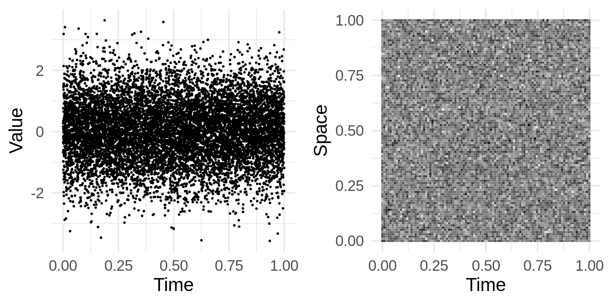
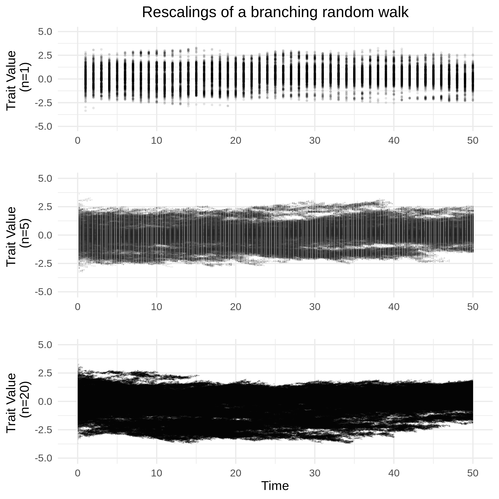
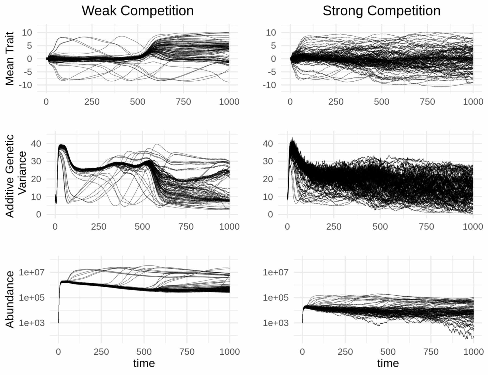
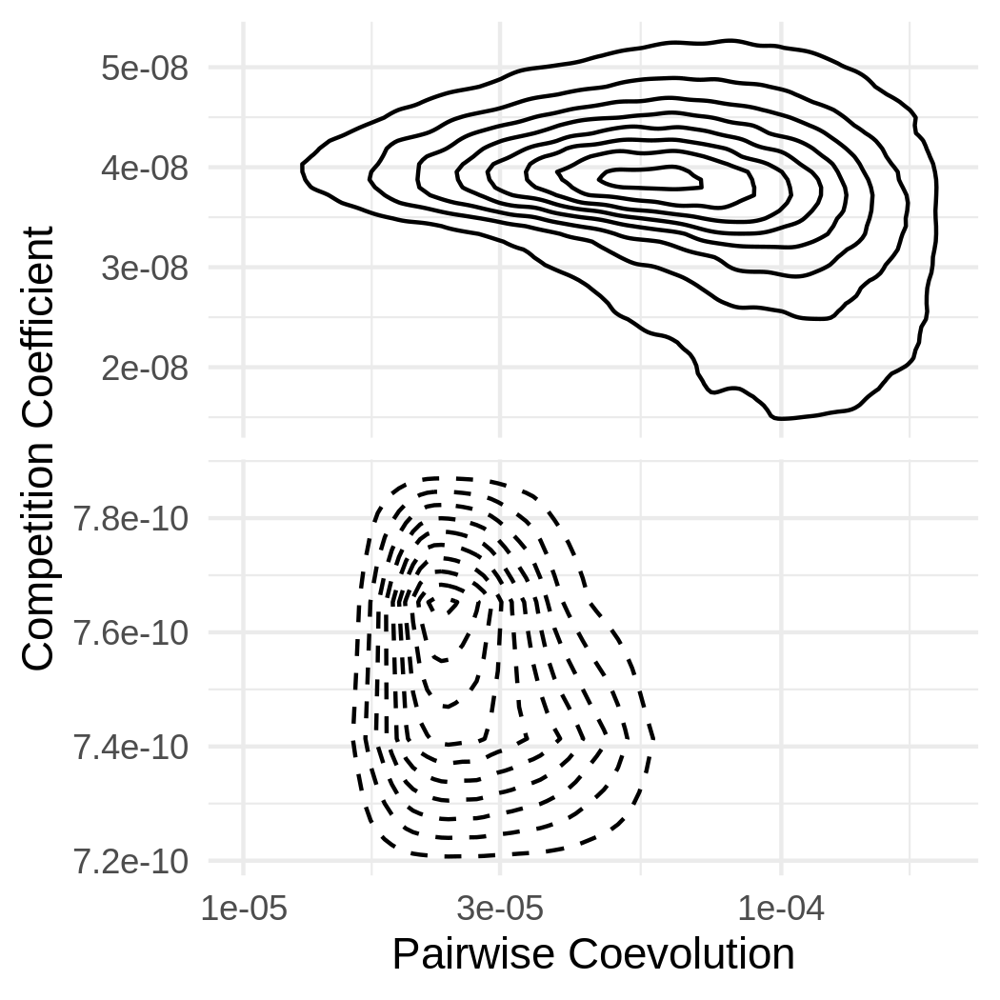

```{r global_options, include=FALSE}
#knitr::opts_chunk$set(fig.pos = "H", out.extra = "")
```

Introduction
==========================

Our goal in this manuscript is to develop a rigorous, but accessible approach to synthesize the stochastic dynamics of abundance, mean trait and heritable variation in biological populations for the study of theoretical evolutionary ecology. A primary aim of theoretical evolutionary ecology is the development of mathematical approaches to describe the evolution of populations and their interactions with both the biotic and abiotic environments in which they are embedded. Given this consideration, a natural scope for such an approach centers on quantifying the abundance dynamics of populations and the evolution of traits mediating their interactions as functions of relevant abiotic factors. Although taking into account abundance, phenotype and environment provides the basis for a partial understanding of the complex nature of biological communities, a deeper understanding must account for the effects of dispersal and the phylogeographic history of interacting lineages [@Kraft2007; @Hickerson2010; @Manceau2016; @markmcpeek2017] along with the genetic basis of ecologically relevant traits [@jeffreyconner2004; @FUSSMANN2007] and feedbacks between populations and the biogeochemical cycles they ultimately depend on [@michelloreau2010; @9781107648258]. It is therefore ideal that the development of any such mathematical approach anticipates extensions to account for these important factors shaping ecological communities, especially as empirical and conceptual work in these directions continues to grow [@AbdalaRoberts2014; @Klzsch2015; @Crutsinger2015; @Fitzpatrick2015; @Fitzpatrick2017; @Marx2017; @Rudman2017; @Skovmand2018; @VanNuland2019; @Harmon2019]. Furthermore, the approach would benefit from a stochastic component to capture the chance nature of biological reality [@Lande2003; @DeMeester2018; @Mubayi2019] and serve as a basis for the construction of statistical methods that measure evolutionary and ecological processes occuring in the wild. Such methods will tether theory to reality and allow for rigorous tests of hypotheses on the structure and behavior of ecological communities. In this paper we introduce a framework that establishes a formal connection between the continuous-time dynamics of abundance and quantitative traits in stochastically evolving populations. We then demonstrate the utility of our framework through the derivation and analysis of a model of diffuse coevolution and discuss how it can be extended to account for the details mentioned above.

Current theoretical approaches to synthesize evolution and ecology have capitalized on the fact that biological fitness plays a key role in determining both sets of dynamics. While correlation of fitness and genotype is the basis of evolution by natural selection, the mean fitness across all individuals in a population determines the growth, stasis or decline of abundance. In section \ref{deterministic} we review the mathematical formalization of this connection, which has been established in the contexts of population genetics [@9781932846126; @joanroughgarden1979], evolutionary game theory [@Hofbauer1998; @9780674023383; @Lion2018], quantitative genetics [@Lande1982; @Doebeli1996; @Lion2018] and a unifying framework for these three distinct approaches to evolutionary theory [@Champagnat2006] which includes our approach as a special case. We note here there are two primary differences between the results presented in this paper and those of Champagnat, Ferrière and Méléard [-@Champagnat2006]. First, instead of developing a unifying approach to evolutionary theory, we focus on developing a stochastic synthesis of population dynamics and quantitative genetics including specific expressions for the dynamics of abundance, mean trait and additive genetic variance. Second, although Champagnat, Ferrière and Méléard [-@Champagnat2006] provide rigorous proofs of results relevant to our approach, they do not communicate the nessecary tools we make use of for deriving the dynamics of abundance, mean trait and additive genetic variance. We aim to communicate these tools to a wide audience by striking a balance between intuitive appeal and mathematical rigor.

Although reviewing previously established theoretical results reveals a beautiful synthesis of evolution and population ecology, it also reveals a gap in theoretical approaches to incorporate the intrinsically random nature of populations. Specifically, in theoretical quantitative genetics the derivation of a population's response to random genetic drift is derived in discrete time under the assumption of constant effective population size using arguments based on properties of random samples [@Lande1976]. Though this approach conveniently mimics the formalism provided by the Wright-Fisher model of population genetics, real population sizes fluctuate over time. Furthermore, since these fluctuations are themselves stochastic, it seems natural to derive expressions for the evolutionary response to demographic stochasticity and consider how the results relate to characterizations of random genetic drift. This can be done in continuous time for population genetic models without too much technical overhead, assuming a finite number of alleles [@Lande2009; @Parsons2010; @Gomulkiewicz2017]. However, for populations with a continuum of types, such as a quantitative trait, finding a formal approach to derive the evolutionary response to demographic stochasticity has remained a vexing mathematical challenge. In this paper we close this gap by combining the calculus of white noise with results on rescaled limits of branching Brownian motion processes (BBM) and stochastic partial differential equations (SPDE), which are stochastic analogs of deterministic partial differential equations (PDE). Our goal has two components: 1) Establish a novel synthetic approach to theoretical evolutionary ecology that provides a formal connection between demographic stochasticity and random genetic drift in the context of quantitative traits. 2) Communicate some useful properties of space-time white noise, BBM and SPDE to as wide of audience as possible. With this goal in mind we will not provide a rigorous treatment of any of these deep subjects. Instead, we introduce a set of heuristics that only require the basic concepts of Reimann integration, partial differentiation and some exposure to Brownian motion and stochastic ordinary differential equations (SDE). For a concise introduction to SDE and Brownian motion, we recommend the primer by Evans [-@9781470410544]. Rigorous treatments of SPDE and rescaled limits of BBM can be found in Walsh [-@Walsh] and Dawson [-@dawson1993measure] respectively.

Through accomplishing these goals this work yields five main results. Firstly, we develop a concise, but accurate approach for understanding SPDE and provide heuristics to empower mathematical evolutionary ecologists to derive novel models that relax key assumptions commonly made in combining models of evolutionary and abundance dynamics. Second, we formally derive general SDE driven by demographic stochasticity that express the joint dynamics of abundance, mean trait and additive genetic variance for populations exhibiting a wide range of potential phenotypic distributions. Although these dynamics have been considered before while accounting for demographic stochasticity [@Polechov2015], to our knowledge this is the first time they have been rigorously derived from first principles. Third, we simplify these SDE by approximating the abundance density of phenotypes with a Gaussian curve and integrate the results with a model of imperfect inheritance to find formula that generalize classical quantitative genetic expressions. This includes an expression for the response of additive genetic variance to selection in terms of fitness gradients analogous to the expression for the response in mean phenotype found by Lande [-@Lande1976]. Fourth, following classical niche theory we provide a rigorous mechanistic derivation of fitness for populations experiencing resource competition and abiotic stabilizing selection using diffusion limits of measure-valued branching processes. This calculation provides a demonstration for performing such diffusion limits that can be applied in other contexts. Fifth, we explore implications of the resulting model of diffuse coevolution by investigating the relationship between selection gradients and competition coefficients, discovering the conditions under which these quantities positively or negatively covary.

We now summarize the basic structure of the paper. To provide motivation for the stochastic equations developed later and background for our model of coevolution, we begin with \S\ref{deterministic} by briefly summarizing derivations of deterministic evolutionary and demographic dynamics. Starting with a PDE (which we refer to as the Deterministic Asexual Gaussian allelic model with Abundance dynamics, abbreviated DAGA), we arrive at a general set of ordinary differential equations modelling the dynamics of abundance, trait mean and trait variance. We discuss the relationship between DAGA and previous models of phenotypic evolution that have been employed in theoretical quantitative genetics. In \S\ref{wnc} we discuss how a diffusion limit of a spatially structured branching process (i.e., a measure-valued branching process) leads to a SPDE that provides a natural stochastic generalization of DAGA. We refer to this SPDE as the Stochastic Asexual Gaussian allelic model with Abundance dynamics (abbreviated SAGA). The diffusion limit in turn provides a rigorous method for constructing fitness functions used in models of evolutionary ecology. However, before we discuss measure-valued braching processes and their diffusion limits, we find it necessary to review some fundamental results on the calculus of white noise and introduce a set of mathematical tools based on these results. In SM \S\ref{SDE_DERIV} we employ these tools to derive a system of SDE generalizing our deterministic results to account for demographic stochasticity. We find the effect of demographic stochasticity on the evolution of mean trait and phenotypic variance characterizes the process of random genetic drift in continuous time. However, although biologically insightful, these equations remain difficult to analyze and implement numerically. In \S\ref{equations} we use an assumption of normally distributed trait values to simplify these expressions into tractable formula that express the evolutionary response to selection in terms of fitness gradients. We then account for the constraint of adaptive evolution on the amount of heritable variation available in a population by extending these results via a model of imperfect inheritance. The resulting equations coincide with classical results in quantitative genetics as a special case. In \S\ref{coev} we combine the derived equations of population dynamics with classical niche theory to formulate a model of coevolution across a guild of $S$ species participating in exploitative competition along a common resource continuum. In SM \S\ref{diffuse} we apply a result on rescaled limits of BBM to provide a rigorous derivation. In \S\ref{dynamics} we illustrate our model of coevolution through numerical integration for $S=100$ species, tracking the dynamics of traits and abundances under scenarios of weak and strong competition. We include an account of the natural history of the simulated system and discuss the significance of demographic stochasticity for structuring ecological communities. In \S\ref{ecoevo} we provide expressions for selection gradients and competition coefficients implied by our model and use these expressions to investigate the relationship between the degree of competition and strength of coevolution. Finally, \S\ref{conclusion} concludes with a summary of accomplishments, a few remarks on the limits of this approach and future directions to incorporate more explicitly the effects of small populations, the genetic architecture of quantitative traits, feedbacks with ecosystem processes and the macroevolutionary history of interacting lineages.

The framework
============

At the core of our approach is a stochastic analog of the replicator equation with mutation in continuous time and phenotypic space [@Taylor1978; @Schuster1983]. From this stochastic replicator-mutator equation we derive a system of SDE for the dynamics of abundance, mean trait and additive genetic variance of a population. Hence, our approach develops a quantitative genetic theory of evolutionary ecology. A popular alternative to quantitative genetics is the theory of adaptive dynamics. As demonstrated by Page and Nowak [-@PAGE2002] and Champagnat, Ferrière and Méléard [-@Champagnat2006], the canonical equation of adaptive dynamics can be derived from the replicator-mutator equation. Thus, one could start from the atomic roots of our approach and pursue a stochastic adaptive dynamic theory instead. We choose the former in anticipation of an extension of our approach that explicitly models the genetic details of populations.

In this section we review the derivations of the replicator-mutator equation and trait dynamics from abundance dynamics and extend these formula along with related results to the stochastic case. The results established in this section provide the framework from which larger scale ecological stuctures, such as species abundance distributions and interaction networks, can be computed.

## Deterministic dynamics \label{deterministic}
Our review begins by considering the dynamics of an asexually reproducing population in a homogeneous environment. For simplicity, we first assume individuals are haploid and carry one of $K$ alleles each with a different fitness expressed as growth rate before introducing a model involving a quantitative trait. Under these assumptions, the derivation of the evolution of allele frequencies due to natural selection can be derived from expressions of exponential growth. This, and a few related approaches, have been provided by Crow and Kimura [-@9781932846126, \S 5.3]. Specifically, denoting $\nu_i$ the abundance of individuals with allele $i$ and $m_i$ the growth rate of allele $i$ [called the Malthusian parameter in @9781932846126], we have

\begin{equation}\label{first}
\frac{d\nu_i}{dt}=m_i\nu_i.
\end{equation}

Starting from this model, we get the total abundance of the population as $N=\sum_{i=1}^K\nu_i$, the frequency of allele $i$ as $p_i=\nu_i/N$ and the mean fitness of the population as $\bar m=\sum_{i=1}^Kp_im_i$. Hence, we can employ some elementary calculus to derive the dynamics of abundance $dN/dt$ and the dynamics of allele frequencies $dp_1/dt,\dots,dp_K/dt$ as

\begin{equation}
\frac{dN}{dt}=\sum_{i=1}^K\nu_im_i=N\sum_{i=1}^Kp_im_i=\bar mN,
\end{equation}
\begin{equation}\label{popgen}
\frac{dp_i}{dt}=\frac{d}{dt}\frac{\nu_i}{N}=\frac{1}{N^2}\left(N\frac{d\nu_i}{dt}-\frac{dN}{dt}\nu_i\right)
=\frac{1}{N}\left(m_i\nu_i-\bar m Np_i\right)=(m_i-\bar m)p_i.
\end{equation}

Two important observations of these equations include (i) mean fitness $\bar m$ determines the abundance dynamics of the entire population and (ii) allele $i$ will increase (decrease) in frequency if $m_i>\bar m$ ($<\bar m$). Equation (\ref{popgen}) is known in the field of evolutionary game theory as the replicator equation [@Hofbauer1998; @9780674023383; @Lion2018; @Taylor1978; @Schuster1983]. Instead of being explicitly focused on alleles, the replicator equation describes the fluctuations of relative abundances of various _types_ in a population in terms of the vital rates of each type. Using a matrix of transition rates between differing types, it is straight-forward to extend the replicator equation to include mutation, which is known as the replicator-mutator equation [@9780674023383].

Inspired by equations (\ref{first})-(\ref{popgen}), we derive an analog of the replicator-mutator equation for a continuum of types (that is, for a quantitative trait). In particular, we model a continuously reproducing population with trait values $x\in\mathbb{R}$ and an abundance density $\nu(x,t)$ that represents the amount of individuals in the population with trait value $x$ at time $t$. Hence, the abundance density satisfies $N(t)=\int_{-\infty}^{+\infty}\nu(x,t)dx$ and $p(x,t)=\nu(x,t)/N(t)$ is the relative density of trait $x$ which we also refer to as the phenotypic distribution. 

To stay within the realm of biological plausibility we require a set technical assumptions. First, we assume the initial abundance density is continuous, non-negative, integrable and has finite trait mean and variance. That is, we assume $\nu(x,0)$ is continuous in $x$, satisfies $\nu(x,0)\geq0$ for all $x\in\mathbb{R}$ and

\begin{equation}
N(0)=\int_{-\infty}^{+\infty}\nu(x,0)dx<+\infty,
\end{equation}
\begin{equation}
-\infty<\bar x(0)=\int_{-\infty}^{+\infty}xp(x,0)dx<+\infty,
\end{equation}
\begin{equation}
\sigma^2(0)=\int_{-\infty}^{+\infty}(x-\bar x(0))^2p(x,0)dx<+\infty,
\end{equation}

where $\bar x(t)$ and $\sigma^2(t)$ are respectively the mean trait and phenotypic variance at time $t\geq0$. Second, we assume selection is determined by the growth rate $m(h,x)$ that is differentiable with respect to both arguments and is bounded above by some $r\in\mathbb{R}$ for all $x\in\mathbb{R}$ and $h\geq0$. We also assume $(1+h)C\leq m(h,x)$ for some constant $C>0$ so that $m(h,x)$ is linear or more than linear in $h$. We denote by $K$ an operator that takes functions such as $\nu(x,t)$ as its argument and returns other functions that may still depend on the spatial variable $x$ and the temporal variable $t$. For our application we will be focused on operators $K$ that can be written as $(K\nu)(x,t)=\int_{-\infty}^{+\infty}\kappa(x-y)\nu(y,t)dy$ for some non-negative and bounded function $\kappa$. We set $h=(K\nu)(x,t)$ to account for nonlocal effects of the abundance density $\nu(x,t)$ on the fitness of individuals with trait value $x$ [@Volpert2014]. As an example of a nonlocal effect, consider a population experiencing intraspecific competition for a common resource such that the competitive interactions are not mediated by any set of traits. In this case all individuals in the population effect the fitness of one another even though they may exhibit a diverse range of trait values. The term nonlocal comes from interpreting the trait value as spatial location. From here on we abbreviate $m(h,x)=m\big((K\nu)(x,t),x\big)$ to just $m(\nu,x)$. Third, we assume mutation is captured by diffusion with coefficient $\frac{\mu}{2}$. With these technicalities addressed we model the demographic dynamics of a population and the dynamics of a quantitative character simultaneously by the PDE

\begin{equation}\label{eq1}
\frac{\partial}{\partial t}\nu(x,t)=m(\nu,x)\nu(x,t)+\frac{\mu}{2}\frac{\partial^2}{\partial x^2}\nu(x,t)
\end{equation}

with the initial condition $\nu(x,0)$ described above. Equation (\ref{eq1}) is a semilinear parabolic PDE and is referred to as a scalar reaction-diffusion equation [@zheng2004nonlinear; @lawrenceevans2010]. To ensure existence and uniqueness of solutions to (\ref{eq1}), we further assume that for each $M>0$ there exists a constant $L_M>0$ depending on $M$ such that $\int_\mathbb{R}\nu_1(x)dx,\int_\mathbb{R}\nu_2(x)dx\leq M$ implies

\begin{equation}\label{local_lipschitz}
\int_\mathbb{R}\left|m(\nu_1,x)\nu_1(x)-m(\nu_2,x)\nu_2(x)\right|dx\leq L_M\int_\mathbb{R}|\nu_1(x)-\nu_2(x)|dx.
\end{equation}

In SM \S\ref{finite} we combine the above assumptions on growth rate, mutation and initial condition to prove that solutions to (\ref{eq1}) satisfy $N(t),|\bar x(t)|,\sigma^2(t)<+\infty$ for all $t\geq0$.

Interpreting the trait value $x$ as spatial location and ignoring nonlocal effects, which can be satisfied by setting $K\nu=\nu$, this model of spatially distributed population dynamics has been intensely studied [for a review, see @Cantrell2004]. When $\mu=0$, equation (\ref{eq1}) can be seen as an analog of equation (\ref{first}) for a continuum of types. By assuming mutation acts as diffusion, the effect of mutation causes $\nu(x,t)$ to flatten out over time. In fact, if the growth rate is constant across $x$, then this model of mutation will cause $\nu(x,t)$ to converge to a flat line as $t\to\infty$. 

Although clearly an idealized representation of biological reality, this model is sufficiently general to capture a large class of dynamics including density dependent growth and frequency dependent selection. As an example, logistic growth combined with quadratic stabilizing selection can be captured using the growth rate 

\begin{equation}\label{special_m}
m(\nu,x)=r-\frac{a}{2}(\theta-x)^2-c\int_{-\infty}^{+\infty}\nu(y,t)dy
\end{equation}

where $r\in\mathbb{R}$ is the intrinsic rate of growth in the absence of abiotic stabilizing selection, $a>0$ is the strength of abiotic stabilizing selection around the phenotypic optimum $\theta\in\mathbb{R}$, $c>0$ captures the sensitivity of fitness to intraspecific competition and $\kappa(x-y)=1$ so that competitive interactions cause the same reduction in fitness regardless of trait value. This exemplary fitness function has a few convenient properties. First, the effect of competition induces a local carrying capacity on the population, leading to a finite equilibrium abundance over bounded subsets of $\mathbb{R}$. Second, abiotic selection prevents the abundance density from diffusing too far from the abiotic optimum, leading to a finite equilibrial abundance across all of $\mathbb{R}$, $\lim_{t\to\infty}N(t)=\tfrac{1}{c}(r-\tfrac{1}{2}\sqrt{a\mu})$, finite equilibrial mean trait $\lim_{t\to\infty}\bar x(t)=\theta$ and finite equilibrial phenotypic variance $\lim_{t\to\infty}\sigma^2(t)=\sqrt{\frac{\mu}{a}}$, so long as $\bar x(0)\in\mathbb{R}$, $\sigma^2(0)\in[0,+\infty)$, $N(0)\in(0,+\infty)$ and $r>\frac{1}{2}\sqrt{a\mu}>0$. We prove these statements in SM \S\ref{equilib}. Note in particular the coincidence of equilibrial phenotypic variance predicted by this model and that predicted by the classic Gaussian allelic model of quantitative genetics [@Lande1975; @9780471986539; @Johnson2005]. In \S\ref{coev} and SM \S\ref{diffuse} we find this fitness function is closely related to a fitness function derived from niche theory that we use to model coevolution driven by resource competition.

To derive a replicator-mutator equation from equation (\ref{eq1}), we employ the chain rule from calculus. Writing $\bar m(t)=\int_{-\infty}^{+\infty}m(\nu,x)p(x,t)dx$ for the mean fitness, we have

\begin{multline}\label{N_det}
\frac{d}{dt}N(t)=\frac{d}{dt}\int_{-\infty}^{+\infty}\nu(x,t)dx=\int_{-\infty}^{+\infty}\frac{\partial}{\partial t}\nu(x,t)dx \\
=\int_{-\infty}^{+\infty} m(\nu,x)\nu(x,t)dx+\int_{-\infty}^{+\infty}\frac{\mu}{2}\frac{\partial^2}{\partial x^2}\nu(x,t)dx \\
=N(t)\int_{-\infty}^{+\infty} m(\nu,x)p(x,t)dx=\bar m(t) N(t).
\end{multline}

Using our assumptions on mutation and rate of growth, we show in SM \S\ref{finite} $\nu(x,t)$ is twice differentiable with respect to $x$ and $\int_{-\infty}^{+\infty}\nu(x,t)dx<\infty$ for all $t\geq0$. This implies that we are justified in swapping the order of differentiation and integration and the result $\int_{-\infty}^{+\infty}\frac{\partial^2}{\partial x^2}\nu(x,t)dx=0$ can be derived from the fundamental theorem of calculus. Biological reasoning agrees with this latter result since mutation neither creates nor destroys individuals, but merely changes their type from their parental type. Taking the same approach, we derive the dynamics of the phenotypic distribution $p(x,t)$ in response to selection and muation as

\begin{multline}\label{p_PDE}
\frac{\partial}{\partial t}p(x,t)=\frac{\partial}{\partial t}\frac{\nu(x,t)}{N(t)}=\frac{1}{N^2(t)}\left(N(t)\frac{\partial}{\partial t}\nu(x,t)-\nu(x,t)\frac{d}{dt}N(t)\right) \\
=\frac{1}{N(t)}\Big(m(\nu,x)\nu(x,t)+\frac{\mu}{2}\frac{\partial^2}{\partial x^2}\nu(x,t)-\bar m(t)\nu(x,t)\Big) \\
=\Big(m(\nu,x)-\bar m(t)\Big) p(x,t)+\frac{\mu}{2}\frac{\partial^2}{\partial x^2}p(x,t).
\end{multline}

This result closely resembles Kimura's continuum-of-alleles model [@Kimura1965; @Brger1986]. The primary difference being that our model utilizes diffusion instead of convolution with an arbitrary mutation kernel. Of course, our model of mutation can be derived as an approximation to Kimura's model, which, for sexually reproducing populations, has been referred to as the Gaussian allelic approximation in reference to the distribution of mutational effects at loci in a genome on the values of traits [@Lande1975; but see also @9780471986539; along with @Johnson2005], the infinitesimal model in reference to modelling continuous traits as being encoded by an infinite number of loci each having infinitesimal effect [@Barton2017] and the Gaussian descendants approximation in reference to offspring trait values being normally distributed around their parental values [@Turelli2017]. Alternatively, since diffusion is the continuous-time equivalent to convolution against a Gaussian kernel (SM \S\ref{diffconvequiv}), equation (\ref{p_PDE}) can also be seen as a special case of Kimura's continuum-of-alleles model. We return to these concepts in \S\ref{inheritance} where we review a simple model of inheritance that leads us to an expression for the stochastic evolution of additive genetic variance. To distinguish this model from previous models of phenotypic evolution we refer to PDE (\ref{eq1}) from which (\ref{p_PDE}) was derived as the Deterministic Asexual Gaussian allelic model with Abundance dynamics (abbreviated DAGA). Later, we will extend this model to include the effects of demographic stochasticity, which we refer to as the Stochastic Asexual Gaussian allelic model with Abundance dynamics (abbreviated SAGA).

The covariance of fitness and phenotype across the population is defined as

\begin{equation}
\mathrm{Cov}_t\Big(m(\nu,x),x\Big)=\int_{-\infty}^{+\infty}\Big(m(\nu,x)-\bar m(t)\Big)\Big(x-\bar x(t)\Big)p(x,t)dx.
\end{equation}

Hence, the dynamics of the mean trait $\bar x(t)$ can be derived as

\begin{multline}\label{detmean}
\frac{d}{dt}\bar x(t)=\frac{d}{dt}\int_{-\infty}^{+\infty} x p(x,t)dx=\int_{-\infty}^{+\infty} x\frac{\partial}{\partial t} p(x,t)dx \\
=\int_{-\infty}^{+\infty} x\big(m(\nu,x)-\bar m(t)\big) p(x,t)+x\frac{\mu}{2}\frac{\partial^2}{\partial x^2} p(x,t)dx
=\mathrm{Cov}_t\Big(m(\nu,x),x\Big).
\end{multline}

Equation (\ref{detmean}) is a continuous time analog of the well known Robertson-Price equation without transmission bias [@Robertson1966; @PRICE1970; @FRANK2012; @Queller2017; @Lion2018]. Whether or not the covariance of fitness and phenotype creates change in $\bar x$ to maximize mean fitness $\bar m$ depends on the degree to which selection is frequency dependent [@Lande1976]. Since this change is driven by a covariance with respect to phenotypic diversity, the response in mean trait to selection is mediated by the phenotypic variance. In particular, when $\sigma^2=0$, $\bar x$ will not respond to selection. The result $\int_{-\infty}^{+\infty} x\frac{\partial^2}{\partial x^2} p(x,t)dx=0$ can be found by applying integration by parts. Following the approach taken to calculate the evolution of $\bar x$, we find the response of phenotypic variation to this model of selection and mutation is

\begin{equation}\label{vardyn_det}
\frac{d}{dt}\sigma^2(t)=\mathrm{Cov}_t\Big(m(\nu,x),(x-\bar x)^2\Big)+\mu.
\end{equation}

For the sake of space we relegate the derivation of $d\sigma^2/dt$ to SM \S\ref{var_deriv}. In the absence of mutation equation (\ref{vardyn_det}) agrees with the result derived by Lion [-@Lion2018] for discrete phenotypes. From a statistical perspective, if we think of $(x-\bar x)^2$ as a square error, then in analogy to the dynamics of the mean trait, we see that the response in $\sigma^2$ to selection can be expressed as a covariance of fitness and square error, which is defined in analogy to $\mathrm{Cov}_t(m(\nu,x),x)$. Just as for the evolution of $\bar x(t)$, this covariance also creates change in $\sigma^2$ that can either increase or decrease mean fitness $\bar m$, depending on whether or not individual fitness depends on the distribution of traits across the entire population. The effect of selection on phenotypic variance can be positive or negative depending on whether selection is stabilizing or disruptive.

In SM \S\ref{SDE_DERIV}, we extend these results to include the effects of demographic stochasticity. The key realization in this direction is that a rigorous derivation of a SPDE that naturally generalizes DAGA and accounts for ecological interactions has been provided by Li [-@zeng1998absolute] and slightly generalized by Champagnat, Ferriére and Méléard [-@Champagnat2006]. To understand how this SPDE was derived, we provide an informal discussion of measure-valued branching processes (which treat populations as sets of discrete individuals) and their diffusion limits, the so-called superprocesses (which treat population size as a continuously varying number). Similar to the approach taken by Champagnat, Ferriére and Méléard [-@Champagnat2006], we begin with a BBM that models populations as discrete sets of reproducing individuals whose vital rates depend on their trait value as well as the state of the entire population. Taking a large population size limit and keeping our assumption of single dimensional traits, we employ a pair of classical results that show, under the appropriate rescaling in time, phenotypic space and population density, a sequence of rescaled BBM converges to a limiting process that can be characterized by a SPDE [@meleard1992interacting; @Mlard1993; @zeng1998absolute; @Champagnat2006]. The limiting processes of rescaled BBM have been referred to as measure-valued Markov processes [@dawson1993measure] or superprocesses [@alisonetheridge2000]. Under the simplifying assumptions inherited from our treatment of deterministic dynamics and the additional assumption that the magnitude of demographic stochasticity is independent of trait values, we obtain as a special case a relatively simple expression for an SPDE that generalizes DAGA. The simplicity of our special case allows us to use properties of space-time white noise processes to derive a set of SDE that generalize equations (\ref{N_det}), (\ref{detmean}) and (\ref{vardyn_det}) to include the effects of demographic stochasticity. Classical expressions for the effects of random genetic drift on the evolution of mean traits are obtained as a further special case.

In the following section we provide the necessary mathematical tools needed to derive SDE from SPDE. Since our aim is to present this material to as wide of audience as possible, our approach deviates from standard definitions to remove the need for a detailed technical treatment. In addition to the notions of Reimann integration and partial differentiation already employed, the reader will only need some elementary probability and an intuitive understanding of SDE, including Brownian motion. Because space-time white noise, denoted by $\dot W(x,t)$, appears in the SPDE characterizing diffusion limits of BBM, we begin by defining $\dot W(x,t)$ and illustrating its relevant properties including a set of heuristics for performing calculations. Treating only the simplist of cases, we then provide a brief review of BBM, their diffusion limits and the SPDE that characterize them. For those not interested in the white noise calculus or superprocesses and would rather jump straight into more biologically relevant results, we recommend skipping to \S\ref{equations}.

## White noise calculus and superprocesses \label{wnc}

One can think of white noise as the static seen on old television sets or infinitely detailed random dust spread across both time and space. From a more mathematical, yet still informal perspective, white noise can be thought of as a stochastic process. That is, we can picture white noise as a collection of random variables indexed by time and possibly space. In relation to Brownian motion, denoted by $W$, white noise can be interpreted of as the derivative of Brownian motion with respect to time, denoted $\dot W$. Since Brownian motion can be thought to take infinitesimally small Gaussian distributed jumps at each time point, this leads to the conceptualization of white noise as a collection of independent Gaussian distributed random variables. Figure \ref{wn} illustrates realizations of this conceptualized white noise in one (left) and two (right) dimensions.

```{r, include=F, eval=F}
require("ggplot2")
require("ggthemes")
require("plot3D")
require("gridExtra")

num1 = 1e4
num2 = 1e4

xi_1 = rnorm(num1)
xi_2 = rnorm(num2)

x1 = seq(0,1,length.out = num1)
x2 = seq(0,1,length.out = sqrt(num2))

M = expand.grid(x=x2,y=x2)
M$value = xi_2

df_1 = data.frame(xi=xi_1,x=x1)

wn1d = ggplot(df_1)+geom_point(aes(x=x,y=xi),size=0.05)+theme_minimal()+xlab("Time")+ylab("Value")
wn2d = ggplot(M, aes(x, y, color = value))+scale_color_gradient2(low="black",mid="grey50", high="white")+geom_point(size=0.001, shape=22, show.legend = FALSE)+theme_minimal()+xlab("Time")+ylab("Space")

wn = grid.arrange(wn1d,wn2d,nrow=1)

ggsave("~/Gits/branching.brownian.motion.and.spde/.A White Noise Approach To Evolutionary Ecology/wn.png",wn,width=5,height=2.5)
```

```{r, echo=F, fig.align='center', out.width='80%', fig.cap='\\label{wn}Approximations of sample paths of temporal white noise (left) and space-time white noise (right) with brightness scaled to value.'}

```

However, it turns out that realizations of white noise do not exist as functions in the classical sense. Indeed, since Brownian motion is nowhere differentiable with respect to time, white noise cannot be formally understood as a time derivative. Thus our notation $\dot W$ is only meant to aid intuition and not be taken as formal. A formal understanding is possible by considering white noise as a _measure_-valued process [@Dawson1975; @Walsh] or as a _generalized_ process that acts on classically defined functions or stochastic processes to return either random variables or stochastic processes [@Krylov1981; @DaPrato2014]. Since a measure-valued process can be defined from a generalized process and a generalized process can be defined from a measure-valued process, the distinction between the two is more or less a matter of perspective. However, we find the perspective of white-noise as a generalized process to be a more efficient route for developing heuristics to help with some routine calculations involved with deriving SDE from SPDE. Hence, the notion of a generalized process provides the general idea implemented here. Although the treatments of SPDE provided by Krylov and Rozovskii [-@Krylov1981] and Da Prato and Zabczyk [-@DaPrato2014] extend the theory of SDE to formally treat SPDE in a general and elegant fashion, they require the navigation of an enourmous amount of technical definitions and detailed proofs. To extract some particularly useful results from this theory relevant to our goal of synthesizing the stochastic dynamics of biological populations, we provide a streamlined approach by capitolizing on the solid ground these authors have established. For instance, instead of rigorously proving properties of white noise, we simply define them to be so, taking solice in the fact that the technical details have been worked out elsewhere. In SM \S\ref{DPZ14} we show how our informal treatment is related to the rigorous treatment provided by Da Prato and Zabczyk [-@DaPrato2014].

Before diving in, we shed a bit of light on the idea of a generalized process. A generalized process is the stochastic analog of a generalized function, such as the Dirac delta function $\delta$. Often one sees $\delta$ defined as a function satisfying the properties $\delta(x)=0$ for $x\neq0$ and $\int_{-\infty}^{+\infty}\delta(x)dx=1$. However, since there is no function that satisfies these properties, we refer to $\delta$ as a generalized function. An alternative definition of $\delta$ considers its action on classically defined functions $f$. In particular, $\delta(f)=f(0)$, which can be heuristically written as $\int_{-\infty}^{+\infty}f(x)\delta(x)dx=f(0)$. Similarly, other generalized functions can be defined by their action on classically defined functions. Then, just as a generalized function operates on classical functions to return a value, a generalized process acts on a set of functions (or processes) to return a random variable (or a classically defined stochastic process). For a brief primer on the theory of generalized functions, see the addendum to chapter 3 of Kolmogorov and Fomin [-@kolmogorov1999elements].

### Definition and basic properties of white noise \label{wnc_intro}

Throughout this section, we minimize notation by writing $\int_{\mathbb{R}}f(x)dx=\int_{-\infty}^{+\infty}f(x)dx$ and similarly $\int_Df(x)dx$ for the integral of $f$ over $D\subset\mathbb{R}$. We define $\mathscr{N}_2$ as the set of stochastic processes $f(x,t)$ that are continuous in $t$ and satisfy $\mathbb{E}\left(\int_0^t\int_\mathbb{R}f^2(x,s)dxds\right)<+\infty$ for each $t\geq0$. The operator $\mathbb{E}$ denotes expectation with respect to the underlying probability space. For each $t\geq0$ we set

\begin{equation}
\|f\|_t=\sqrt{\mathbb{E}\left(\int_0^t\int_\mathbb{R}f^2(x,s)dxds\right)},
\end{equation}

and make use of the convention $f=g$ if $\|f-g\|_t=0$ for all $t\geq0$. Later, when we investigate stochastic dynamics of the abundance density $\nu(x,t)$, we will find $\sqrt\nu\in\mathscr{N}_2$. This enables us to utilize the heuristics developed in this section for the derivation of SDE describing the stochastic dynamics of $N(t)$, $\bar x(t)$ and $\sigma^2(t)$.

We define a generalized stochastic process $\mathbf W$ that maps processes $f\in\mathscr{N}_2$ to real-valued stochastic processes indexed by time $t\geq0$, but not by space. To evaluate $\mathbf W$ for a process $f\in\mathscr{N}_2$ and some time $t\geq0$ we write $\mathbf W_t(f)$. Specifically, for any $f,g\in\mathscr{N}_2$, we define $\mathbf W(f)$ and $\mathbf W(g)$ to be Gaussian processes satisfying, for any $t,t_1,t_2\geq0$,

\begin{equation}\label{exp_WN}
\mathbb{E}\big(\mathbf W_t(f)\big)=\mathbb{E}\big(\mathbf W_t(g)\big)=0,
\end{equation}
\begin{equation}\label{cov_WN}
\mathbb{C}\big(\mathbf W_{t_1}(f),\mathbf W_{t_2}(g)\big)=\mathbb{E}\left(\int_0^{t_1\wedge t_2}\int_\mathbb{R} f(x,s)g(x,s)dxds\right),
\end{equation}

where $t_1\wedge t_2=\min(t_1,t_2)$ and $\mathbb{C}$ denotes covariance with respect to the underlying probability space. In particular, denoting $\mathbb{V}$ the variance operator with respect to the underlying probability space, we have $\mathbb{V}\big(\mathbf W_t(f)\big)=\|f\|_t^2$ for all $t\geq0$ and $f\in\mathscr{N}_2$. The operators $\mathbb{E}$ and $\mathbb{C}$ are to be distinguished from $\bar f(t)$ and $\mathrm{Cov}_t(f,g)$ which denote expectation and covariance with respect to phenotypic diversity at time $t\geq0$.

Since Gaussian processes are characterized by their expectations and covariances and since we assume the $\mathscr{N}_2$ processes are continuous in time, the processes $\mathbf W(f)$ and $\mathbf W(g)$ are well defined. As an example, if $f\in\mathscr{N}_2$ is independent of time, then $\mathbf W(f)$ is a Brownian motion with variance at time $t\geq0$ equal to $\|f\|_t^2=t \ \mathbb{E}(\int_\mathbb{R}f^2(x,0)dx)$. With the generalized process $\mathbf W$ defined, we define the space-time white noise $\dot W(x,t)$ implicitly via the stochastic integral

\begin{equation}\label{informal}
``\int_0^t\int_\mathbb{R}f(x,s)\dot W(x,s)dxds"=\mathbf W_t(f), \ \forall \ f\in\mathscr{N}_2, \ t\geq0.
\end{equation}

We place quotations in the above expression to emphasize its informal nature and that it should not be confused with classical Riemann integration. Following this definition of white noise, we compute its value by sampling it using $\mathscr{N}_2$ processes. For example, integrating white noise over a region $D\times[0,t]$, with $t>0$ and $D$ a bounded subset of $\mathbb{R}$, is equivalent to evaluating $\mathbf W_t(I_D)$ for the deterministic process

\begin{equation}
I_D(x,t)=\left\{\begin{matrix}
0, & x\notin D \\
1, & x\in D
\end{matrix}\right..
\end{equation}

Since 

\begin{equation}
\|I_D\|_t^2=\mathbb{E}\left(\int_0^t\int_\mathbb{R}I_D^2(x,s)dxds\right)=t\int_Ddx=t|D|<+\infty, 
\end{equation}

where $|D|$ denotes the length of $D$, we have $I_D\in\mathscr{N}_2$. Thus, using equations (\ref{exp_WN}) and (\ref{cov_WN}) and adopting the informal notation introduced in equation (\ref{informal}), we can write the following

\begin{equation}
\mathbb{E}\left(\int_0^t\int_D\dot W(x,s)dxds\right)=0,
\end{equation}
\begin{equation}
\mathbb{V}\left(\int_0^t\int_D\dot W(x,s)dxds\right)=t|D|.
\end{equation}

Using this informal notation, equations (\ref{exp_WN}) and (\ref{cov_WN}) can be rewritten as

\begin{equation}\label{exp_WN_xi}
\mathbb{E}\left(\int_0^t\int_\mathbb{R}f(x,s)\dot W(x,s)dxds\right)=0,
\end{equation}
\begin{multline}\label{cov_WN_xi}
\mathbb{C}\left(\int_0^{t_1}\int_\mathbb{R}f(x,s)\dot W(x,s)dxds,\int_0^{t_2}\int_\mathbb{R}g(x,s)\dot W(x,s)dxds\right) \\
=\int_0^{t_1\wedge t_2}\int_\mathbb{R}f(x,s)g(x,s)dxds.
\end{multline}

To relate these formula to the common notation used for SDE, we write

\begin{equation}
\hat f(x,t)=\frac{f(x,t)}{\sqrt{\int_\mathbb{R}f^2(y,t)dy}} \ \text{ and } \ 
d\hat{\mathbf W}_t(f)=\left(\int_\mathbb{R}\hat f(x,t)\dot W(x,t)dx\right)dt
\end{equation}

so that

\begin{equation}
\int_0^td\hat{\mathbf W}_s(f)=\int_0^t\int_\mathbb{R}\frac{f(x,s)}{\sqrt{\int_\mathbb{R}f^2(s,y)dy}}\dot W(x,s)dxds.
\end{equation}

This implies 

\begin{equation}
\mathbb{E}\left(\int_0^td\hat{\mathbf W}_s(f)\right)=0, \ \mathbb{C}\left(\int_0^{t_1}d\hat{\mathbf W}_s(f),\int_0^{t_2}d\hat{\mathbf W}_s(f)\right)=t_1\wedge t_2
\end{equation}

and in particular, as a function of $t$, $\int_0^td\hat{\mathbf W}_s(f)$ is a standard Brownian motion for any $f\in\mathscr{N}_2$. Hence, $d\hat{\mathbf W}_t(f)$ is analogous to the traditional shorthand used to denote stochastic differentials. Thus, equation (\ref{cov_WN_xi}) effectively extends It&ocirc;'s multiplication table to:

\begin{table}[H]
\centering\caption{An extension of It\^o's multiplication table.}\vspace{0.2cm}
\begin{tabular}{l|lll}
             & $d\hat{\mathbf W}_t(f)$               & $d\hat{\mathbf W}_t(g)$                & $dt$ \\ \hline
             &                            &                            &      \\
$d\hat{\mathbf W}_t(f)$ & $dt$                       & $\left(\int_\mathbb{R}\hat f(x,t)\hat g(x,t)dx\right)dt$ & $0$  \\
             &                            &                            &      \\
$d\hat{\mathbf W}_t(g)$ & $\left(\int_\mathbb{R}\hat f(x,t)\hat g(x,t)dx\right)dt$ & $dt$                       & $0$  \\
             &                            &                            &      \\
$dt$         & $0$                        & $0$                        & $0$
\end{tabular}\label{mult}
\end{table}

The extension of It&ocirc;'s multiplication table and properties of white noise outlined in this subsection provide a useful set of tools for working with SPDE. In SM \S\ref{SDE_DERIV} we employ these tools to derive SDE that track the dynamics of abundance, mean trait and phenotypic variance of a population from a particular SPDE. In the following subsection, we review how this particular SPDE naturally arises as the diffusion limit of a BBM.

### From branching processes to SPDE \label{stochastic}

In real populations individuals are born and potentially reproduce before they ultimately die. These three events provide the basic ingredients of a branching process. Mathematical investigations of such processes have a relatively deep history [@Kendall1966]. The most simple branching process, known as the Galton-Watson process, describes the number of individuals alive at a given time $t\geq0$ as a non-negative integer [@Kimmel2015]. Feller [-@feller1951] introduced a formal method to approximate branching processes with diffusion processes which are continuous in state (i.e., population size is approximated as a continuous quantity). Since diffusion processes possess greater analytical tractability than branching processes, Feller's method, known as the diffusion limit, has acquired immense popularity particularly in the field of mathematical population genetics [@Ewens2004]. For over the past half of a century a great deal of accomplishments have been achieved in formalizing the diffusion limits of branching processes that describe populations of individuals occuring in some continuous space [@Watanabe1968; @Dawson1975; @Dawson1978; @Perkins1992; @Mlard1993; @edwinarendperkins1995; @zeng1998absolute; @Bertoin2003; @Etheridge2008; @Barton2019]. This space can represent geographic space or, relevant to our context, phenotypic space. In the following subsection, we describe the BBM process, which is a particularly important branching process with spatial structure. This process has been very useful in the study of SPDE due to its simplifying assumption that individuals do not interact. However, this assumption imposes an unfortunate restriction by precluding the modelling of ecological interactions. We therefore follow our discussion of BBM with a review of a few important results on spatially structured branching processes that account for interactions.

_Branching Brownian motion (BBM):_
A BBM tracks individuals navigating $d$-dimensional Euclidean space that reproduce and senesce between exponentially distributed intervals. Unlike other stochastic processes that take values in $\mathbb{R}^d$, BBM takes values in the set of _non-negative finite measures_ over $\mathbb{R}^d$. Intuitively, one can think of a finite measure as a function that maps subsets of $\mathbb{R}^d$ to real numbers. To be formal, we only consider the Borel subsets of $\mathbb{R}^d$ corresponding to the Euclidean metric, but understanding this technicality is not crucial to our discussion. In particular, denoting $X_t$ a BBM, for a subset $D\subset\mathbb{R}^d$, $X_t(D)$ returns the (random) number of individuals alive within the region $D$ at time $t\geq0$. The BBM has three main components: 

  1) __Branching rate:__ In our formulation of BBM we assume Lifetimes of individuals are exponentially distributed with death rate $\lambda>0$ and reproduction occurs simultaneously with death. Biologically, this implies individuals are semelparous An alternative formulation treats birth and death events separately to model iteroparity. However, under the appropriate rescaling, both approaches converge to the same diffusion limit [@Champagnat2006]. We therefore choose the former approach for the sake of simplicity.
  
  2) __Reproductive law:__ When a birth event occurs we assume a random (possibly zero) number of offspring are produced. The distribution of offspring left is called the reproductive law or branching mechanism. We denote the mean and variance in reproductive output by $\mathscr{W}$ and $V$ respectively. The case of $\mathscr{W}=1$ is referred to as the critical condition. Since $X_t(\mathbb{R}^d)$ is a Galton-Watson branching process, it is well known the critical condition implies extinction in finite time with probability one, given finite $X_0(\mathbb{R}^d)$ [@Athreya1972].

  3) __Spatial movement:__ Each offspring is born at the current location of their parent. Immediately after birth they move around space according to $d$-dimensional Brownian motion with diffusion parameter $\sqrt\mu$. In our context we interpret spatial movement as mutation so that the location of an individual at death represents the value of its phenotype. Then an individual born at location $x\in\mathbb{R}^d$ that lives for $\tau>0$ units of time will have a normally distributed trait centered on $x$ with covariance matrix equal to $\tau\mu$ times the $d\times d$ identity matrix. Hence, offspring inherit normally distributed traits centered on their parental trait. This fact creates a vital link to the deterministic dynamics reviewed above. Indeed, in the absence of selection, the deterministic PDE (\ref{eq1}) reduces to the $d=1$-dimensional Kolmogorov forward equation for a Brownian motion with diffusion parameter $\sqrt\mu$.
  
To obtain a SPDE from a BBM we take a diffusion limit. There are several ways to do this, but a simple approach is to rescale the mass of individuals and time by $1/n$, diffusion by $\mu\to\mu/n$, branching rate by $\lambda\to n\lambda$, fitness by $\mathscr{W}\to\mathscr{W}^{1/n}$ and consider the limit as $n\to\infty$. Denoting the rescaled process by $X_t^{(n)}(D)$, the limiting process $\mathscr{X}_t=\lim_{n\to\infty}X_t^{(n)}$ is called a super-Brownian motion and is also a non-negative finite measure-valued process [@Watanabe1968]. However, instead of returning the number of individuals alive in a region of space, super-Brownian motion returns the _mass_ of the population concentrated in a region of space. Since we have rescaled individual mass by $1/n$ and took the limit $n\to\infty$, individuals are no longer discrete units. Instead, the particle view of the population gets replaced by a blob spread across $d$-dimensional space. In particular, the value of $\mathscr{X}_t(D)$ is a continuously varying non-negative random variable for any $t\geq0$ and $D\subset\mathbb{R}^d$. 

Unfortunately, just as with cream cheese spread across too much toast, the blob perspective of the population may exhibit some complicated spatial discontinuities. However, for spatial dimension $d=1$, it turns out that $\mathscr{X}_t$ is absolutely continuous with respect to the Lebesgue measure for each $t\geq0$ [@Konno1988; @Reimers1989]. This means that we can write $\mathscr{X}_t(D)=\int_D \nu(x,t)dx$ for some density process $\nu(x,t)$. Setting $\lambda=1$ and $m=\ln\mathscr{W}$ this density process satisfies the SPDE

\begin{equation}\label{neutral_SPDE}
\frac{\partial}{\partial t}\nu(x,t)=m\nu(x,t)+\frac{\mu}{2}\frac{\partial^2}{\partial x^2}\nu(x,t)+\sqrt{V\nu(x,t)}\dot W(x,t).
\end{equation}

Since $\nu(x,t)$ is not generally differentiable in $x$ or $t$, the derivatives in expression (\ref{neutral_SPDE}) are taken in the _weak_ sense [for a definition see @lawrenceevans2010]. That is, to rigorously interpret SPDE (\ref{neutral_SPDE}), we integrate the solution $\nu(x,t)$ against functions $f\in C_b^2(\mathbb{R})$ where $C_b^2(\mathbb{R})$ is the set of bounded and twice continuously differentiable functions on $\mathbb{R}$. Hence, equation (\ref{neutral_SPDE}) is just an abbreviation for

\begin{multline}\label{neutral_int}
\int_\mathbb{R}\nu(x,t)f(x)dx-\int_\mathbb{R}\nu(x,0)f(x)dx=\int_0^t\int_\mathbb{R}\nu(x,s)\left(mf(x)+\frac{\mu}{2}\frac{\partial^2}{\partial x^2}f(x)\right)dsdx \\
+\int_0^t\int_\mathbb{R}f(x)\sqrt{V\nu(x,s)}\dot W(x,s)dxds, \ \forall \ f\in C_b^2(\mathbb{R}).
\end{multline}

This expression is referred to as the _mild_ solution of (\ref{neutral_SPDE}). For more on the general theory of SPDE see Walsh [-@Walsh] and Da Prato and Zabczyk [-@DaPrato2014]. Note that since $\nu(x,t)$ is the density of a finite measure, it is integrable for each $t\geq0$. Thus, since for some $M>0$, $|f(x)|\leq M$ for every $x\in\mathbb{R}$, setting $\varphi(x,t)=f(x)\sqrt{V\nu(x,t)}$ implies $\varphi\in\mathscr{N}_2$. Hence, the white noise integral on the right-hand side of equation (\ref{neutral_int}) can be understood using the heuristics introduced above. Evaluating equation (\ref{neutral_int}) in the particular case of $f(x)\equiv1$ returns the total mass process, which we refer to as the total abundance $N(t)$.

A convergence theorem for the diffusion limit of a generalization of BBM was established by Watanabe [-@Watanabe1968]. Dawson [-@Dawson1975] suggested that, for spatial dimension $d=1$, this diffusion limit should admit a density process that satisfies a SPDE. Konna and Shiga [-@Konno1988] and Reimers [-@Reimers1989] independently proved Dawson's suggestion was indeed correct. The diffusion limit of this more general branching process (in arbitrary spatial dimension) is referred to as a Dawson-Watanabe superprocess [@alisonetheridge2000]. Conditioning a Dawson-Watanabe superprocess to have constant mass returns a Fleming-Viot process [@Etheridge1991; @Perkins1991] which has been popular in studies of spatial population genetics. In particular, an extension of the Fleming-Viot process, known as the $\Lambda$-Fleming-Viot process, was introduced by Bertoin and Le Gall [-@Bertoin2003] and coined by Etheridge [-@Etheridge2008] where it was used to resolve some technical challenges in modelling isolation by distance [@Felsenstein1975; see also @Barton2013; and @Barton2019]. Although this provides an impressive list of accomplishments, the Dawson-Watanabe superprocess falls short of our needs. In particular this process assumes individuals do not interact and thus precludes its ability to model nonlocal effects on the fitness of individuals, such as those produced via competitive interactions. However, this concern has been addressed, leading to constuctions of superprocesses that account for interactions among individuals. In the next subsection we summarize the main results in this area and introduce the SPDE that provides the basis for our approach to theoretical evolutionary ecology.

_Interacting superprocesses:_
In the above subsection we reviewed the diffusion limit of an especially tractable measure-valued branching process. However, we found the simplicity of this process restricts us from modelling nonlocal effects on the fitness of individuals. Here, we discuss superprocesses that account for such effects. The existence of diffusion limits for a class of measure-valued branching processes involving nonlocal effects has been treated by Méléard and Roelly [-@meleard1992interacting; -@Mlard1993]. The interactions can manifest as dependencies of the spatial movement or reproductive law of individuals on their position $x$ and the state of the whole population described by $X_t$. An important result of Méléard and Roelly [-@meleard1992interacting; -@Mlard1993] is a theorem that provides sufficient conditions to construct a sequence of rescaled measure-valued branching processes that converge to a generalization of the Dawson-Watanabe superprocess that includes interactions. The rescaling is analogous to that described above for non-interacting Dawson-Watanabe superprocesses, but now the reproductive law described by $\mathscr{W}(X_t,x)$ and $V(X_t,x)$, branching rate $\lambda(X_t,x)$ and diffusion parameter $\sqrt{\mu(X_t,x)}$ are allowed to depend on the whole population $X_t$ and individual location $x$. In Figure \ref{rescaled} we demonstrate this rescaling in discrete time for a population experiencing stabilizing selection and logistic growth. Since time is discretized, the process we simulate is formally a branching random walk. For further details on our simulation see SM \S\ref{numerical}.

```{r, eval=F, echo=F}
require(ggplot2)
require(ggthemes)
require(gridExtra)

n_1 = read.csv("/home/bb/Gits/branching.brownian.motion.and.spde/n_1.csv")
n_2 = read.csv("/home/bb/Gits/branching.brownian.motion.and.spde/n_2.csv")
n_3 = read.csv("/home/bb/Gits/branching.brownian.motion.and.spde/n_3.csv")

n1p = ggplot(n_1,aes(x=time,y=x))+geom_point(size=1.0,stroke=0,alpha=0.1)+theme_minimal()+ylab("Trait Value \n (n=1)")+xlab("")+xlim(0,50)+ylim(-5,5)+ggtitle("Rescalings of a branching random walk")+theme(plot.title = element_text(hjust = 0.5))
n2p = ggplot(n_2,aes(x=time,y=x))+geom_point(size=0.5,stroke=0,alpha=0.1)+theme_minimal()+ylab("Trait Value \n (n=5)")+xlab("")+xlim(0,50)+ylim(-5,5)
n3p = ggplot(n_3,aes(x=time,y=x))+geom_point(size=0.25,stroke=0,alpha=0.1)+theme_minimal()+ylab("Trait Value \n (n=20)")+xlab("Time")+xlim(0,50)+ylim(-5,5)

rescaled_plots = grid.arrange(n1p,n2p,n3p,nrow=3)

ggsave("~/Gits/branching.brownian.motion.and.spde/.A White Noise Approach To Evolutionary Ecology/rescaled_plots.png",rescaled_plots,device="png",width=6,height=6,units="in",dpi=350)
```


```{r, message=FALSE, echo=F, fig.align='center', out.width='80%', fig.cap='\\label{rescaled}Rescaled sample paths of a branching random walk under stabilizing selection and logistic growth. The top plot displays a sample path without scaling $(n=1)$, the middle plot shows a sample path rescaled by $n=5$ and the bottom plot shows a sample path rescaled by $n=20$.'}

```

Interactions that manifest in the spatial movement can be used to model mutation bias and those manisfesting in the reproductive law can model density-dependent growth rates and frequency-dependent selection. Perkins [-@Perkins1992; -@edwinarendperkins1995] developed a theory of stochastic integration with respect to the so-called _Brownian trees_ to characterize interacting superprocesses and establish properties of existence and uniqueness. Li [-@zeng1998absolute] built directly off of the construction of Méléard and Roelly [-@meleard1992interacting; -@Mlard1993] to study properties of interacting superprocesses and, by assuming individual spatial movement occurs independently of location $x$ and the entire population $X_t$, showed the evolution of associated density processes can be described by SPDE.

Recall $\nu(x,t)$ denotes the density of a superprocess, given it exists. Assuming the interactions manifest only in the reproductive law and that spatial movement follows Brownian motion with diffusion parameter $\sqrt\mu$ independent of both $X_t$ and $x$ and the growth rate is bounded both above and below, Li's [-@zeng1998absolute] result implies the interacting superprocess on one dimensional trait space has a density $\nu(x,t)$ which is non-negative, integrable, continuous in time and space and satisfies the SPDE

\begin{equation}\label{SPDE}
\frac{\partial}{\partial t}\nu(x,t)=m(\nu,x)\nu(x,t)+\frac{\mu}{2}\frac{\partial^2}{\partial x^2}\nu(x,t)+\sqrt{V\nu(x,t)}\dot W(x,t).
\end{equation}

As mentioned above, we refer to SPDE (\ref{SPDE}) as the Stochastic Asexual Gaussian allelic model with Abundance dynamics (abbreviated SAGA). Comparing equation (\ref{SPDE}) to equation (3.5) of Li [-@zeng1998absolute], our $m$ and $V$ correspond to Li's $b$ and $c$ respectively. Using techniques developed by Evans and Perkins [-@Evans1994], Champagnat, Ferrière and Méléard [-@Champagnat2006] generalized this result to the case when $m(h,x)$ is bounded above and is linear or more than linear in $h$. In particular, SAGA corresponds to a special case of equation (4.6) in Champagnat, Ferrière and Méléard [-@Champagnat2006] and is valid for the assumptions on $m$ made in \S\ref{deterministic}.

With solutions to SAGA well defined, we can calculate the total mass process $N(t)$ using the mild solution of (\ref{SPDE}) with $f(x)\equiv1\in C_b^2(\mathbb{R})$ (the symbol "$\equiv$" means equal to for every $x$). That is,

\begin{multline}
N(t)=N(0)+\int_0^t\int_\mathbb{R}\nu(x,s)\left(m(\nu,x)\cdot1+\frac{\mu}{2}\frac{\partial^2}{\partial x^2}1\right)+1\sqrt{V\nu(x,s)}\dot W(x,s)dsdx \\
=N(0)+\int_0^t\bar m(s)N(s)dt+\int_0^t\sqrt{VN(s)}d\hat{\mathbf{W}}_s(\sqrt{\nu(x,s)}),
\end{multline}

where

\begin{equation}
\bar m(t)=\frac{1}{N(t)}\int_\mathbb{R}m(\nu,x)\nu(x,t)dx,
\end{equation}

and

\begin{equation}
\int_0^td\hat{\mathbf{W}}_s(\sqrt{\nu(x,s)})=\int_0^t\int_\mathbb{R}\frac{\sqrt{\nu(x,s)}}{\sqrt{\int_\mathbb{R}\nu(x,s)dx}}\dot W(x,s)dxds.
\end{equation}

Setting $W_1(t)=\hat{\mathbf{W}}_t(\sqrt{\nu(x,t)})$, we can use traditional stochastic differential notation to write

\begin{equation}
dN=\bar mNdt+\sqrt{VN}dW_1.
\end{equation}

To find the associated SDE for $\bar x(t)$ and $\sigma^2(t)$, we want to repeat the same approach for $f(x)=x,x^2$ and apply It&ocirc;'s lemma. However, for these cases $f\notin C^2_b(\mathbb{R})$ since $f$ will not be bounded. But if we can show $\int_\mathbb{R}(|x|+x^2+x^4)\nu(x,t)dx<+\infty$ for all $t>0$ given this condition is satisfied by $\nu(x,0)$, then we can apply the mild solution of (\ref{SPDE}) to derive SDE for $\bar x(t)$ and $\sigma^2(t)$. To illustrate, let us suppose this is the case. Setting $\tilde x(t)=\int_\mathbb{R}x\nu(x,t)dx$, we have

\begin{equation}
\tilde x(t)=\tilde x(0)+\int_0^t\int_\mathbb{R}\nu(x,s)m(\nu,x)x+x\sqrt{V\nu(x,s)}\dot W(x,s)dxds.
\end{equation}

Similarly, setting $\tilde{\tilde\sigma}^2(t)=\int_\mathbb{R}x^2\nu(x,t)dx$, we have

\begin{equation}
\tilde{\tilde\sigma}^2(t)=\tilde{\tilde\sigma}^2(0)+\int_0^t\int_\mathbb{R}\nu(x,s)\left(m(\nu,x)x^2+\mu\right)+x^2\sqrt{V\nu(x,s)}\dot W(x,s)dxds.
\end{equation}

Since $\bar x(t)=\tilde x(t)/N(t)$ and $\sigma^2(t)=\tilde{\tilde\sigma}^2(t)/N(t)-\bar x^2(t)$, we can use It&ocirc;'s lemma to derive SDE for $\bar x(t)$ and $\sigma^2(t)$, which we perform in SM \S\ref{SDE_DERIV}. We make no attempt in finding sufficient conditions to ensure $\int_\mathbb{R}(|x|+x^2+x^4)\nu(x,t)dx<+\infty$ and hence make no general assertions about the existence or uniqueness of $\bar x(t)$ or $\sigma^2(t)$. Regardless, we will later assume $\nu(x,t)$ can be approximated by a Gaussian curve in $x$ for all $t\geq0$. This assumption implies $\int_\mathbb{R}|x|^n\nu(x,t)dx<+\infty$ for all $n\in\mathbb{N}$ and for all $t\geq0$.

<!--

__Superprocesses without densities__

The superprocesses we consider here allow function-valued representations (i.e., densities such as $\nu(x,t)$) only in the case of spatial dimension $d=1$. However, if we are willing to let go of function-valued representations, we are free to study superprocesses for greater spatial dimensions. Dawson [-@dawson1993measure] provides an excellent resource for this subject. Futhermore, the literature on these more general processes includes models of ecological interactions including competition. We summarize a few results important to our model of diffuse coevolution here.

Denoting $C^k(\mathbb{R}^d)$ the set of functions on $\mathbb{R}^d$ with continuous derivatives up to order $k$ and $\Delta=\sum_{i=1}^d\frac{\partial^2}{\partial x_i^2}$ the Laplacian operator on $C^2(\mathbb{R}^d)$, we define the operator $A:C^2(\mathbb{R}^d)\to C^0(\mathbb{R}^d)$ by
\begin{equation}
A=\frac{\mu}{2}\Delta+r-\frac{a}{2}(\theta-x)^2,
\end{equation}
for fixed $r,\theta\in\mathbb{R}$ and $\mu,a>0$.

-->

## Equations of evolutionary and demographic dynamics \label{equations}

In SM \S\ref{SDE_DERIV} we show SDE for $N(t)$, $\bar x(t)$ and $\sigma^2(t)$ can be expressed as

\begin{subequations}\label{gen_eqns}
\begin{equation}\label{N}
dN(t)=\bar m(t)N(t)dt+\sqrt{V N(t)}dW_1(t),
\end{equation}
\begin{equation}\label{xbar_gen}
d\bar x(t)=\mathrm{Cov}_t\Big(x,m(\nu,x)\Big)dt+\sqrt{V\frac{\sigma^2(t)}{N(t)}}dW_2(t),
\end{equation}
\begin{equation}\label{sig2_gen}
d\sigma^2(t)=\mathrm{Cov}_t\Big((x-\bar x(t))^2,m(\nu,x)\Big)dt+\left(\mu-V\frac{\sigma^2(t)}{N(t)}\right)dt+\sqrt{V\frac{\overline{(x-\bar x(t))^4}-\sigma^4(t)}{N(t)}}dW_3(t),
\end{equation}
\end{subequations}

where $W_1$, $W_2$ and $W_3$ are standard Brownian motions. We note that conditions on the growth rate $m$ to guarantee existence and uniqueness of solutions to (\ref{xbar_gen}) and (\ref{sig2_gen}) have yet to be investigated. However, our results on the deterministic PDE suggest that $m(h,x)$ bounded above and differentiable in both arguments is sufficient. Dividing by $dt$ one can interpret equations (\ref{gen_eqns}) as if they are ordinary differential equations, but this not technically rigorous since Brownian motion is nowhere differentiable with respect to time. In SM \S\ref{SDE_DERIV} we show that in general $W_1$ is independent of both $W_2$ and $W_3$, but $W_2$ and $W_3$ covary.

There is quite a bit we can learn from expressions (\ref{gen_eqns}). Firstly, setting $V=0$ recovers the deterministic dynamics derived in \S\ref{deterministic}. Alternatively, one can take $N(t)\to\infty$ to recover the deterministic dynamics for $\bar x(t)$ and $\sigma^2(t)$. Characteristically, we note the effect of demographic stochasticity on abundance grows with $\sqrt{N(t)}$. Hence, dividing by $N(t)$, we find the effects of demographic stochasticity on the per-capita growth rate diminish with increased abundance. Relating the response to demographic stochasticity derived here to the effect of random genetic drift derived in classic quantitative genetic theory, if we set $\sigma^2(t)=\sigma^2$ and $N(t)=N$ constant with respect to time, then integrating the stochastic term in equation (\ref{xbar_gen}) over a single unit of time returns a normally distributed random variable with mean zero and variance equal to $V\sigma^2/N$. In particular, assuming perfect inheritance, when reproductive variance is unity ($V=1$) this random variable coincides with the effect of random genetic drift on the change in mean trait over a single generation derived using sampling arguments [@Lande1976]. There is also an interesting connection with classical population genetics. A fundamental result from early population genetic theory is the expected reduction in diversity due to the chance loss of alleles in finite populations [@Fisher1923; @Wright97]. This expected reduction in diversity due to random genetic drift is captured by the third term in the deterministic component of expression (\ref{sig2_gen}), particularly $-V\sigma^2(t)/N(t)$. The component of SDE (\ref{sig2_gen}) describing random fluctuations in $\sigma^2(t)$ is more complicated and is proportional to the root of the difference between the centralized fourth moment of $p(x,t)$ and $\sigma^4(t)$.

These expressions can be used to investigate the dynamics of the mean and variance for general $\nu(x,t)$, assuming $\int_\mathbb{R}(|x|+x^2+x^4)\nu(x,t)dx<+\infty$ for all $t\geq0$. However, in the next subsection we simplify these expressions by approximating $\nu(x,t)$ with a Gaussian curve. By assuming $\nu(x,t)$ is Gaussian for $t\geq0$, we guarantee the existence of $\bar x(t)$ and $\sigma^2(t)$ for all $t\geq0$. Furthermore, in SM \S\ref{SDE_DERIV} we show that under the Gaussian case $W_1,W_2$ and $W_3$ are independent.

### Particular results assuming a Gaussian phenotypic distribution \label{particular}

By approximating $\nu(x,t)$ with a Gaussian curve in $x$ for each $t\geq0$, expressions (\ref{gen_eqns}) transform into efficient tools for deriving the dynamics of populations given a fitness function $m(\nu,x)$. Gaussian phenotypic distributions are often obtained through Gaussian, exponential or weak selection approximations together with a simplified model of mutation and asexual reproduction or random mating [@pmid17248993; @Turelli1984; @Turelli1986; @Turelli2017; @9780471986539]. Alternatively, it has been shown that a Gaussian distribution can provide a reasonable approximation even when selection is strong and non-Gaussian [@pmid7851785]. Hence, given appropriate assumptions on selection, mutation and reproduction, the abundance density $\nu(x,t)$ can be approximated as a Gaussian curve in $x$ when the ratio $V/N$ is small (i.e., when the variance in reproductive output is much smaller than the population size). As with any diffusion approximation, this requires a sufficiently large abundance to accurately reflect the dynamics of populations. Hence, models developed in this framework are not suitable for studies involving very small population sizes. Allowing for these restrictions, we assume

\begin{equation}
\nu(x,t)=\frac{N(t)}{\sqrt{2\pi\sigma^2(t)}}\exp\left(-\frac{\big(x-\bar x(t)\big)^2}{2\sigma^2(t)}\right).
\end{equation}

Under this assumption we find in SM \S\ref{cov2deriv} the results (suppressing the dependency on $t$)

\begin{equation}\label{covxm}
\mathrm{Cov}(x,m)=\sigma^2\left(\frac{\partial\bar m}{\partial\bar x}-\overline{\frac{\partial m}{\partial\bar x}}\right),
\end{equation}
\begin{equation}
\mathrm{Cov}\Big((x-\bar x)^2,m\Big)=2\sigma^4\left(\frac{\partial\bar m}{\partial\sigma^2}-\overline{\frac{\partial m}{\partial\sigma^2}}\right)
\end{equation}

and $\overline{(x-\bar x)^4}=3\sigma^4$. In particular, these results imply

\begin{subequations}\label{no_inher}
\begin{equation}\label{xbar}
d\bar x=\sigma^2\left(\frac{\partial\bar m}{\partial\bar x}-\overline{\frac{\partial m}{\partial\bar x}}\right)dt+\sqrt{V\frac{\sigma^2}{N}}dW_2,
\end{equation}
\begin{equation}\label{G}
d\sigma^2=2\sigma^4\left(\frac{\partial\bar m}{\partial\sigma^2}-\overline{\frac{\partial m}{\partial\sigma^2}}\right)dt +\left(\mu-V\frac{\sigma^2}{N}\right)dt+\sigma^2\sqrt{\frac{2V}{N}}dW_3.
\end{equation}
\end{subequations}

These equations allow us to derive the response in trait mean and variance by taking derivatives of fitness, a much more straightforward operation than calculating a covariance for general phenotypic distributions. Note that in the above expressions, the partial derivatives of $\bar m$ represent frequency independent selection and the averaged partial derivatives of $m$ represent frequency dependent selection. This relationship has already been pointed out by Lande [-@Lande1976] for the evolution of the mean trait in discrete time, but here we see an analogous relationship holds in continuous time and also for the evolution of trait variance.

In the next subsection we generalize this result to the case when traits are imperfectly inherited. In this case, the phenotypic variance $\sigma^2$ is replaced by a genetic variance $G$. This genetic variance represents the component of the variance in expressed traits $\sigma^2$ explained by additive effects of different alleles among genetic loci encoding for the focal phenotype [@joanroughgarden1979; @bulmer1980; @michaellynch1998]. It is therefore fitting that $G$ is referred to as the additive genetic variance. 

### The evolution of additive genetic variance \label{inheritance}

To model imperfect heritability we consider the relationship between expressed phenotypes $x\in\mathbb{R}$ and associated genetic values $g\in\mathbb{R}$ known as _breeding values_. The breeding value of an individual is the sum of additive effects of the alleles carried by the individual on its expressed trait. Since our derivations of evolutionary equations are based on branching processes that assume asexually reproducing populations (\S\ref{stochastic}), the additive genetic variance $G$ is just the variance of breeding values in a population. For a detailed treatment of breeding values and additive genetic variances, see Bulmer [-@bulmer1980] and Lynch and Walsh [-@michaellynch1998]. 

Our treatment of the relationship between breeding values and expressed traits follows classical quantitative genetic assumptions such as those used in the seminal paper by Lande [-@Lande1975] to investigate the maintenance of genetic variation. In particular, we assume that the expressed trait for any given individual is independent of environmental conditions and normally distributed around their breeding value with variance $\eta$. Hence, $\sigma^2=G+\eta$. In the case that all of the effects of alleles on an expressed trait are additive, $\eta$ is known as the _variance of environmental deviation_ [@Lande1975; @michaellynch1998]. For a given breeding value, we denote the probability density of a randomly drawn expressed trait by $\psi(x,g)$. Hence,

\begin{equation}
\psi(x,g)=\frac{1}{\sqrt{2\pi\eta}}\exp\left(-\frac{(x-g)^2}{2\eta}\right).
\end{equation}

To include this relationship in our framework, we write $\rho(g,t)$ as the abundance density of breeding values at time $t$ so that $\int_{-\infty}^{+\infty}\rho(g,t)dg=\int_{-\infty}^{+\infty}\nu(x,t)dx=N(t)$. We switch our focus from directly modelling the evolution of $\nu(x,t)$ to modelling the evolution of $\rho(g,t)$. Once $\rho(g,t)$ is determined, we can compute $\nu(x,t)$ via

\begin{equation}\label{nu_from_rho}
\nu(x,t)=\int_{-\infty}^{+\infty}\rho(g,t)\psi(x,g)dg.
\end{equation}

However, since selection acts on expressed phenotypes, we use the assumed relationship between breeding values and expressed traits to calculate the fitness of breeding values. To motivate the approach taken, consider the problem of inferring the breeding value of an individual given its expressed trait $x$. Denote $\mathfrak{g}$ a random variable representing the unkown breeding value. Under this model of inheritance we know $x$ is a random sample from a normal distribution with mean $\mathfrak{g}$ and variance $\eta$. Maximizing likelihood suggests $x$ is our best guess for $\mathfrak{g}$, but the actual value of $\mathfrak{g}$ is normally distributed around $x$ with the variance $\eta$. Hence, for fixed $x$, we obtain $\psi(x,g)$ as the probability density of $\mathfrak{g}$. Thus, the mean fitness of a breeding value $g$ across all individuals carrying $g$ can be written as

\begin{equation}\label{m_rel}
m^*(\rho,g)=\int_{-\infty}^{+\infty}m(\nu,x)\psi(x,g)dx.
\end{equation}

This is similar to the approach taken by Kimura and Crow [-@Kimura1978] to calculate the overall effects of selection for expressed characters onto the changes in the distribution of alleles encoding those characters. However, instead of focusing on the frequencies of alleles at particular loci, our results focus on the densities of breeding values. With the relationship between $m(\nu,x)$ and $m^*(\rho,g)$ established, we define the evolution of $\rho(g,t)$ by the SPDE

\begin{equation}\label{rho_SPDE}
\dot\rho(g,t)=m^*(\rho,g)\rho(g,t)+\frac{\mu}{2}\frac{\partial^2}{\partial^2 g}\rho(g,t)+\sqrt{V\rho(g,t)}\dot W(g,t).
\end{equation}

Equation (\ref{rho_SPDE}) is a stochastic generalization of the deterministic PDE (\ref{eq1}) from \S\ref{deterministic}, but describes the evolution of the distribution of breeding values instead of expressed characters. However, whether modelling expressed characters or breeding values, we refer to SPDE of the form (\ref{rho_SPDE}) as Stochastic Asexual Gaussian allelic models with Abundance dynamics (abbreviated SAGA). Replacing $\psi(x,g)$ with different probability densities produces different developmental models. This includes densities that may depend on environmental variables and hence model phenotypic plasticy. To leave room for the naming of other models where $\psi(x,g)$ is Gaussian, we refer to the model of development we have chosen as the _centered_ Gaussian developmental model. In \S\ref{wnc} we review the origins of equation (\ref{rho_SPDE}) and provide some theory to help make sense of it, particularly the term $\dot W$.

Assuming $\rho(g,t)$ is Gaussian implies its mode coincides with $\bar x$. Furthermore, since $\sigma^2=G+\eta$, we can use equation (\ref{m_rel}) and the chain rule from calculus (see SM \S\ref{fit2fit}) to find

\begin{subequations}
\begin{equation}
\frac{\partial\bar m}{\partial G}=\frac{\partial\bar m}{\partial\sigma^2}\frac{\partial\sigma^2}{\partial G}=\frac{\partial\bar m}{\partial\sigma^2},
\end{equation}
\begin{equation}
\overline{\frac{\partial m}{\partial G}}=\overline{\frac{\partial m}{\partial\sigma^2}\frac{\partial\sigma^2}{\partial G}}=\overline{\frac{\partial m}{\partial\sigma^2}}.
\end{equation}
\end{subequations}

Thus, equations (\ref{no_inher}) become

\begin{subequations}\label{inher}
\begin{equation}\label{xbarfinal}
d\bar x=G\left(\frac{\partial\bar m}{\partial\bar x}-\overline{\frac{\partial m}{\partial\bar x}}\right)dt+\sqrt{V\frac{G}{N}}dW_2,
\end{equation}
\begin{equation}\label{Gfinal}
dG=2G^2\left(\frac{\partial\bar m}{\partial G}-\overline{\frac{\partial m}{\partial G}}\right)dt+\left(\mu-V\frac{G}{N}\right)dt+ G\sqrt{\frac{2V}{N}}dW_3.
\end{equation}
\end{subequations}

From expressions (\ref{inher}) we see that, under this model of inheritance, focusing on additive genetic variance $G$ instead the variance in expressed traits $\sigma^2$ makes no structural changes to the basic equations describing the dynamics of populations. In the next section, we make use of these expressions to develop a model of diffuse coevolution in a guild of $S$ species competing along a resource continuum.

A model of diffuse coevolution \label{coev}
============


## Formulation \label{form_coev}

In this section we demonstrate the use of our framework by developing a model of diffuse coevolution across a guild of $S$ species whose interactions are mediated by resource competition along a single niche axis. Because our approach treats abundance dynamics and evolutionary dynamics simultaneously, this model allows us to investigate the relationship between selection gradients and competition coefficients, which we carry out in what follows.

The dynamics of phenotypic distributions and abundances have been derived above and so the only task remaining is the formulation of a fitness function. Our approach mirrors closely the theory developed by MacArthur and Levins [-@Macarthur1967], Levins [-@9780691080628] and MacArthur [-@Arthur1969; -@MacArthur1970; -@9780691023823]. The most significant difference, aside from allowing evolution to occur, is the treatment of resource quality, which we replace with a model of abiotic stabilizing selection. A derivation is provided in SM \S\ref{diffuse}.

For species $i$ we inherit the above notation for trait value, distribution, average, variance, abundance, et cetera, except with an $i$ in the subscript. Real world examples of niche axes include the size of seeds consumed competing finch species and the date of activity in a season for pollinators competing for floral resources. For mathematical convenience, we model the axis of resources by the real line $\mathbb{R}$. The value of a resouce along this axis is denoted by the symbol $\zeta$. For an individual in species $i$, we assume the resource utilization curve $u_i$ can be written as

\begin{equation}
u_i(\zeta,x_i)=\frac{U_i}{\sqrt{2\pi w_i}}\exp\left(-\frac{(x_i-\zeta)^2}{2w_i}\right).
\end{equation}

We further assume the niche center $x_i$ is normally distributed among individuals in species $i$, but the niche breadth $w_i$ and total niche utilization $U_i$ are constant across individuals in species $i$ and therefore cannot evolve. Suppose $\theta_i\in\mathbb R$ is the optimal location along the niche axis for species $i$ such that, in the absence of competition, individuals leave on average $Q_i$ offspring when concentrated at $\theta_i$. We assume the expected reproductive output of an individual in species $i$ decreases as niche location $\zeta$ leaves the optimum $\theta_i$ at the rate $A_i>0$. Hence, abiotic stabilizing selection along the resource axis can be modelled by the curve

\begin{equation}
e_i(\zeta)=Q_i\exp\left(-\frac{A_i}{2}(\theta_i-\zeta)^2\right).
\end{equation}

The effect of abiotic stabilizing selection on the fitness for an individual of species $i$ with niche location $x_i$ is then given by

\begin{equation}
\int_{-\infty}^{+\infty}e_i(\zeta)u_i(\zeta,x_i)d\zeta=\frac{Q_iU_i}{\sqrt{A_iw_i+1}}\exp\left(-\frac{A_i}{2(A_iw_i+1)}(\theta_i-x_i)^2\right).
\end{equation}

To determine the potential for competition between individuals with niche locations $x_i$ and $x_j$, belonging to species $i$ and $j$ respectively, we compute the niche overlap

\begin{equation}
\mathcal O_{ij}(x_i-x_j)=\int_{-\infty}^{+\infty}u_i(\zeta,x_i)u_j(\zeta,x_j)d\zeta=\frac{U_iU_j}{\sqrt{2\pi(w_i+w_j)}}\exp\left(-\frac{(x_i-x_j)^2}{2(w_i+w_j)}\right).
\end{equation}

A notable criticism of using niche overlap to measure the intensity of competition points to cases where populations competiting on multiple niche axes exhibit overlap on at least one of the axes, but no overall niche overlap [@Holt1987]. Thus niche overlap on lower-dimensional projections of some multivariate niche space does not imply the populations compete. To illustrate with a simple example, consider two populations competing for space on the plane $\mathbb{R}^2$. If the spatial distributions of the two populations overlap, then they will overlap on both spatial axes. However, if the populations do not overlap on at least one of the spatial axes, they will have no overall spatial overlap. Furthermore, even if the species overlap on both spatial axes, they need not have any overall spatial overlap. This final result corresponds to the fact that components of niche space do not necessarily interact multiplicatively to determine the consequences for the intensity of competition. In another component of Holt's [-@Holt1987] critique, an argument is made for the potential of competition occuring without any overlap in niche space. However, this argument is based on the practical difficulty of identifying every resource axis populations are competing on and how these axes interact to determine fitness consequences. Our model avoids these caveats by assuming competition only occurs along a single dimensional resource gradient. 

To map the degree of niche overlap to fitness, we assume competition between individuals with niche locations $x_i$ and $x_j$ decreases the expected reproductive output for the individual in species $i$ at the rate $c_i\mathcal{O}_{ij}(x_i-x_j)$ for some $c_i>0$. We refer to $c_i$ as the sensitivity to competition for species $i$. The term $c_i\mathcal{O}_{ij}(x_i-x_j)$ coincides with a special case of a term used to capture competition in Dawson's geostochastic logistic model, an SPDE model developed to study the combined effects of demographic stochasticity, spatial dispersion and locally finite carrying capacity [@Dawson1978]. In relation to the example fitness function discussed in \S\ref{deterministic}, consider $\kappa(x_i-x_j)=\mathcal{O}_{ij}(x_i-x_j)$. In SM \S\ref{diffuse} we combine our treatment of resource competition with equations (\ref{N}), (\ref{xbarfinal}) and (\ref{Gfinal}) to find

\begin{subequations}\label{comm_dynamics}
\begin{multline}\label{N_comm}
dN_i = \Bigg\{R_i-\frac{a_i}{2}\Big((\bar x_i-\theta_i)^2+G_i+\eta_i\Big) - c_i\sum_{j=1}^SN_jU_iU_j\sqrt{\frac{b_{ij}}{2\pi}}e^{-\frac{b_{ij}}{2}(\bar x_i-\bar x_j)^2}\Bigg\}N_idt \\ + \sqrt{V_iN_i}dW_1,
\end{multline}
\begin{multline}\label{x_comm}
d\bar x_i = \Bigg\{a_iG_i(\theta_i-\bar x_i)-c_iG_i\bigg(\sum_{j=1}^SN_jU_iU_jb_{ij}(\bar x_j-\bar x_i)\sqrt{\frac{b_{ij}}{2\pi}}e^{-\frac{b_{ij}}{2}(\bar x_i-\bar x_j)^2}\bigg)\Bigg\}dt \\ +\sqrt{V_i\frac{G_i}{N_i}}dW_2,
\end{multline}
\begin{multline}\label{G_comm}
dG_i =  \Bigg\{c_i{G_i}^2\bigg(\sum_{j=1}^SN_jU_iU_jb_{ij}\left(1-b_{ij}(\bar x_i-\bar x_j)^2\right)\sqrt{\frac{b_{ij}}{2\pi}}e^{-\frac{b_{ij}}{2}(\bar x_i-\bar x_j)^2} \\
+N_iU_i^2b_{ii}\sqrt\frac{b_{ii}}{2\pi}+\mu_i-a_i{G_i}^2-V_i\frac{G_i}{N_i}\bigg)\Bigg\}dt+G_i\sqrt{\frac{2V_i}{N_i}}dW_3,
\end{multline}
\end{subequations}

where
\begin{subequations}
\begin{align}
R_i = & \ \ln \left(\frac{Q_iU_i}{\sqrt{1+A_iw_i}}\right), \\
a_i = & \ \frac{A_i}{1+A_iw_i}, \\
b_{ij}(t) = b_{ji}(t) = & \ \big(w_i+w_j+\eta_i+\eta_j+G_i(t)+G_j(t)\big)^{-1}, \\
c_i \geq & \ 0.
\end{align}
\end{subequations}
Despite the convoluted appearance of system (\ref{comm_dynamics}), there are some nice features that reflect biological reasoning. For example, the dynamics of abundance are just a generalization of Lotka-Volterra dynamics. In particular, the effect of competition with species $j$ on the fitness of species $i$ grows linearly with $N_j$. However, as biotic selection pushes $\bar x_i$ away from $\bar x_j$, the effect of competition with species $j$ on the fitness of species $i$ rapidly diminishes, reflecting a reduction in niche overlap. The divergence of $\bar x_i$ and $\bar x_j$ due to competition is referred to in the community ecology literature as character displacement [@Brown1956]. We also see that the fitness of species $i$ drops quadratically with the difference between $\bar x_i$ and the abiotic optimum $\theta_i$. Hence, abiotic selection acts to pull $\bar x_i$ towards $\theta_i$. The response in mean trait $\bar x_i$ to natural selection is proportional to the amount of heritable variation in the population, represented by the additive genetic variance $G_i$. However, we have that $G_i$ is itself a dynamic quantity. Under our model, abiotic stabilizing selection erodes away heritable variation at a rate that is independent of both $N_i$ and $\bar x_i$. The effect of competition on $G_i$ is a bit more complicated. When $b_{ij}(\bar x_i-\bar x_j)^2<1$, competition with species $j$ acts as diversifying selection which tends to increase the amount of heritable variation. However, when $b_{ij}(\bar x_i-\bar x_j)^2>1$, competition with species $j$ acts as directional selection and reduces $G_i$. In the following subsections we demonstrate the behavior of system (\ref{comm_dynamics}) by plotting numerical solutions and investigate implications for the relationship between the strength of ecological interactions and selection.

## Community dynamics \label{dynamics}

For the sake of illustration we numerically integrated system (\ref{comm_dynamics}) for a richness of $S=100$ species. We assumed homogeneous model parameters across species in the community as summarized by Table \ref{par_vals}. We repeated numerical integration under the two scenarios of weak and strong competition. For the first scenario of weak competition we set $c=1.0\times10^{-7}$ and for the second scenario of strong competition we set $c=5.0\times10^{-6}$. With these two sets of model parameters, we simulated our model for $1000.0$ units of time. For both scenarios, we initialized the trait means to $\bar x_i=0.0$, additive genetic variances to $G_i=10.0$ and abundances to $N_i=1000.0$ for each $i=1,\dots,S$. 

Temporal dynamics for each scenario are provided in Figure \ref{temporal}. This figure suggests weaker competition leads to smoother dynamics and a higher degree of organization within the community. Considering expression (\ref{N_comm}) we note that, all else equal, relaxed competition allows for larger growth rates which promote greater abundances. From (\ref{N_comm}) we also note that the per-capita effects on demographic stochasticity diminish with abundance. To see this, divide both sides by $N_i$. Inspecting expressions (\ref{x_comm}) and (\ref{G_comm}), we see that larger abundances also erode the effects of demographic stochasticity on the evolution of mean trait and additive genetic variance. These effects were already noted in \S\ref{equations}, and thus are not a consequence of our model of coevolution per-se, but we revisit them here since Figure \ref{temporal} demonstrates the importance of demographic stochasticity in structuring ecological communities even when populations are very large. Hence, contrary to the common assumption that stochastic effects can be ignored for large populations, we find that minute asymmetries generated by demographic stochasticity remain significant drivers of community structure. In particular, we initialized the species with identical state variables and model parameters, but found an enourmous amount of asymmetry and even some potential phase changes. In the following two paragraphs we describe the natural history of the community as illustrated in Figure \ref{temporal}.

We begin by describing the weak competition scenario. After about $125.0$ units of time, the community appears to have shaken off the initial conditions and entered into a qualitatively distinct phase of dynamics. Aside from a few outliers, most of the species remain clustered together in their state variables. This lasts for approximately $375.0$ units of time until, at around time $500.0$, a drastic change occurs. At this moment the tightly packed cluster of species begins to fan out in all three state variables. Simultaneously, we observe large a shift in mean traits for higher values and in additive genetic variances for lower values. Upon inspecting our calculations, we diagnose the reason for this shift. The outlier species that were initially pushed away from the common abiotic optimum ($0.0$ in this case) evolved a significant reduction in the amount of heritable variation ($\approx60\%$) due to directional selection induced by competition. This reduction in heritable variation slowed adaptation, causing these species to linger on the outskirts of niche space, some longer than others. In the meantime the rest of the community, being tightly packed, experienced greater competition which led to diminished abundances for these species and caused some members of the core group to veer away from the abiotic optimum. The reduced abundances of the core group led to reduced competition overall. As a result, the outlier populations were given a slight increase in growth rate, enough to allow them to increase their abundances orders of magnitude higher than the species in the core group and giving them more weight in driving the evolution of other species. Many of these heavy-hitting outlier species had already been maintaining negative mean traits, but around time $500.0$ the high abundance species with positive mean traits began to experience enough intraspecific competition to override interspecific competition. This generated a net selection gradient and associated evolutionary response towards the abiotic optimum. The sudden imbalance of these high abundance species effectively induced a single large competitive exclusion event pushing the majority of the community far away from the abiotic optimum. After this shift the cluster began to slowly bloom in all three state variables as species took advantage of novel asymmetries in their competitive abilities mediated by a new distribution of mean trait values across the community. About $125.0$ units of time later, the community reached a qualitatively new phase of dynamics. If we kept running the numerical integrator, we would continue to see similar drama unfolding over and over again as minute stochastic changes contribute to asymmetries which slowly build into drastic shifts.

The strong competition scenario is not quite as showy. Although the dynamics of trait means and variances tend to be far more stochastic than in the weak competition scenario, the community overall appears to quickly reach some statistical equilibrium and remain there. However, the abundances across all species in the community are very low due to competition sensitivies being an order of magnitude higher than in the weak competition case. Most of the species maintain abundances greater than $1000.0$, but we found one species that dropped to an abundance of about $50.0$. If we let the numerical integrator run long enough in this case, we will likely see many of the species go extinct.

Finding ways to interpret simulated dynamics provides a useful arena to exercise biological reasoning. However, it does not fulfill our desire to quantify the patterns and processes present in competing communities. In the next subsection we take a step in this direction by using our model to derive formula for selection gradients and competition coefficients. To investigate their relationship, we calculate their covariances using simplifying assumptions on species abundances and intraspecific trait variances. We then investigate how these covariances change with the ratio of variance of interspecific mean traits to variance of intraspecific individual traits and use a numerical approach to investigate correlations between the strength of pairwise coevolution and competition coefficients.
\begin{table}
\centering\caption{Values of model parameters used for numerical integration.}\vspace{0.2cm}
\begin{tabular}{l|l|l}
Parameter     & Description & Value                                           \\ \hline
$R$         & innate growth rate, see \S\ref{ecoevo}  & $1.0$      \\
$\theta$    & abiotic optimum & $0.0$                              \\
$a$         & strength of abiotic selection & $0.01$               \\
$c$         & sensitivity to competition & $\{1.0\times10^{-7},5.0\times10^{-6}\}$ \\
$w$         & niche breadth & $0.1$                               \\
$U$         & total niche use & $1.0$                              \\
$\eta$      & segregation variance & $1.0$                         \\
$\mu$       & mutation rate & $1.0\times10^{-7}$                             \\
$V$ & variance of reproductive output & $5.0$
\end{tabular}\label{par_vals}
\end{table}

```{r, eval=F, echo=F}
require("ggplot2")
require("gridExtra")
require("reshape")

####################
#                  #
# weak competition #
#                  #
####################

smpl_wc = read.csv("/home/bb/Gits/branching.brownian.motion.and.spde/sample_path_wc.csv")

x_wc = ggplot(smpl_wc,aes(x=time,y=x,group=spp))+theme_minimal()+xlab("")+ylab("Mean Trait")+
  ylim(-12,12)+geom_line(show.legend=F, lwd=0.1)+
  ggtitle("Weak Competition")+theme(plot.title = element_text(hjust = 0.5))

G_wc = ggplot(smpl_wc,aes(x=time,y=G,group=spp))+theme_minimal()+xlab("")+ylab("Additive Genetic \n Variance")+
  ylim(0,45)+geom_line(show.legend=F, lwd=0.1)

N_wc = ggplot(smpl_wc,aes(x=time,y=N,group=spp))+theme_minimal()+xlab("time")+ylab("Abundance")+
  scale_y_log10(limits=c(50,1e8))+geom_line(show.legend=F, lwd=0.1)

smpl_plt_wc = grid.arrange(x_wc,G_wc,N_wc,nrow=3)

#
# calculating strength of coevolution
#

tmax = max(smpl_wc$time)

final_comm = subset(smpl_wc,time==tmax)

x = final_comm$x
G = final_comm$G
N = final_comm$N

w = 0.1
c = 1e-7
eta = 1.0
R = 1.0
a = 1e-2
th = 0
S = length(x)

b = matrix(0,nc=S,nr=S)
C = matrix(0,nc=S,nr=S)
alpha = matrix(0,nc=S,nr=S)
beta = matrix(0,nc=S,nr=S)
gamma = matrix(0,nc=S,nr=S)
for( i in 1:S){
  for( j in 1:S ){
    
    r = R - a*( (x[i]-th)^2 + G[i] + eta )/2
    
    b[i,j] = 1/( G[i]+G[j]+2*(w+eta) )
    
    alpha[i,j] = c*sqrt(b[i,j]/(2*pi))*exp(-b[i,j]*(x[i]-x[j])^2/2) / r
    
    beta[i,j] = c*N[j]*b[i,j]*(x[i]-x[j])*sqrt(b[i,j]/(2*pi))*exp(-b[i,j]*(x[i]-x[j])^2/2)
    
    gamma[i,j] = c*N[j]*b[i,j]*(1 - b[i,j]*(x[i]-x[j])^2)*sqrt(b[i,j]/(2*pi))*exp(-b[i,j]*(x[i]-x[j])^2/2)
    
    C[i,j] = abs(beta[i,j]) + abs(gamma[i,j])
    
  }
}

Csp = C # defines a matrix that ignores intraspecific interactions
for( i in 1:S ){
  Csp[i,i] = 0
}

Cvec = NULL
for(i in 1:S){
  for(j in i:S)
    if( i!=j ) Cvec = c(Cvec,C[i,j])
}

#
# distribution of coevolution
#

Cdf = data.frame(val=Cvec)

WC_co <- ggplot(Cdf, aes(x=val)) + geom_histogram(aes(y=..count../sum(..count..)), fill='black', alpha=1.0, bins=50) + 
  theme_minimal() + xlab("Pairwise Coevolution") + ylab("Relative Frequency") + 
  scale_x_log10(limits=c(1e-7,1e-1))


#
# building a network
#
require(igraph)
require(plotwidgets)
require(network)
require(GGally)

asp = alpha # defines a matrix that ignores intraspecific interactions
for( i in 1:S ){
  asp[i,i] = 0
}

avec = NULL
for(i in 1:S){
  for(j in i:S)
    if( i!=j ) avec = c(avec,alpha[i,j])
}

# bivariate plot
Cadf_WC = data.frame(Coev=Cvec,Comp=avec, Which="WC")
Ca_WC_pl = ggplot(Cadf_WC, aes(Coev,Comp)) + geom_bin2d(bins=20, show.legend = FALSE) + 
  geom_density_2d(col='white') + scale_fill_gradient(low="black",high="grey",trans="log") +
  scale_x_log10(limits=c(5e-5,1e-2)) + scale_y_log10(limits=c(2e-9,2e-8)) + 
  theme_minimal() + xlab("Pairwise Coevolution") + ylab("Competition Coefficient") + 
  ggtitle("Weak \n Competition") + theme(plot.title = element_text(hjust = 0.5))

network <- graph_from_adjacency_matrix(ceiling(asp/max(asp)))

CDF <- function(x,X){
  L <- length(X)
  k <- 0
  for(i in 1:L){
    if(x >= X[i]) k <- k+1
  }
  k/L
}

resc_wts <- NULL
for(i in 1:length(avec)){
  resc_wts <- c(resc_wts, CDF(avec[i],avec))
}

colors <- colorRamp(c("white","black"))

edge_colors <- NULL
for(i in 1:length(avec)){
  edge_colors <- c(edge_colors,rgb2col(t(colors(resc_wts[i]))))
}

E(network)$width <- resc_wts
E(network)$weights <- resc_wts
E(network)$arrow.size <- 0.01
E(network)$color <- edge_colors
V(network)$size <- N/sum(N)
V(network)$frame.color <- "white"
V(network)$color <- "black"
V(network)$label <- ""
# l <- layout_in_circle(network)
l <- layout_with_fr(network)

WC_net <- network(asp, directed = F)

netWC <- ggnet2(WC_net, mode = "circle", edge.alpha=.1, edge.color = edge_colors, edge.size = 2*min(1/avec)*avec, size = N/sum(N), max_size = 3, node.color = 'black')+
  ggtitle("Weak \n Competition")+theme(plot.title = element_text(hjust = 0.5), legend.position = "none")


######################
#                    #
# strong competition #
#                    #
######################


smpl_mc = read.csv("/home/bb/Gits/branching.brownian.motion.and.spde/sample_path_mc.csv")

x_mc = ggplot(smpl_mc,aes(x=time,y=x,group=spp))+theme_bw()+theme_minimal()+xlab("")+ylab("")+
  ylim(-12,12)+geom_line(show.legend=F, lwd=0.1)+ggtitle("Strong Competition")+theme(plot.title = element_text(hjust = 0.5))

G_mc = ggplot(smpl_mc,aes(x=time,y=G,group=spp))+theme_bw()+theme_minimal()+xlab("")+ylab("")+
  ylim(0,45)+geom_line(show.legend=F, lwd=0.1)

N_mc = ggplot(smpl_mc,aes(x=time,y=N,group=spp))+theme_bw()+theme_minimal()+xlab("time")+ylab("")+
  scale_y_log10(limits=c(50,1e8))+geom_line(show.legend=F, lwd=0.1)

smpl_plt_mc = grid.arrange(x_mc,G_mc,N_mc,nrow=3)

community_plot = grid.arrange(smpl_plt_wc,smpl_plt_mc,nrow=1)

ggsave("~/Gits/branching.brownian.motion.and.spde/.A White Noise Approach To Evolutionary Ecology/community_dynamics.png",community_plot,width=6.5,height=5,dpi=320)

#
# calculating strength of coevolution
#

tmax = max(smpl_mc$time)

final_comm = subset(smpl_mc,time==tmax)

x = final_comm$x
G = final_comm$G
N = final_comm$N

w = 0.1
c = 1e-7
eta = 1.0
R = 1.0
a = 1e-2
th = 0
S = length(x)

b = matrix(0,nc=S,nr=S)
C = matrix(0,nc=S,nr=S)
alpha = matrix(0,nc=S,nr=S)
beta = matrix(0,nc=S,nr=S)
gamma = matrix(0,nc=S,nr=S)
for( i in 1:S){
  for( j in 1:S ){
    
    r = R - a*( (x[i]-th)^2 + G[i] + eta )/2
    
    b[i,j] = 1/( G[i]+G[j]+2*(w+eta) )
    
    alpha[i,j] = c*sqrt(b[i,j]/(2*pi))*exp(-b[i,j]*(x[i]-x[j])^2/2) / r
    
    beta[i,j] = c*N[j]*b[i,j]*(x[i]-x[j])*sqrt(b[i,j]/(2*pi))*exp(-b[i,j]*(x[i]-x[j])^2/2)
    
    gamma[i,j] = c*N[j]*b[i,j]*(1 - b[i,j]*(x[i]-x[j])^2)*sqrt(b[i,j]/(2*pi))*exp(-b[i,j]*(x[i]-x[j])^2/2)
    
    C[i,j] = abs(beta[i,j]) + abs(gamma[i,j])
    
  }
}

Csp = C # defines a matrix that ignores intraspecific interactions
for( i in 1:S ){
  Csp[i,i] = 0
}

Cvec = NULL
for(i in 1:S){
  for(j in i:S)
    if( i!=j ) Cvec = c(Cvec,C[i,j])
}

#
# distribution of coevolution
#

Cdf = data.frame(val=Cvec)

MC_co <- ggplot(Cdf, aes(x=val)) + geom_histogram(aes(y=..count../sum(..count..)), fill='black', alpha=1.0, bins=50) + 
  theme_minimal() + xlab("Pairwise Coevolution") + ylab("") + 
  scale_x_log10(limits=c(1e-7,1e-1))


#
# building a network
#
require(igraph)
require(plotwidgets)
require(network)
require(GGally)

asp = alpha # defines a matrix that ignores intraspecific interactions
for( i in 1:S ){
  asp[i,i] = 0
}

avec = NULL
for(i in 1:S){
  for(j in i:S)
    if( i!=j ) avec = c(avec,alpha[i,j])
}

# bivariate plot
Cadf_SC = data.frame(Coev=Cvec,Comp=avec, Which="SC")
Ca_SC_pl = ggplot(Cadf_SC, aes(Coev,Comp)) + geom_bin2d(bins=20, show.legend = FALSE) + 
  geom_density_2d(col='white') + scale_fill_gradient(low="black",high="grey",trans="log") +
  scale_x_log10(limits=c(5e-7,2e-4)) + scale_y_log10(limits=c(3e-9,1e-8)) + 
  theme_minimal() + xlab("Pairwise Coevolution") + ylab("") + ggtitle("Strong \n Competition") +
  theme(plot.title = element_text(hjust = 0.5))

bivplot = grid.arrange(Ca_WC_pl,Ca_SC_pl,nrow=1)

Cadf = rbind(Cadf_WC,Cadf_SC)
head(Cadf)

on_pl = ggplot(Cadf_WC, aes(Coev,Comp)) + geom_density_2d(col="black") +
  geom_density_2d(data=Cadf_SC,col="red") +
  scale_x_log10(limits=c(5e-7,1e-2)) + scale_y_log10(limits=c(2.5e-9,1.5e-8)) + 
  theme_minimal() + xlab("Pairwise Coevolution") + ylab("Competition Coefficient")

ggsave("~/Gits/branching.brownian.motion.and.spde/.A White Noise Approach To Evolutionary Ecology/on_pl.png",on_pl,device="png",width=3.5,height=3.5,units="in",dpi=350)

network <- graph_from_adjacency_matrix(ceiling(asp/max(asp)))

CDF <- function(x,X){
  L <- length(X)
  k <- 0
  for(i in 1:L){
    if(x >= X[i]) k <- k+1
  }
  k/L
}

resc_wts <- NULL
for(i in 1:length(avec)){
  resc_wts <- c(resc_wts, CDF(avec[i],avec))
}

colors <- colorRamp(c("white","black"))

edge_colors <- NULL
for(i in 1:length(avec)){
  edge_colors <- c(edge_colors,rgb2col(t(colors(resc_wts[i]))))
}

E(network)$width <- resc_wts
E(network)$weights <- resc_wts
E(network)$arrow.size <- 0.01
E(network)$color <- edge_colors
V(network)$size <- N/sum(N)
V(network)$frame.color <- "white"
V(network)$color <- "black"
V(network)$label <- ""
# l <- layout_in_circle(network)
l <- layout_with_fr(network)

MC_net <- network(asp, directed = F)

netMC <- ggnet2(MC_net, mode = "circle", edge.alpha=.1, edge.color = edge_colors, edge.size = 2*min(1/avec)*avec, size = N/sum(N), max_size = 3, node.color = 'black')+
  ggtitle("Strong \n Competition")+theme(plot.title = element_text(hjust = 0.5), legend.position = "none")

coevs <- grid.arrange(netWC, netMC,
                      WC_co, MC_co, nrow=2)

ggsave("~/Gits/branching.brownian.motion.and.spde/.A White Noise Approach To Evolutionary Ecology/interaction_networks.png",coevs,device="png",width=6,height=6,units="in",dpi=350)

```


```{r, message=FALSE, echo=F, fig.align='center', out.width='100%', fig.cap='\\label{temporal}Temporal dynamics of mean trait (top), additive genetic variance (middle) and abundance (bottom) for the scenario of weak competition (left) and strong competition (right).'}

```

## The relation between the strength of ecological interactions and coevolution \label{ecoevo}

Relating our treatment of resource competition to modern coexistence theory [@Chesson2000], the absolute competition coefficient $\alpha_{ij}$ becomes a dynamical quantity that can be written as

\begin{multline}
\alpha_{ij}(t)=\frac{c_i}{r_i(t)}\int_{-\infty}^{+\infty}\int_{-\infty}^{+\infty}p_i(x,t)p_j(y,t)\mathcal O_{ij}(x,y) dxdy \\ =\frac{c_iU_iU_j}{r_i(t)}\sqrt\frac{b_{ij}(t)}{2\pi}\exp\left(-\frac{b_{ij}(t)}{2}\big(\bar x_i(t)-\bar x_j(t)\big)^2\right),
\end{multline}

where

\begin{equation}
r_i(t)=R_i-\frac{a_i}{2}\Big((\bar x_i(t)-\theta_i)^2+G_i(t)+\eta_i\Big).
\end{equation}

Hence, $dN_i(t)$ can be expressed as

\begin{equation}
dN_i(t)=r_i(t)\left(1-\sum_{j=1}^S\alpha_{ij}(t)N_j(t)\right)N_i(t)dt+\sqrt{V_iN_i(t)}dW_1(t).
\end{equation}

Note that although $r_i(t)$ is referred to in the coexistence literature as the intrinsic growth rate of the population, $R_i$ is a deeper intrinsic quantity. For now we refer to $R_i$ as the _innate_ growth rate. Previous work has shown the importance of demographic stochasticity [@Turelli1980; @Schreiber2017] and evolutionary dynamics [@Case1986; @Schreiber2018] in determining coexistence of competing species. However, these studies consider evolution and demographic stochasticity separately. To our knowledge, there are no rigorous theoretical investigations of coexistence that account for evolutionary dynamics of quantitative characters and demographic stochasticity simultaneously and, in particular, no studies combining these processes that also include the evolution of additive genetic variance. With the connection outlined in this section formally established, researchers may pursue a postmodern coexistence theory that naturally includes both the evolutionary dynamics of quantitative characters and the effects of demographic stochasticity in a simple synthetic framework.

In SM \S\ref{diffuse} we show that the standardized directional selection gradient [sensu @Lande1983] induced by species $j$ on species $i$ can be computed as

\begin{multline}
\beta_{ij}(t)=c_iU_iU_jN_j(t)b_{ij}(t)\big(\bar x_i(t)-\bar x_j(t)\big) \\
\times\sqrt\frac{b_{ij}(t)}{2\pi}\exp\left(-\frac{b_{ij}(t)}{2}\big(\bar x_i(t)-\bar x_j(t)\big)^2\right).
\end{multline}

Our notation differs from Lande and Arnold [-@Lande1983] in that subscripts here denote species instead of components of multivariate traits and we drop the prime that distinguishes between selection gradients and standardized selection gradients. 

_Metric of pairwise coevolution:_
Below we investigate the correspondence of interaction intensity and coevolutionary change. However, we can already identify one major discrepancy; $\alpha_{ij}$ is maximized when $\bar x_i=\bar x_j$, but $\beta_{ij}=0$ under the same condition. We therefore include in our metric of selection the standardized stabilizing selection gradient $\gamma$ which measures the effect of stabilizing or disruptive selection on phenotypic variance [@Lande1983]. In SM \S\ref{diffuse} we show that the standardized stabilizing selection gradient induced by species $j$ on species $i$ can be computed as

\begin{multline}
\gamma_{ij}(t)=c_iU_iU_jN_j(t)b_{ij}(t)\left(1-b_{ij}(t)\big(\bar x_i(t)-\bar x_j(t)\big)^2\right) \\
\times\sqrt\frac{b_{ij}(t)}{2\pi}\exp\left(-\frac{b_{ij}(t)}{2}\big(\bar x_i(t)-\bar x_j(t)\big)^2\right).
\end{multline}

To measure evolutionary change in species $i$ induced by species $j$, we form the metric $\Psi_{ij}=|\beta_{ij}|+|\gamma_{ij}|$ and define the strength of coevolution as $\mathfrak{C}_{ij}=\Psi_{ij}\Psi_{ji}$. Figure \ref{net} displays the joint distribution of $\mathfrak{C}_{ij}$ and the product of competition coefficients $\alpha_{ij}\alpha_{ji}$ for two simulated communities, both with richness $S=1000$. The solid contour represents the case of relatively high sensitivity to competition ($c=5\times10^{-7}$) and the dashed contour represents the case of relatively weak sensitivity to competition ($c=1\times10^{-8}$). In both cases we see that $\mathfrak{C}_{ij}$ and $\alpha_{ij}\alpha_{ji}$ are, essentially, unrelated. However, this depiction is only representative of a specific set of parameters. Next, we provide analytical approximations of the covariance between selection gradients and competition coefficients and a numerical estimate for the relationship between pairwise coevolution and competition coefficients for a range of parameters.

```{r, eval=F, echo=F}
require("ggplot2")
require("gridExtra")
require("reshape")

####################
#                  #
# weak competition #
#                  #
####################

smpl_wc1e3 = read.csv("/home/bb/Gits/branching.brownian.motion.and.spde/sample_path_wc1e3.csv")

#
# calculating strength of coevolution
#

x = smpl_wc1e3$x
G = smpl_wc1e3$G
N = smpl_wc1e3$N

w = 0.1
c = 1e-8
eta = 1.0
R = 1.0
a = 1e-2
th = 0
S = length(x)

b = matrix(0,nc=S,nr=S)
C = matrix(0,nc=S,nr=S)
alpha = matrix(0,nc=S,nr=S)
beta = matrix(0,nc=S,nr=S)
gamma = matrix(0,nc=S,nr=S)
for( i in 1:S){
  for( j in 1:S ){
    
    r = R - a*( (x[i]-th)^2 + G[i] + eta )/2
    
    b[i,j] = 1/( G[i]+G[j]+2*(w+eta) )
    
    alpha[i,j] = c*sqrt(b[i,j]/(2*pi))*exp(-b[i,j]*(x[i]-x[j])^2/2) / r
    
    beta[i,j] = c*N[j]*b[i,j]*(x[i]-x[j])*sqrt(b[i,j]/(2*pi))*exp(-b[i,j]*(x[i]-x[j])^2/2)
    
    gamma[i,j] = c*N[j]*b[i,j]*(1 - b[i,j]*(x[i]-x[j])^2)*sqrt(b[i,j]/(2*pi))*exp(-b[i,j]*(x[i]-x[j])^2/2)
    
    C[i,j] = abs(beta[i,j]) + abs(gamma[i,j])
    
  }
}

Cvec = NULL
for(i in 1:S){
  for(j in i:S)
    if( i!=j ) Cvec = c(Cvec,C[i,j])
}

avec = NULL
for(i in 1:S){
  for(j in i:S)
    if( i!=j ) avec = c(avec,alpha[i,j])
}

Cadf_WC = data.frame(Coev=Cvec,Comp=avec, Which="WC")

######################
#                    #
# strong competition #
#                    #
######################

smpl_mc1e3 = read.csv("/home/bb/Gits/branching.brownian.motion.and.spde/sample_path_mc1e3.csv")

#
# calculating strength of coevolution
#

x = smpl_mc1e3$x
G = smpl_mc1e3$G
N = smpl_mc1e3$N

w = 0.1
c = 5e-7
eta = 1.0
R = 1.0
a = 1e-2
th = 0
S = length(x)

b = matrix(0,nc=S,nr=S)
C = matrix(0,nc=S,nr=S)
alpha = matrix(0,nc=S,nr=S)
beta = matrix(0,nc=S,nr=S)
gamma = matrix(0,nc=S,nr=S)
for( i in 1:S){
  for( j in 1:S ){
    
    r = R - a*( (x[i]-th)^2 + G[i] + eta )/2
    
    b[i,j] = 1/( G[i]+G[j]+2*(w+eta) )
    
    alpha[i,j] = c*sqrt(b[i,j]/(2*pi))*exp(-b[i,j]*(x[i]-x[j])^2/2) / r
    
    beta[i,j] = c*N[j]*b[i,j]*(x[i]-x[j])*sqrt(b[i,j]/(2*pi))*exp(-b[i,j]*(x[i]-x[j])^2/2)
    
    gamma[i,j] = c*N[j]*b[i,j]*(1 - b[i,j]*(x[i]-x[j])^2)*sqrt(b[i,j]/(2*pi))*exp(-b[i,j]*(x[i]-x[j])^2/2)
    
    C[i,j] = abs(beta[i,j]) + abs(gamma[i,j])
    
  }
}

Cvec = NULL
for(i in 1:S){
  for(j in i:S)
    if( i!=j ) Cvec = c(Cvec,C[i,j])
}

avec = NULL
for(i in 1:S){
  for(j in i:S)
    if( i!=j ) avec = c(avec,alpha[i,j])
}

Cadf_SC = data.frame(Coev=Cvec,Comp=avec, Which="SC")

# bivariate plot
Cadf = rbind(Cadf_WC,Cadf_SC)

on_pl = ggplot(Cadf_SC, aes(Coev,Comp)) + 
  scale_x_log10(limits=c(1e-5,2e-4)) + 
  geom_density_2d(col="black",n=200) +
  geom_density_2d(data=Cadf_WC, linetype="dashed", col="black") +
  theme_minimal() + xlab("Pairwise Coevolution") + ylab("")

on_pl2 = on_pl + facet_grid(rows=vars(Which), scales="free_y") + 
  ylab("Competition Coefficient") + theme(strip.background = element_blank(), strip.text.y = element_blank())

ggsave("~/Gits/branching.brownian.motion.and.spde/.A White Noise Approach To Evolutionary Ecology/on_pl.png",on_pl2,device="png",width=3.5,height=3.5,units="in")
```


```{r, echo=F, fig.align='center', out.width='60%', fig.cap='\\label{net}Bivariate distributions of competition coffecients (y-axis) and pairwise coevolution (x-axis) under the scenarios of weak competition (dashed line) and strong competition (solid line) after simulating for $t=1000.0$ units of time. Simulations were ran for $S=1000$ species. Parameters are the same as in Table 2, except we used $c=1\\times 10^{-8}$ for weak competition and $c=5\\times 10^{-7}$ for strong competition in order to account for increased species richness.'}

```

_Covariance of selection and competition as a function of diversity:_
We now make use of the expressions derived for competition coeffecients and selection gradients to investigate their relationship. As a first pass, let us assume all model parameters are equivalent across species and that each species has the same abundance and trait variance. Let us further assume that richness $S$ is large and the distribution of mean trait values is normal with mean $\bar{\bar x}$, variance $V_{\bar X}$ and density $f_{\bar X}$. Such assumptions are typical when deriving analytical results in the field of theoretical coevolutionary community ecology [@Nuismer2012; @Nuismer2018]. If $\bar{\bar x}$ is near $\theta$ and $V_{\bar X}$ is much smaller than $|2\frac{R}{a}-G-\eta|$, then we may approximate $r_i$ with

\begin{multline}
\bar r=\int_{-\infty}^{+\infty}\left(R-\frac{a}{2}\Big((\bar x-\theta)^2+G+\eta\Big)\right)f_{\bar X}(\bar x)d\bar x \\
=R-\frac{a}{2}\Big((\bar{\bar x}-\theta)^2+V_{\bar X}+G+\eta\Big).
\end{multline}

In SM \S\ref{coef_grad_moms} we use these assumptions to calculate the first and second order moments describing the joint distribution of competition coefficients and selection gradients across the community. We find that the covariance between linear selection gradients and competition coeffecients are zero due to the symmetry implied by our assumptions. However, setting $\alpha(\bar x_i,\bar x_j)=\alpha_{ij}$, $\beta(\bar x_i,\bar x_j)=\beta_{ij}$ and $\gamma(\bar x_i,\bar x_j)=\gamma_{ij}$, the covariances between the magnitude of linear selection gradients and competition coefficients and between stabilizing selection gradients and competition coefficients can be written as

\begin{subequations}\label{cov_eqns}
\begin{multline}\label{cov_alpha_beta}
\mathrm{Cov}_{f_{\bar X}}(\alpha,|\beta|)=\frac{2c^2b^2U^4N}{\pi\bar r}\sqrt\frac{V_{\bar X}}{2\pi} \\
\times\left(\frac{1}{(1+8bV_{\bar X})^{3/4}}-\frac{1}{(1+4bV_{\bar X})^{3/4}(1+2bV_{\bar X})^{1/2}}\right),
\end{multline}
\begin{equation}\label{cov_alpha_gamma}
\mathrm{Cov}_{f_{\bar X}}(\alpha,\gamma)=\frac{c^2b^2U^4N}{2\pi\bar r}(1-2bV_{\bar X})\left(\frac{1}{\sqrt{1+4bV_{\bar X}}}-\frac{1}{1+2bV_{\bar X}}\right).
\end{equation}
\end{subequations}
```{r, eval=F, echo=F}
c=1e-4
b=1e-1
r=0.1
N=1e10
Cov_ab <- function(x){
  # x <- 2*b*V_{\bar X}
  val = 2*c^2*b^2*N / (pi*r)
  val = val * sqrt(x/(2*b*pi))
  val2 = (1+8*x/2)^(-0.75)
  val3 = (1+4*x/2)^(-0.75) / sqrt(1+2*x/2)
  val = val * (val2 - val3)
  return(val)  
}
Cov_ag <- function(x){
  # x <- 2*b*V_{\bar X}
  val = 2*c^2*b^2*N / (2*pi*r)
  val = val * (1-2*x/2)
  val2 = 1 / sqrt(1+4*x/2)
  val3 = 1 / (1+2*x/2)
  val = val * (val2 - val3)
  return(val)  
}
require(ggplot2)
require(ggthemes)
require(gridExtra)
dummy <- ggplot(data = data.frame(x = 0), mapping = aes(x = x))
cov_ab_p <- dummy + stat_function(fun = Cov_ab) + ylim(-0.4,0.4) + xlim(0,2) + theme_minimal() + xlab("Approximate ratio of variance among \n species to variance within species") + ylab("Covariance of \u03B1 and |\u03B2|")
cov_ag_p <- dummy + stat_function(fun = Cov_ag) + ylim(-0.4,0.4) + xlim(0,2) + theme_minimal() + xlab("Approximate ratio of variance among \n species to variance within species") + ylab("Covariance of \u03B1 and \u03B3")
cov_plot <- grid.arrange(cov_ab_p,cov_ag_p,nrow=1) 
ggsave("~/Gits/branching.brownian.motion.and.spde/.A White Noise Approach To Evolutionary Ecology/cov.png",cov_plot,width=6.5,height=2.5)
```


```{r, echo=F, fig.align='center', out.width='100%', fig.cap='\\label{cov_fig}Curves representing the covariance between the magnitude of linear selection gradients and competition coefficients (left) and between stabilizing selection gradients and competition coefficients (right) as a function of $2bV_{\\bar X}$ which is approximately equal to the ratio of variance in mean traits among species to the intraspecific trait variance. In both plots we set $c=1.0\\times10^{-4}$, $b=0.1$, $\\bar r=0.1$ and $N=1.0\\times10^{10}$ and let $V_{\\bar X}$ vary.'}
knitr::include_graphics('/home/bb/Gits/branching.brownian.motion.and.spde/.A White Noise Approach To Evolutionary Ecology/cov.png')
```
We visualize these relationships in Figure \ref{cov_fig} for fixed $c,b,\bar r,U$ and $N$. In SM \S\ref{coef_grad_moms} we verify the qualitative nature of these relationships by repeating numerical integrations of system (\ref{comm_dynamics}) across a set of randomly drawn model parameters. We designed our numerical approach to inherit the assumptions of symmetric model parameters such as mutation rates $\mu_1=\dots=\mu_S$ and abiotic optima $\theta_1=\dots=\theta_S$ and to relax the key assumptions of normally distributed mean traits along with constant additive genetic variances and abundances across species.

Our assumptions in this section imply $b^{-1}=2(\sigma^2+w)$. If we further assume $\sigma^2+w\approx\sigma^2$, then $2bV_{\bar X}\approx V_{\bar X}/\sigma^2$. That is, when populations are generalists and are comprised of specialist individuals, the value $2bV_{\bar X}$ is approximately equal to the ratio of interspecific mean trait variation to intraspecific individual trait variation. Glancing at Figure (\ref{cov_fig}) we see there is no relationship between selection gradients and competition coefficients when this ratio is zero. From equation (\ref{cov_alpha_beta}) we can use numerical optimization to find that when $V_{\bar X}/\sigma^2\approx1.25$ the relationship between the magnitudes of linear selection gradients and competition coefficients disappears, but when $V_{\bar X}/\sigma^2\lessapprox1.25$ ($\gtrapprox1.25$), this covariance becomes negative (positive). Equation (\ref{cov_alpha_gamma}) states that when $V_{\bar X}/\sigma^2$ is approximately equal to one (or slightly larger), there is no expected relationship between competition coefficients and quadratic selection gradients. However, when $V_{\bar X}/\sigma^2<1.0$ ($>1.0$), then we expect a positive (negative) relationship between $\alpha$ and $\gamma$. These results are true regardless of the chosen parameter values. In SM \S\ref{coef_grad_moms} we use simulations of system (\ref{comm_dynamics}) to show that these results do not qualitatively differ when allowing for heterogeneous population sizes and additive genetic variances across species.

From a biological perspective, if the ratio $V_{\bar X}/\sigma^2$ is small, then species are packed tightly in phenotypic space. In our model this occurs when fitness is more sensitive to abiotic stabilizing selection than competition ($a\gg c$). This causes species to overlap more in niche space (i.e., large $\alpha$) and creates disruptive selection for greater intraspecific variance (i.e., positive $\gamma$), which explains the positive region of covariance between $\alpha$ and $\gamma$. However, as species begin to overlap in niche space, directional selection begins to vanish (i.e., small $|\beta|$), leading to a negative covariance between $\alpha$ and $|\beta|$. In the limiting case that two species have perfectly overlapping niches, they will exhibit zero directional selection since a shift in either direction will yield identical fitness advantages.

In the opposite scenario where fitness is much more sensitive to competition than abiotic stabilizing selection ($c\gg a$), species will not evolve to be as tightly packed and instead their niche-centers will be spread out with little ovelap in their resouce utilization curves (i.e., small $\alpha$). In this case biotic directional selection will be strong (i.e., large $|\beta|$), particularly for species towards the outer regions of niche space due to asymmetric fitness advantages conferred by shifts in niche-centers. This leads to a positive covariance between $\alpha$ and $|\beta|$. However, as noted above, this directional selection will also erode away at standing heritable variation (i.e., negative $\gamma$), reducing the rate at which adaptation can occur and creating a negative covariance between $\alpha$ and $\gamma$.

In summary, we see the relations between competition coefficients and selection gradients are non-trivial and depend on the relative magnitudes of different ecological processes shaping the community. However, this does not address the relation between competition coefficients and coevolution per se. In SM \S\ref{coef_grad_moms} we show that calculating a formula for the covariance between competition coefficients and the metric of coevolution $\mathfrak{C}$ introduced above provides a difficult analytical challenge. Instead of confronting this challenge we build on our numerical approach used to justify analytical approximations of $\mathrm{Cov}_{f_{\bar X}}(\alpha,|\beta|)$ and $\mathrm{Cov}_{f_{\bar X}}(\alpha,\gamma)$ to approximate the correlation of $\alpha$ and $\mathfrak{C}$. In Figure \ref{cor_coev_fig} we plot values of $\mathrm{Corr}_{f_{\bar X}}(\alpha,\mathfrak{C})$ against the exact ratio of interspecific trait variance to intraspecific trait variance. Using a cubic regression, we see the correlation of coevolutionary selection gradients and competition coefficeints is negative at variance ratios below $0.5$, zero at variance ratios between $0.5$ and $1.0$, and drops below zero again at variance ratios above $1.0$.

```{r, eval=F, echo=F}
require(ggplot2)
require(gridExtra)
df = read.csv("~/Research/Branching Brownian Motion/corrs.csv")
Cαβp = ggplot(df,aes(x=df$V/df$σ,y=df$Cαβ))+geom_point(size=0.1)+stat_smooth(color="black", method = "lm", formula = y ~ x + I(x^2) + I(x^3))+theme_minimal() + ylab("Correlation of \u03B1 and \u03B2")+xlab("Ratio of variance among \n species to variance within species")
Cαabsβp = ggplot(df,aes(x=df$V/df$σ,y=df$Cαabsβ))+geom_point(size=0.1)+stat_smooth(color="black", method = "lm", formula = y ~ x + I(x^2) + I(x^3))+theme_minimal()+ylab("Correlation of \u03B1 and |\u03B2|")+xlab("Ratio of variance among \n species to variance within species")
Cαγp = ggplot(df,aes(x=df$V/df$σ,y=df$Cαγ))+geom_point(size=0.1)+stat_smooth(color="black", method = "lm", formula = y ~ x + I(x^2) + I(x^3))+theme_minimal()+ylab("Correlation of \u03B1 and \u03B3")+xlab("Ratio of variance among \n species to variance within species")
Cαℭp = ggplot(df,aes(x=df$V/df$σ,y=df$Cαℭ))+geom_point(size=0.1)+stat_smooth(color="black", method = "lm", formula = y ~ x + I(x^2) + I(x^3))+theme_minimal()+ylab("Correlation of \u03B1 and ℭ")+xlab("Ratio of variance among \n species to variance within species")
corrsp = grid.arrange(Cαabsβp,Cαγp,nrow=1)
ggsave("/home/bb/Gits/branching.brownian.motion.and.spde/.A White Noise Approach To Evolutionary Ecology/corrs.png",  corrsp,  width=6.5,height=2.5)
ggsave("/home/bb/Gits/branching.brownian.motion.and.spde/.A White Noise Approach To Evolutionary Ecology/Cαℭp.png",   Cαℭp,  width=4,height=2.5)
```

```{r, echo=F, fig.align='center', out.width='60%', fig.cap='\\label{cor_coev_fig}Numerical estimates for the correlation of the strength of coevolution measured by $\\mathfrak{C}$ and competition coefficeints $\\alpha$ plotted against the variance of mean traits among species divided by the mean variance of traits within species. Each dot represents the result from a single simulation. The red line is a cubic regression.'}
knitr::include_graphics('/home/bb/Gits/branching.brownian.motion.and.spde/.A White Noise Approach To Evolutionary Ecology/Cαℭp.png')
```


Conclusion \label{conclusion}
===================

We have introduced an approach to derive models of evolutionary ecology using the calculus of white noise and coined SAGA, a SPDE model of phenotypic evolution that accounts for demographic stochasticity. From SAGA we derived SDE that track the dynamics of abundance, mean trait and additive genetic variance. Observing the expressions of these SDE we find the effects of demographic stochasticity on the evolution of mean trait and additive genetic variance characterize the effects of random genetic drift. Although Lande [-@Lande1976] has previously characterized the effects of random genetic drift on mean trait evolution in quantitative genetic models, the approach taken assumed constant effective population size and discrete non-overlapping generations. In contrast, our approach shows random genetic drift is a result of demographic stochasticity for continuously reproducing populations with fluctuating abundances. To illustrate the relevance of our approach to studies of evolutionary ecology, we comined our SDE with classical competition theory to derive a model of diffuse coevolution and used this model to investigate the relationship between standardized selection gradients and competition coefficients. We found the absolute value of linear selection gradients are negatively related with competition coefficients when the ratio of interspecific phenotypic variation to intraspecific phenotypic variation is approximately less than $1.25$ and positive when this ratio is approximately greater than $1.25$. We found the opposite relationship between quadratic selection gradients and competition coefficients with a threshold diversity ratio equal to unity instead of $1.25$. This work demonstrates that connecting contemporary theoretical approaches to evolutionary ecology with some fundamental results in the theory of measure-valued stochastic processes allows for the development of a rigorous, yet flexible approach to synthesizing the dynamics of abundance and distributions of quantitative characters, in agreement with Champagnat, Ferrière and Méléard [-@Champagnat2006]. Although this approach enjoys these important merits, there remains biological details and their associated technical challenges that need to be confronted for gaining a more thorough and accurate understanding of ecological communities. We touch on just four of them here and provide suggestions for future research to approach these challenges. For the first three, we recommend the use of individual-based simulations of measure-valued processes to confront these challenges. To summarize why, we state here that analytical results become difficult to derive for small populations and complicated models of mutation and selection.

## Limitations of diffusion limits and generalizing coexistence theory

As noted by Feller [-@feller1951], diffusion limits provide reasonable approximations for large populations, but relatively small populations require discrete models. Hence, as a diffusion limit, SPDE (\ref{SPDE}) restricts parameter values to regions that maintain large population sizes. Although this suggests an important restriction on any model developed under this framework by implying populations are not at risk of extinction, the SDE describing abundance dynamics technically permits extinction. However, for small abundances, pathology emerges in the evolution of trait means and variances. In particular, stochastic components of the SDE describing the evolution of $\bar x$ and $\sigma^2$ diverge towards infinite values as $N\to0$. Hence, studies involving extinction and phenotypic evolution should be pursued through a different approach. A natural alternative can be developed utilizing the underlying measure-valued branching process that SAGA is a diffusion limit of (see section \ref{stochastic}). This process explicitly tracks individuals throughout their life-history and captures reproduction as branching events. Hence, branching processes model population size as a non-negative integer instead of a continuously varying number. In particular, the pathological behavior described for the SDE of $\bar x$ and $\sigma^2$ does not occur for measure-valued branching processes. This concern relates to our comment in \S\ref{ecoevo} on using our model of diffuse coevolution to extend modern coexistence theory [sensu @Chesson2000] in a way that accounts for phenotypic evolution and demographic stochasticity. Just as previous work has sought to understand the implications of processes for coexistence separately, it seems necessary to determine whether or not results pertaining to the coexistence of competing populations hold using models that account for phenotypic evolution and demographic stochasticity simultaneously. Because such investigations consider both extinction and phenotypic evolution we argue the models used should be either simulations of, or whenever possible, analytical results based on measure-valued branching processes.

## Genetic architecture and intraspecific trait distributions

Our treatment of inheritance and our approach to model coevolution rests on the assumptions of normally distributed breeding values and expressed phenotypes along with asexual reproduction. However, real traits are not encoded by an infinite number of loci each contributing an additive infinitesimal effect (as required by the infinitesimal model), mutations are not inherited as normally distributed deviations from parental breeding values (as required by the Gaussian allelic model) and many populations of interest exhibit non-random sexual reproduction. Departures from this model of genetic architecture can produce more complex distributions of breeding values and expressed traits. Such deviations can be reinforced via strong non-Gaussian selection surfaces, including the surface $m(\nu,x)$ we have derived from niche theory, along with non-random mating in sexually reproducing populations. However, Gaussian approximations are convenient since they are defined by their mean and variance. Future work investigating the effects of non-normally distributed traits on the structure and dynamics of ecological communities will therefore need to confront higher moments such as skew and kurtosis, ideally integrating previously established mathematical approaches to derive the dynamics of these higher moments [@Dbarre2015EvolutionOQ].

Another approach to breaking the assumption of normally distributed trait values is the development of explicit multilocus models. These models describe the contributions of alleles at particular loci in the genome to the development of quantitative traits. Tracking the fluctuations of allele frequencies then allows theoreticians to investigate the dynamics of phenotypic distributions that deviate from normality. This approach has a long history in theoretical quantitative genetics [@bulmer1980; @pmid7851785; @Kirkpatrick1727] and coevolutionary theory [@Nuismer2005; @Kopp2006; @Nuismer2007]. However, work to investigate the role of complex genetic architectures in mediating feedbacks between the dynamics of population abundances and the distributions of traits mediating ecological interactions has apparently only just begun [@Patel2019]. Since analytical results are difficult to obtain for general models of mutation, development and selection [c.f., @9780471986539], we again suggest the use of measure-valued branching processes and their individual-based simulations. For example, by assuming the mutational effects in the BBM model is Gaussian with variance an order of magnitude greater than the equilibrium phenotypic (or additive genetic) variance, we obtain the _House-of-cards_ model [@Turelli1984]. However, perhaps considering heavy-tailed distributions such as the Laplace-distributions considered by Park et. al. [-@Park2017] will provide more realistic yet less analytically tractable models of mutational effects. Such mutation models have important implications in conservation genetics where small populations evolve primarily in response to mutation and random genetic drift [@Lande1995].

## Ecological stoichiometry

Our treatment of both biotic and abiotic selection neglects important chemical constraints of biological reality. For instance, the resource we assume species are competing over is modelled as a static quantity. However, real resources can be dynamic quantities. Such theoretical quantities may reflect abiotic cycles of material and energy or whole trophic layers comprised of prey, hosts or mutualists. Although resource dynamics have been captured theoretically in consumer-resource models [@davidtilman1982], developing a more realistic model of resource competition must incorporate details on the ecophysiology of organisms [@michelloreau2010]. Doing so will help clarify the feedback between the evolution of populations and the ecosystem processes they are a part of. 

Using plant-pollinator communities as an example, the role of nitrogen mediating interspecific interactions has been reviewed by David, Storkey and Stevens [-@David2019] and the evolutionary ecology of the nutritional content of nectar has been reviewed by Parachnowitsch, Manson and Sletvold [-@Parachnowitsch2018]. These studies demonstrate the need for further research to understand how soil nutrient availability and organismal ecophysiology structures communities of plants and pollinators. Theoretical pursuits in this direction may profit from interfacing the framework we have outlined here with population-ecosystem models such as that developed by Fridley [-@Fridley2017]. However, these population-ecosystem models will likely yield complicated fitness functions that are difficult to analyze using rigorous mathematical techniques. Hence, we again recommend the use of simulations of measure-valued branching processes that generalize BBM to understand when analytical approximations hold.

## Accounting for macroevolutionary history

To understand patterns found in ecological communities considerations must push beyond microevolutionary and contemporary ecological processes and consider the macroevolutionary dynamics of ancestral lineages leading to extant populations. Using sub-alpine flower communities as an example, one can observe a very strict ordering of phenology across a broad geographic range. In particular, whether in the Colorado Rocky mountains (such as Gothic, Colorado) or on an outlier of the Idaho batholith (such as Kamiak butte near Palouse, Washington), one will almost surely observe a very conspicuous order of flowers emerging in early spring: at the very beginning of the season blooms _Claytonia lanceolata_ followed by _Erythronium grandiflorum_ which precedes _Delphinium nuttallianum_ (B. Week, personal observations). If contemporary phenological coevolution is rampant, why should this pattern be so well preserved across a thousand miles of rugged and diverse terrain? Although it would be exciting to find that these species repeatedly coevolved this pattern in each location, a more parsimoniuous hypothesis suggests the phenology and physiology of these species slowly evolved independently over macroevolutionary time scales to take advantage of the specific conditions available within each of these windows of the flowering season. However, this could not have carried out in the Rocky mountains since this terrain only became habitable just over ten thousand years ago as the glaciers of the Pleistocene began to retreat (Paul CaraDonna, personal communications). Hence, given these considerations, it appears that an understanding of early season phenology patterns should focus on how these communities are assembled as opposed to contemporary evolutionary dynamics. Indeed, recent work testing models of phylogeography ignores the potential for contemporary evolution and instead suggests alpine flower communities tend to follow neutral assembly where flowers merely compete for who can disperse to new habitat first, as opposed to a selective process where a regional species pool is filtered for those species adapted to the newly available habitat [@Marx2017]. 

Of course microevolutionary and ecological dynamics are not completely irrelevant for understanding patterns in communities that are primarily structured by deep evolutionary processes. In particular, macroevolutionary trait evolution is simply the aggregation of microevolutionary change occuring over large spans of time. This suggests a road forward to connect the theory we have introduced to models of macroevolutionary trait evolution. 

Some approaches to modelling macroevolutionary trait change simply repurpose microevolutionary models by blindly rescaling time from the units of generations to millions of years [e.g., @Nuismer2014]. Such an approach makes the implicit assumption that trait evolution is statistically self-similar [sensu @kennethfalconer2014] so that the stochastic evolution of traits on macroevolutionary time scales has the same properties of trait evolution on microevolutionary time scales. Although some stochastic processes, including Brownian motion, do exhibit self-similarity, others do not. For example, consider a modification of the Ornstein-Uhlenbeck process defined by the SDE

\begin{equation}
dX_t=a(\theta_t-X_t)dt+bdW_t
\end{equation}

where $a,b>0$, $W_t$ is a standard Brownian motion and $\theta_t$ is itself a Markov process that takes normally distributed jumps centered on its current location at exponentially distributed time intervals. If we assume the rate $\lambda$ at which jumps occur is much smaller than $a$ and the variance in jumping is much larger than $b^2$, then, even though the sample paths of $X_t$ are actually continuous (if we zoom in close enough, they look like Brownian motion), over long intervals of time sample paths of $X_t$ will begin to appear to have periods of continuity interrupted by an occasional discontinuous jump and thus approach a qualitatively distinct process. These emergent properties can be formally characterized by L&eacute;vy processes and have been successfully employed in comparative phylogenetics to fit phenotypic data from extant populations and the fossil record [@Landis2017]. It would therefore be interesting to investigate whether an application of a separation of time scales argument for the rate of environmental change ($\lambda$) versus the rate of evolutionary and ecological change ($a$) to microevolutionary models derived via our framework can be used to obtain macroevolutionary models that include not only mean trait evolution, but also the evolution of trait variance and abundance. The resulting macroevolutionary models can give rise to novel comparative phylogenetic methods and provide initial conditions for microevolutionary models that capture contemporary dynamics.

# Final remarks

Although top-down approaches to community ecology, such as the Maximum Entropy Theory of Ecology [@Harte2011], have enjoyed some success in describing community-level patterns [@Harte2014; @Xiao2015], a mechanistic understanding of why these patterns emerge and how they will change remains a formidable task. Such an understanding must take both bottom-up and top-down approaches integrating considerations from the ecophysiology of individual organisms that reveal the economics of interspecific interactions [@Sterner2008], to the phylogeographic history of taxa that sets the stage for contemporary dynamics [@Hickerson2010]. Through connecting these dots we can increase the variance explained in observations of ecological communities by specific mechanisms and come closer to a predictive theory of evolutionary community ecology. Despite the long list of equations derived in this paper, this work takes just one small step towards capturing these many details. However, we hope the theoretical framework outlined here along with the demonstration of its use in modelling competitive communities provides some helpful tools to aid quantitative evolutionary ecologists in reaching such lofty goals.

References {#references .unnumbered}
==========
