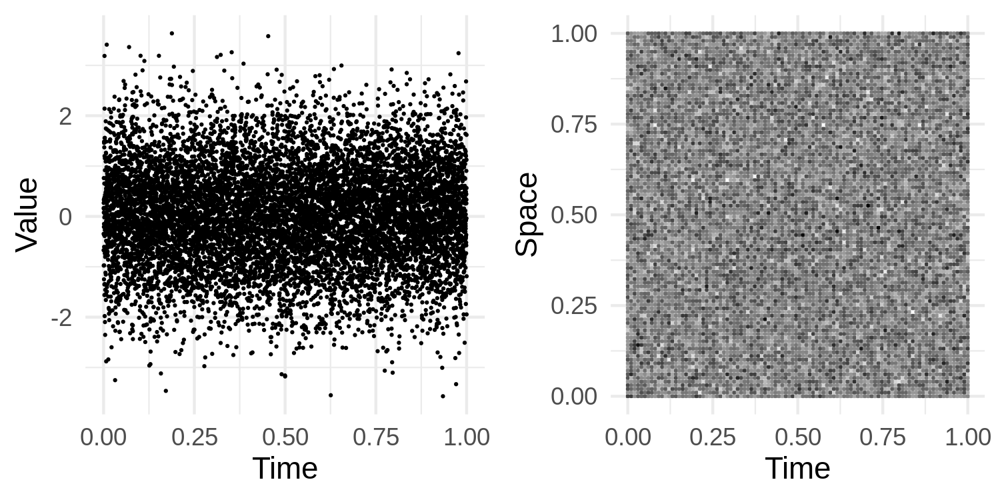
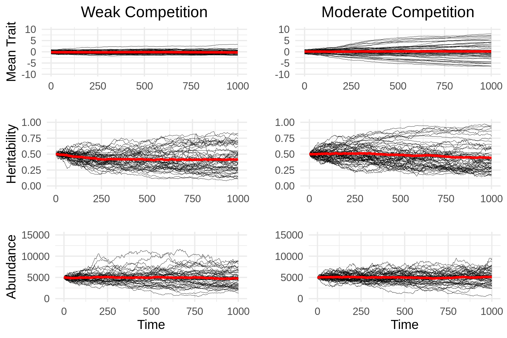
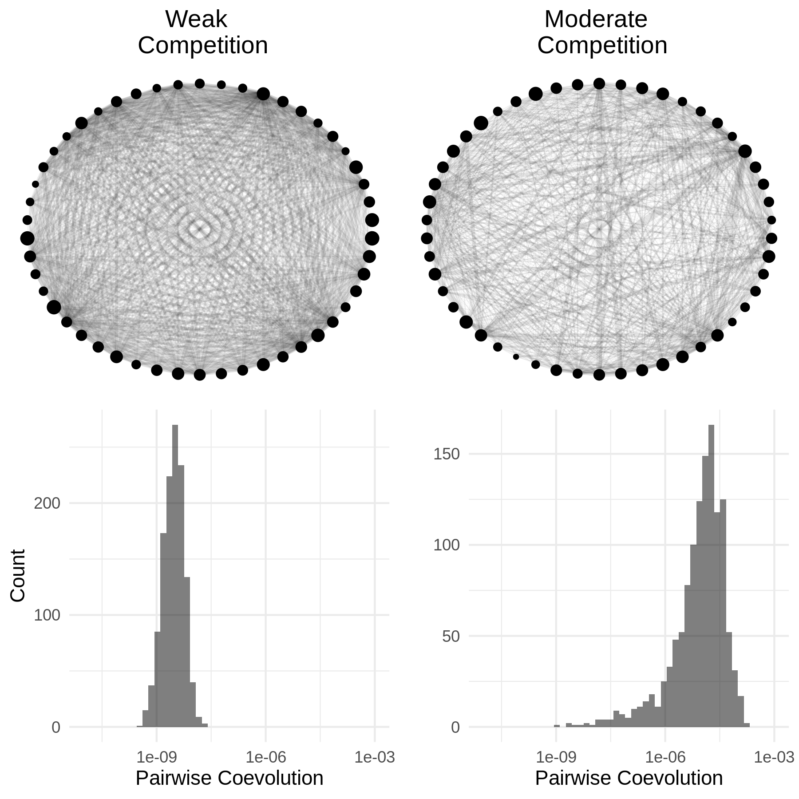

```{r global_options, include=FALSE}
#knitr::opts_chunk$set(fig.pos = 'H')
```

# Introduction

A primary aim of theoretical evolutionary ecology is the development of mathematical approaches to describe the evolution of biological populations and their interactions with both the biotic and abiotic environments in which they are embedded. Given this consideration a natural scope for such an approach centers on quantifying the abundance dynamics of populations and the evolution of traits mediating their interactions as functions of relevant abiotic factors. Although taking into account abundance, phenotype and environment provides the basis for a partial understanding of the complex nature of biological communities, a deeper understanding must account for the effects of contemporary dispersal and the phylogeographic history of interacting lineages [@Kraft2007; @Hickerson2010; @Manceau2016; @markmcpeek2017] along with the genetic basis of ecologically relevant traits [@jeffreyconner2004; @FUSSMANN2007] and feedbacks between populations and the biogeochemical cycles they ultimately depend on [@michelloreau2010; @9781107648258]. It is therefore ideal that the development of any such mathematical approach anticipates extensions to account for these important factors shaping ecological communities, especially as empirical and conceptual work in these directions continues to grow [@AbdalaRoberts2014; @Klzsch2015; @Crutsinger2015; @Fitzpatrick2015; @Fitzpatrick2017; @Marx2017; @Rudman2017; @Skovmand2018; @VanNuland2019; @Harmon2019]. Furthermore, the approach should have a stochastic component to capture the chance nature of biological reality [@Lande2003; @DeMeester2018; @Mubayi2019] and serve as a basis for the construction of statistical methods that measure evolutionary and ecological processes occuring in the wild. Such methods will tether theory to reality and allow for rigorous tests of hypotheses on the structure and behavior of ecological communities. In this paper we take one small step in this direction by establishing a formal connection between the continuous-time dynamics of abundance and quantitative traits in stochastically evolving populations and investigate the relationship between strengths of ecological interactions and coevolution.

Current theoretical approaches to synthesize evolution and ecology have capitalized on the fact that biological fitness plays a key role in determining both sets of dynamics. While correlation of fitness and genotype is the basis of evolution by natural selection, the mean fitness across all individuals in a population determines the growth, stasis or decline of abundance. In section \ref{deterministic} we review the mathematical formalization of this connection, which has been established in the contexts of population genetics [@9781932846126], evolutionary game theory [@9780674023383] and quantitative genetics [@Lion2018]. Although reviewing these accomplishments reveals a beautiful synthesis of evolution and population ecology, it also reveals a gap in theoretical approaches to incorporate the intrinsically random nature of populations. Specifically, in theoretical quantitative genetics the derivation of a populations' response to random genetic drift is derived in discrete time under the assumption of constant population (or effective population) size [@Lande1976]. Although this approach conveniently mimics the formalism provided by the Wright-Fisher model of population genetics, real population sizes fluctuate over time. Furthermore, since these fluctuations are themselves stochastic, it seems natural to derive expressions for the evolutionary response to demographic stochasticity and consider how the results relate to characterizations of random genetic drift. This can be done in continuous time for population genetic models without too much technical overhead, assuming a finite number of alleles. However, for populations with a continuum of types, such as a quantitative trait, this becomes a serious mathematical endeavor. Here we close this gap by applying some theory of stochastic partial differential equations (SPDE). Our goal is two-fold: 1) Communicate some useful results of SPDE to as wide of audience as possible. With this goal in mind we will not provide a rigorous treatment of SPDE. Instead, we introduce a set of heuristics that only require the basic concepts of Reimann integration, partial differentiation and some exposure to stochastic ordinary differential equations (SDE). For a concise introduction to SDE, we recommend the primer by Evans [-@9781470410544]. 2) Establish a novel synthetic approach to theoretical evolutionary ecology. To demonstrate the utility of our approach, we derive a model of coevolution in an ecological network and use it to investigate the relationship between competition coefficients and selection gradients.

We begin in section \ref{deterministic} with a brief review of progress in modelling the deterministic dynamics of populations. Section \ref{wnc} then introduces a useful set of mathematical tools based on the calculus of white noise. In section \ref{stochastic} we outline how to employ these tools to derive a system of SDE modelling abundance dynamics and the evolution of the mean and variance of a quantitative trait. In section \ref{particular} we derive particular results under the assumption of a normally distributed trait. Section \ref{inheritance} extends the previous results under the condition of imperfect inheritance. Section \ref{coev} demonstrates the utility of our framework through a derivation of a model of coevolution across a guild of $S$ species participating in exploitative competition along a common resource continuum. In section \ref{dynamics} we numerically compute distributions of traits and abundances along with interaction networks parameterized by selection gradients under the scenarios of weak and moderate competition, yielding theoretical possibilities for the distribution of pairwise coevolution in ecological communities. In section \ref{ecoevo} we investigate the relationship between the strengths of competition and coevolution. Finally, section \ref{conclusion} concludes with a few remarks on the limits of this approach along with future directions to incorporate more explicitly the genetic architecture of populations and feedbacks with ecosystem processes.

# The framework

At the core of our approach is a stochastic analog of the replicator equation with mutation in continuous time and phenotypic space [@Taylor1978; @Schuster1983]. From this stochastic replicator-mutator equation we derive a system of SDE for the dynamics of abundance, mean trait and additive genetic variance of a population. Hence, our approach develops a quantitative genetic theory of evolutionary ecology. A popular alternative to quantitative genetics is the theory of adaptive dynamics. As demonstrated by Page and Nowak [-@PAGE2002], the canonical equation of adaptive dynamics can be derived from the replicator-mutator equation. Thus, one could start from the atomic roots of our approach and pursue a stochastic adaptive dynamic theory instead. We choose the former in anticipation of an extension of our approach that explicitly models the genetic details of populations.

In this section we review the derivations of the replicator-mutator equation and trait dynamics from abundance dynamics and extend these formulae along with related results to the stochastic case. The results established in this section provide the framework from which larger scale ecological stuctures, such as species abundance distributions and interaction networks, can be derived.

## Deterministic dynamics \label{deterministic}

The connection between the deterministic dynamics of the abundance of a population and the frequencies of discrete phenotypes within it is well established via heterogeneity in the vital rates of differing phenotypes [ie, demographic heterogeneity, @Mubayi2019]. This is particularly evident in the derivation of the evolution of allele frequencies due to natural selection provided by Crow and Kimura [-@9781932846126, \S 5.3]. Specifically, denoting $N$ the abundance of the population, $m_i$ the growth rate [called the Malthusian parameter in @9781932846126] of allele $i$ and $p_i$ the frequency of this allele, we find (using their numbering scheme)

\begin{equation}
\dot N=N\sum_ip_im_i=\bar mN,\tag{5.3.3}
\end{equation}

\begin{equation}\label{popgen}
\dot p_i=(m_i-\bar m)p_i.\tag{5.3.5}
\end{equation}

Equation (\ref{popgen}) is known in the field of evolutionary game theory as the replicator equation [@9780674023383; @Lion2018]. Instead of being explicitly focused on alleles, the replicator equation describes the fluctuations of relative abundances of various _types_ in a population in terms of the vital rates of each type [@Taylor1978; @Schuster1983]. It is straight-forward to extend the replicator equation to include mutation, which is known as the replicator-mutator equation [@9780674023383]. To derive the replicator-mutator equation one can take the same steps to derive (\ref{popgen}) and inject a model of mutation via a matrix of transition rates [@9780674023383, eqn. 13.25]. Building on these insights, we derive an analog of the replicator-mutator equation for a continuum of types (that is, for a quantitative trait). In particular, for a continuously reproducing population at time $t$ with trait values $x\in\mathbb{R}$ and an abundance density $\nu(x,t)$, the demographic dynamics can be modelled by the general PDE

\begin{equation}\label{eq1}
\dot{\nu}(x,t)=F(\nu(x,t),x).
\end{equation}

More specifically, assuming selection is determined by the growth rate $m(\nu(x,t),x)$, mutation is captured by diffusion with coefficient $\frac{\mu}{2}$, and ignoring all other processes, we set

\begin{equation}\label{rxn_diff}
F(\nu(x,t),x)=m(\nu(x,t),x)\nu(x,t)+\frac{\mu}{2}\frac{\partial^2}{\partial x^2}\nu(x,t).
\end{equation}

In this case equation (\ref{eq1}) becomes a nonlinear reaction-diffusion equation. For brevity we often write the growth rate as just $m(\nu,x)$. As an example, logistic growth combined with quadratic stabilizing selection can be captured using the growth rate $m(\nu,x)=r-\frac{a}{2}(\theta-x)^2-c\int_\mathbb{R}\nu(x,t)dx$ where $a\geq0$ is the strength of stabilizing selection around the phenotypic optimum $\theta\in\mathbb{R}$, $c\geq0$ captures the effect of intraspecific competition and $r\in\mathbb{R}$ is the intrinsic growth rate in the absence of abiotic selection. We will always assume $r>0$. In section \ref{coev} we will derive a model of coevolution in which the associated fitness function shares some important properties with this fitness function. In particular, we show in SM \S\ref{finite} that fitness functions $m(\nu,x)$ satisfying
\begin{equation}\label{m_cond}
r-\frac{a}{2}(\theta-x)^2-c\int_\mathbb{R}\nu(x,t)dx\leq m(\nu,x)\leq r-\frac{a}{2}(\theta-x)^2
\end{equation}
for some $r,a,c\geq0$ guarantee finite total abundance $N(t)$, trait mean $\bar x(t)$ and trait variance $\sigma^2(t)$ for all $t\geq0$, so long as these variables have finite initial conditions. Since this is the only form of fitness we consider, for the remainder of this paper we assume
\begin{subequations}
\begin{align}
N(t)=&\int_\mathbb{R}\nu(x,t)dx <\infty, \\
|\bar x(t)|=&\frac{1}{N(t)}\left|\int_\mathbb{R}x\nu(x,t)dx\right|<\infty, \\ 
\sigma^2(t)=&\frac{1}{N(t)}\int_\mathbb{R}(x-\bar x(t))^2\nu(x,t)dx <\infty, \ \forall \ t\geq0.
\end{align}
\end{subequations}

To derive a replicator-mutator equation from the combination of equations (\ref{eq1}) and (\ref{rxn_diff}), we employ the chain rule from elementary calculus. Defining $p(x,t)=\nu(x,t)/N(t)$ as the relative density of trait $x$ at time $t$, we have

\begin{multline}
\dot N(t)=\frac{d}{dt}\int_\mathbb{R}\nu(x,t)dx=\int_\mathbb{R}\dot{\nu}(x,t)dx \\
=\int_\mathbb{R}m(\nu,x)\nu(x,t)+\frac{\mu}{2}\frac{\partial^2}{\partial x^2}\nu(x,t)dx \\
=N(t)\int_\mathbb{R}m(\nu,x)p(x,t)+\frac{\mu}{2}\frac{\partial^2}{\partial x^2}p(x,t)dx=\bar m(t) N(t)
\end{multline}

where, for $f:\mathbb{R}\to\mathbb{R}$, we define, when it exists, $\bar f(t)=\int_\mathbb{R}f(x)p(x,t)dx$. In particular $\bar m(t)$ is the mean fitness across all trait values in the population. Since $\nu(x,t)$ is continuous in $x$ and $\int_\mathbb{R}\nu(x,t)dx<\infty$, the result $\int_\mathbb{R}\frac{\partial^2}{\partial x^2}\nu(x,t)dx=0$ can be derived from the fundamental theorem of calculus. Biological reasoning agrees with this result since mutation neither creates nor destroys individuals, but merely changes their type from their parental type. Taking the same approach, we derive the dynamics of $p(x,t)$ as

\begin{multline}
\dot p(x,t)=\frac{\partial}{\partial t}\frac{\nu(x,t)}{N(t)}=\frac{N(t)\dot{\nu}(x,t)-\nu(x,t)\dot N(t)}{N^2(t)} \\
=\frac{1}{N(t)}\Big(m(\nu,x)\nu(x,t)+\frac{\mu}{2}\frac{\partial^2}{\partial x^2}\nu(x,t)-\bar m(t)\nu(x,t)\Big) \\
=(m(\nu,x)-\bar m(t)) p(x,t)+\frac{\mu}{2}\frac{\partial^2}{\partial x^2}p(x,t).
\end{multline}

This result closely resembles Kimura's continuum-of-alleles model [@Kimura1965]. The primary difference being that our model utilizes diffusion instead of convolution with an arbitrary mutation kernel. Of course, our model of mutation can be derived as an approximation to Kimura's model, which has been referred to as the Gaussian allelic approximation [in reference to the distribution of mutational effects at a given locus of a genome on the values of traits, @9780471986539], the infinitesimal model [in reference to modelling continuous traits as being encoded by an infinite number of loci each having infinitesimal effect, @Barton2017] and the Gaussian descendants approximation [in reference to offspring trait values being normally distributed around their parental values, @Turelli2017]. Alternatively, since diffusion is the continuous-time equivalent to convolution against a Gaussian kernel (SM \S\ref{diffconvequiv}), our model can also be seen as a special case of the continuum-of-alleles model. Under our model of mutation, the dynamics of the mean trait $\bar x(t)$ are derived as
\begin{multline}\label{detmean}
\dot{\bar x}(t)=\frac{d}{dt}\int_\mathbb{R}x p(x,t)dx=\int_\mathbb{R}x\dot p(x,t)dx \\
=\int_\mathbb{R}x\big(m(\nu,x)-\bar m(t)\big) p(x,t)+x\frac{\mu}{2}\frac{\partial^2}{\partial x^2} p(x,t)dx \\
=\mathrm{Cov}_t\Big(x,m(\nu,x)\Big)+\frac{\mu}{2}\int_\mathbb{R} x\frac{\partial^2}{\partial x^2} p(x,t)dx,
\end{multline}

where, for $f,g:\mathbb{R}\to\mathbb{R}$, we define, when it exists,

\begin{equation}
\mathrm{Cov}_t\Big(f(x),g(x)\Big)=\int_\mathbb{R}\big(f(x)-\bar f(t)\big)\big(g(x)-\bar g(t)\big)p(x,t)dx.
\end{equation}

Equation (\ref{detmean}) is a continuous time analog of the well known Robertson-Price equation [@Robertson1966; @PRICE1970; @FRANK2012; @Queller2017; @Lion2018]. In the particular case developed here, transmission bias only occurs when $p(x,t)$ is not symmetric around $\bar x$. In particular, when $p(x,t)$ is a Gaussian curve $\int_\mathbb{R}x\frac{\partial^2}{\partial x^2}p(x,t) dx=0$. Following this approach, in SM \S\ref{var_deriv} we derive the dynamics of the variance $\sigma^2(t)=\mathrm{Cov}_t(x,x)$ as

\begin{equation}\label{vardyn_det}
\dot{\sigma}^2(t)=\mathrm{Cov}_t\Big((x-\bar x)^2,m(\nu,x)\Big)+\frac{\mu}{2}\int_\mathbb{R}(x-\bar x)^2\frac{\partial^2}{\partial x^2}p(x,t)dx.
\end{equation}

In the absence of mutation equation (\ref{vardyn_det}) agrees with the result derived by Lion [-@Lion2018] for discrete phenotypes. When $p$ is Gaussian the increase in variance due to mutation simplifies to $\mu$. 

In the following sections we extend these results to the case when PDE (1) is driven by a space-time white noise process $\dot W(x,t)$. We begin by defining space-time white noise and illustrating its relevant properties. We then introduce a set of heuristics for performing calculations with respect to $\dot W(x,t)$. Since our aim is to present this material to as wide of audience as possible, our approach deviates from standard definitions to remove the need for a detailed technical treatment. For those not interested in the white noise calculus and would rather jump straight into more biologically relevant results, we recommend skipping to \S\ref{particular}.

## White noise calculus and superprocesses \label{wnc}

### Definition and basic properties \label{wnc_intro}

We define $L^2_C(\mathbb{R}\times[0,\infty))$ as the set of functions $f:\mathbb{R}\times[0,\infty)\to\mathbb R$ that are continuous in their second argument (time) and satisfy $\|f\|_2(t)=\sqrt{\int_\mathbb R f^2(x,t)dx}<\infty$. We define a generalized stochastic process $\mathbf W$ that maps functions $f\in L^2_C(\mathbb{R}\times[0,\infty))$ to real-valued stochastic processes indexed by $t\in[0,\infty)$. To evaluate this process for a function $f\in L^2_C(\mathbb{R}\times[0,\infty))$ and some time $t>0$ we write $\mathbf W_t(f)$. Specifically, for any $f,g\in L^2_C(\mathbb{R}\times[0,\infty))$, we define $\mathbf W(f)$ and $\mathbf W(g)$ to be Gaussian processes satisfying, for any $t,t_1,t_2\geq0$,

\begin{equation}\label{exp_WN}
\mathbb{E}\big(\mathbf W_t(f)\big)=\mathbb{E}\big(\mathbf W_t(g)\big)=0,
\end{equation}

\begin{equation}\label{cov_WN}
\mathbb{C}\big(\mathbf W_{t_1}(f),\mathbf W_{t_2}(f)\big)=\int_0^{t_1\wedge t_2}\int_\mathbb{R} f(x,s)g(x,s)dxds,
\end{equation}

where $t_1\wedge t_2=\min(t_1,t_2)$ and $\mathbb{E},\mathbb{C}$ denote expectation and covariance with respect to the underlying probability space. These operators are to be distinguished from $\bar f(t)$ and $\mathrm{Cov}_t(f,g)$ which denote expectation and covariance with respect to phenotypic diversity at time $t\geq0$.

Since Gaussian processes are characterized by their expectations and covariances, the processes $\mathbf W(f)$ and $\mathbf W(g)$ are well defined (under the convention $f=g$ whenever $\|f-g\|_2(t)=0$ for each $t>0$). In particular, if $f\in L^2_C(\mathbb{R}\times[0,\infty))$ is independent of time, then $\mathbf W(f)$ is a Brownian motion with variance $t\|f\|_2^2$. With the generalized process $\mathbf W$ defined, we define the space-time white noise $\dot W(x,t)$ implicitly via 

\begin{equation}
``\int_0^t\int_\mathbb{R}f(x,s)\dot W(x,s)dxds"=\mathbf W_t(f), \ \forall \ f\in L^2_C(\mathbb{R}\times[0,\infty)), \ t>0.
\end{equation}

We place quotations around the left-hand side of the above expression to emphasize its informal nature. Since space-time white noise, represented by the symbol $\dot W(x,t)$, does not exist as a function in the classical sense it cannot be integrated as suggested above. However, similar to the approach taken here, space-time white noise can be made sense of in a more abstract setting as a _measure_-valued process [@Dawson1975; @Walsh]. Hence, our use of integral notation is merely symbolic to provide intuition and should not be confused with classical Riemann integrals. One can think of $\dot W(x,t)$ as the static seen on old television sets or infinitely detailed random dust spread across both time and space. Figure \ref{wn} illustrates sample paths of white noise in one (left) and two (right) dimensions. 

```{r, include=F, eval=F}
require("ggplot2")
require("ggthemes")
require("plot3D")
require("gridExtra")

num1 = 1e4
num2 = 1e4

xi_1 = rnorm(num1)
xi_2 = rnorm(num2)

x1 = seq(0,1,length.out = num1)
x2 = seq(0,1,length.out = sqrt(num2))

M = expand.grid(x=x2,y=x2)
M$value = xi_2

df_1 = data.frame(xi=xi_1,x=x1)

wn1d = ggplot(df_1)+geom_point(aes(x=x,y=xi),size=0.05)+theme_bw()+xlab("Time")+ylab("Value")
wn2d = ggplot(M, aes(x, y, color = value))+scale_color_gradient(low="black", high="white")+geom_point(size=0.001, shape=22, show.legend = FALSE)+theme_bw()+xlab("Time")+ylab("Space")

wn = grid.arrange(wn1d,wn2d,nrow=1)

ggsave("~/Research/White Noise/wn.png",wn,width=5,height=2.5)
```

```{r, echo=F, fig.align='center', fig.cap='\\label{wn}Approximations of sample paths of temporal white noise (left) and space-time white noise (right) with brightness scaled to value.'}

```

Following our definition of white noise, when attempting to compute the value of this random field we sample it using $L^2_C(\mathbb{R}\times[0,\infty))$ functions. For example, integrating white noise over a region $D\times[0,t]$, with $t>0$ and $D$ a bounded subset of $\mathbb{R}$, is equivalent to evaluating $\mathbf W_t(I_{D\times [0,\infty)})$ where

\begin{equation}
I_{D\times [0,\infty)}(x,t)=\left\{\begin{matrix}
0, & x\notin D \\
1, & x\in D
\end{matrix}\right..
\end{equation}

Since $\int_\mathbb{R}I_{D\times [0,\infty)}^2(x,t)dx=\int_Ddx=|D|$, where $|D|$ denotes the length of $D$, $I_{D\times [0,\infty)}\in L^2_C(\mathbb{R}\times[0,\infty))$. Thus, by equations (\ref{exp_WN}) and (\ref{cov_WN}), we have 

\begin{equation}
\mathbb{E}\left(\int_0^t\int_D\dot W(x,s)dxds\right)=0,
\end{equation}

\begin{equation}
\mathbb{V}\left(\int_0^t\int_D\dot W(x,s)dxds\right)=t|D|,
\end{equation}

where $\mathbb{V}$ denotes the variance operator with respect to the underlying probability space. Following this notation, equations (\ref{exp_WN}) and (\ref{cov_WN}) can be rewritten as

\begin{equation}\label{exp_WN_xi}
\mathbb{E}\left(\int_0^t\int_\mathbb{R}f(x,s)\dot W(x,s)dxds\right)=0,
\end{equation}

\begin{equation}\label{cov_WN_xi}
\mathbb{C}\left(\int_0^{t_1}\int_\mathbb{R}f(x,s)\dot W(x,s)dxds,\int_0^{t_2}\int_\mathbb{R}g(x,s)\dot W(x,s)dxds\right)
=\int_0^{t_1\wedge t_2}\int_\mathbb{R}f(x,s)g(x,s)dxds.
\end{equation}

We write $d\hat{\mathbf W}_t(f)=\frac{1}{\|f\|_2(t)}\left(\int_\mathbb{R}f(x,t)\dot W(x,t)dx\right)dt$ (and typically suppress the dependency on time) so that

\begin{equation}
\int_0^td\hat{\mathbf W}(f)=\int_0^t\int_\mathbb{R}\frac{f(x,s)}{\sqrt{\int_\mathbb{R}f^2(s,y)dy}}\dot W(x,s)dxds.
\end{equation}

It follows that $\mathbb{E}\big(\int_0^td\hat{\mathbf W}(f)\big)=0$ and $\mathbb{C}\big(\int_0^{t_1}d\hat{\mathbf W}(f),\int_0^{t_2}d\hat{\mathbf W}(f)\big)=t_1\wedge t_2$. This implies that, as a function of $t$, $\int_0^td\hat{\mathbf W}(f)$ is a standard Brownian motion for any $f\in L^2_C(\mathbb{R}\times[0,\infty))$. Hence, $d\hat{\mathbf W}(f)$ is analogous to the traditional shorthand used to denote stochastic differentials. Thus, equation (\ref{cov_WN_xi}) effectively extends It&ocirc;'s multiplication table to:

\begin{table}[H]
\centering\caption{An extension of It\^o's multiplication table.}\vspace{0.2cm}
\begin{tabular}{l|lll}
             & $d\hat{\mathbf W}(f)$               & $d\hat{\mathbf W}(g)$                & $dt$ \\ \hline
             &                            &                            &      \\
$d\hat{\mathbf W}(f)$ & $dt$                       & $\frac{\left(\int_\mathbb{R}f \ g \ dx\right)dt}{\|f\|_2\|g\|_2}$ & $0$  \\
             &                            &                            &      \\
$d\hat{\mathbf W}(g)$ & $\frac{\left(\int_\mathbb{R}f \ g \ dx\right)dt}{\|f\|_2\|g\|_2}$ & $dt$                       & $0$  \\
             &                            &                            &      \\
$dt$         & $0$                        & $0$                        & $0$
\end{tabular}\label{mult}
\end{table}

The extension of It&ocirc;'s multiplication table and properties of white noise outlined in this subsection provide a useful set of tools for working with SPDE. In SM \S\ref{SDEriv} we employ these tools to derive SDE that track the dynamics of abundance, mean trait and phenotypic variance of a population from a particular SPDE. In the following subsection, we review how this SPDE naturally arises from diffusion limits of branching processes.

## From branching processes to SPDE \label{stochastic}

In real populations individuals are born and potentially reproduce before they ultimately die. These three events provide the basic ingredients of a branching process. Mathematical investigations of such processes have a relatively deep history [@Kendall1966]. The most simple branching process, known as the Galton-Watson process, describes the number of individuals alive at a given time $t\geq0$ as a non-negative integer [@Kimmel2015]. Feller [-@feller1951] introduced a formal method to approximate branching processes with diffusion processes which are continuous in state (ie, population size is approximated as a continuous quantity). Since diffusion processes possess greater analytical tractability than branching processes, Feller's method, known as the diffusion limit, has acquired immense popularity, particularly in the field of mathematical population genetics [@Ewens2004]. For over the past half of a century a great deal of accomplishments have been achieved in formalizing the diffusion limits of branching processes that describe biological populations with some continuous structure [@Watanabe1968; @Dawson1975; @Mlard1993; @edwinarendperkins1995; @zeng1998absolute; @alisonetheridge2000; @Bertoin2003; @Etheridge2008; @Barton2019]. This structure can represent geographic space or, relevant to our context, phenotypic space. One particularly important branching process with continuous structure is known as the branching Brownian motion. Unlike other stochastic processes that take values in $d$-dimensional Euclidean space, branching Brownian motion takes values in the set of non-negative finite measures over $\mathbb{R}^d$. Intuitively, one can think of a measure as a function that maps bounded subsets of $\mathbb{R}^d$ to real numbers. As a technical aside, we only consider the Borel subsets of $\mathbb{R}^d$. In particular, denoting $X_t$ a branching Brownian motion, for any $D\subset\mathbb{R}^d$, $X_t(D)$ returns the number of individuals alive within the region $D$ at time $t\geq0$. The branching Brownian motion has three main components: 

  1) __Spatial movement:__ Individuals are born at the current location of their parent and then move around space according to Brownian motion with diffusion parameter $\sqrt\mu$. In our context we interpret spatial movement as mutation so that the _location_ of an individual represents the value of its phenotype.
  
  2) __Branching rate:__ Lifetimes of these individuals are often assumed to be exponentially distributed. At the death of an individual, a branching event occurs where a random (possibly zero) number of offspring are left. However, in our case we will assume lifetimes are non-random and equal to a single unit of time for all individuals. From a mathematical standpoint this assumption makes little difference since many alternative branching processes lead to the same diffusion limit. However, we make this assumption because we are interpreting movement as mutation and are assuming the effects of mutations are independent and identically distributed for the trait values inherited by each offspring. Note that a Brownian motion with diffusion parameter $\sqrt\mu$ integrated over the unit interval is a zero-mean Gaussian random variable with variance $\mu$. This fact creates a vital link to the deterministic dynamics reviewed above. Indeed, in the absence of selection, the deterministic PDE combining equations (\ref{eq1}) and (\ref{rxn_diff}) reduces to the Fokker-Planck equation for a Brownian motion with diffusion parameter $\sqrt\mu$.
  
  3) __Branching mechanism:__ At a branching event, the parent leaves a random number of offspring. The distribution of offspring left is called the branching mechanism. Under the so-called critical condition the average number of offspring left is set equal to one. We denote the variance in reproductive output by $V$.
  
To obtain a SPDE from the branching Brownian motion we take a diffusion limit. For a population of size $n$ at time $t$ we rescale the mass of individuals and time by $1/n$, space by $1/\sqrt{n}$ and consider the limit as $n\to\infty$. That is, denoting $\sqrt n D=\{\sqrt n x:x\in D\subset\mathbb{R}^d\}$, we consider the rescaled process $X_t^{(n)}(D)=\frac{1}{n}X_{nt}(\sqrt n D)$. The limiting process $\mathscr{X}_t=\lim_{n\to\infty}X_t^{(n)}$ is called a super-Brownian motion and is also a non-negative finite measure-valued process [@Watanabe1968]. It turns out that for spatial dimension $d=1$, $\mathscr{X}_t$ is absolutely continuous for each $t\geq0$. This means that we can write $\mathscr{X}_t(D)=\int_D \nu(x,t)dx$ for some density process $\nu(x,t)$ [@Konno1988; @Reimers1989]. Under the critical condition this density process satisfies the SPDE

\begin{equation}\label{neutral_SPDE}
\dot\nu(x,t)=\frac{\mu}{2}\Delta\nu(x,t)+\sqrt{V\nu(x,t)}\dot W(x,t).
\end{equation}

The symbol $\Delta$, referred to as the Laplacian or Laplace operator, represents here the continuous extension of the second derivative $\frac{\partial^2}{\partial x^2}$ to the space of bounded continuous functions on $\mathbb{R}$ vanishing at $\pm\infty$. To rigorously interpret SPDE (\ref{neutral_SPDE}), we integrate the solution $\nu(x,t)$ against functions $f\in C_b^\infty(\mathbb{R})$, where $C_b^\infty(\mathbb{R})$ is the set of bounded and infinitely continuously differentiable functions on $\mathbb{R}$. That is, equation (\ref{neutral_SPDE}) is just an abbreviation for
\begin{multline}\label{neutral_int}
\int_\mathbb{R}\nu(x,t)f(x)dx-\int_\mathbb{R}\nu(x,0)f(x)dx \\
=\int_0^t\int_\mathbb{R}\nu(x,s)\frac{\mu}{2}\Delta f(x)dsdx+\int_0^t\int_\mathbb{R}f(x)\sqrt{V\nu(x,s)}\dot W(x,s)dxds.
\end{multline}

For more on the general theory of SPDE see Walsh [-@Walsh]. Note that since $\nu(x,t)$ is the density of a finite measure, it is integrable for each $t\geq0$. Thus, since $|f(x)|\leq M$ for every $x$ and some $M>0$, setting $\varphi(x,t)=f(x)\sqrt{V\nu(x,t)}$ implies $\varphi\in L^2_C(\mathbb{R}\times[0,\infty))$. Hence, the white noise integral on the right-hand side of equation (\ref{neutral_int}) can be understood using the heuristics introduced above. Evaluating equation (\ref{neutral_int}) in the particular case of $f(x)\equiv1$ returns the total mass process, which we refer to as the total abundance $N(t)$.

A convergence theorem for the diffusion limit of a more general version of the branching Brownian motion was established by Watanabe [-@Watanabe1968]. Dawson [-@Dawson1975] suggested that, for spatial dimension $d=1$, this diffusion limit should admit a density process that satisfies a SPDE. Konna and Shiga [-@Konno1988] and Reimers [-@Reimers1989] independently proved that this is the case. The diffusion limit of this more general branching process (in arbitrary spatial dimension) is referred to as the Dawson-Watanabe superprocess [@alisonetheridge2000]. Conditioning the Dawson-Watanabe superprocess to have constant mass returns the Fleming-Viot process [@Etheridge1991; @Perkins1991] which has been popular in studies of spatial population genetics. In particular, an extension of the Fleming-Viot process, known as the $\Lambda$-Fleming-Viot process, was introduced by Bertoin and Le Gall [-@Bertoin2003] and used (and coined) by Etheridge [-@Etheridge2008] to resolve some technical challenges in modelling isolation by distance [@Felsenstein1975; see also @Barton2013; and @Barton2019]. 

A more general version of the Dawson-Watanabe superprocess that includes interactions (which can represent, among other phenomena, density-dependent growth rates and frequency-dependent selection) was studied by Perkins [-@Perkins1992; -@edwinarendperkins1995]. When the interactions occur only at branching events, which in our case translates to independence of mutation and selection, the Dawson-Watanabe superprocess with interactions on one dimensional trait space has also been shown to satisfy a SPDE that admits function-valued solutions which are positive, integrable and continuous in time and space [@zeng1998absolute]. Hence, this process provides a very natural and mathematically convenient candidate to base our framework on.

Instead of formally developing the diffusion limit of a branching Brownian motion with interaction we skip directly to a special case of the SPDE found by Li [-@zeng1998absolute] mentioned above:
\begin{equation}\label{SPDE}
\dot{\nu}(x,t)=m(\nu,x)\nu(x,t)+\frac{\mu}{2}\Delta\nu(x,t)+\sqrt{V\nu(x,t)}\dot W(x,t).
\end{equation}

Note that, comparing equation (\ref{SPDE}) to equation (3.5) of Li [-@zeng1998absolute], our $m$ and $V$ correspond to Li's $b$ and $c$ respectively. Denoting $C_1(\mathbb{R})^+$ the set of non-negative, continuous, integrable functions on $\mathbb{R}$, it is important to note equation (\ref{SPDE}) is only formal when $m(h,x)$ is bounded across all $h\in C_1(\mathbb{R})^+$ and $x\in\mathbb{R}$. However, recalling condition (\ref{m_cond}), the $m(h,x)$ we consider are only bounded above. Replacing $m(h,x)$ with its upper-bound demonstrates that the associated superprocess should still take values in the set of finite measures. Hence, we should still be able to compute the total mass process $N(t)$. What remains is to show the spatial moments $\int_\mathbb{R}|x|^n\nu(x,t)dx$ are finite for each $t>0$ and $n\in\mathbb{N}$, assuming finite initial conditions. In SM \S\ref{numerical} we investigate this claim by comparing simulations of the Branching brownian motion with selection to analytical solutions of the PDE obtained by combining equations (\ref{eq1}) and (\ref{rxn_diff}). Our results suggest this assertion is sound, but it has yet to be rigorously justified. For now, we leave this as an open problem and assume all spatial moments are finite for every $t\geq0$.

### Derivation of SDE for $N$, $\bar x$ and $\sigma^2$ \label{SDEriv}

As noted above, the dynamics of abundance (referred to in the superprocess literature as the total mass process) is obtained by defining the process $N(t)=\int_{\mathbb{R}}\nu(x,t)dx$ and evaluating expression 

\begin{multline}
\int_\mathbb{R}f(x)\nu(x,t)dx-\int_\mathbb{R}f(x)\nu(x,0)dx \\
=\int_0^t\int_\mathbb{R}\nu(x,s)\left(m(\nu,x)f(x)+\frac{\mu}{2}\Delta f(x)\right)dxds+\int_0^t\int_\mathbb{R}f(x)\sqrt{V\nu(x,s)}\dot W(x,s)dxds
\end{multline}

with $f(x)\equiv1$ to obtain

\begin{equation}
N(t)-N(0)=\bar m(t)N(t)+\int_0^t\int_\mathbb{R}\sqrt{V\nu(x,s)}\dot W(x,s)dxds.
\end{equation}

Equation (\ref{cov_WN_xi}) implies

\begin{equation}
\mathbb{V}\left(\int_0^t\int_\mathbb{R}\sqrt{V\nu(x,s)}\dot W(x,s)dxds\right)=\int_0^t\int_\mathbb{R}V\nu(x,s)dxds=\int_0^tV N(s)ds.
\end{equation}

Following the notation introduced in \S\ref{wnc_intro}, we have

\begin{equation}
\int_0^td\hat{\mathbf W}_s(\sqrt{V\nu(x,s)})=\int_0^t\int_\mathbb{R}\frac{\sqrt{V\nu(x,s)}}{\sqrt{V N(s)}}\dot W(x,s)dxds
\end{equation}

is, as a function of $t$, a standard Brownian motion. To clean up notation set $dW_1(t)=d\hat{\mathbf W}_t(\sqrt{V\nu(x,t)})$. Then we can write the SDE for $N$ as

\begin{equation}\label{N}
dN(t)=\bar m(t)N(t)dt+\sqrt{V N(t)}dW_1(t).
\end{equation}

Under the assmption that $\int_\mathbb{R}(|x|+x^2)\nu(x,t)dx<\infty$ for each $t\geq0$, we show in SM \S\ref{SDE_DERIV} SDE for $\bar x$ and $\sigma^2$ can be expressed as

\begin{equation}\label{xbar_gen}
d\bar x(t)=\mathrm{Cov}_t\Big(x,m(\nu,x)\Big)dt+\frac{\mu}{2}\int_\mathbb{R}x\Delta p(x,t)dx+\sqrt{V\frac{\sigma^2(t)}{N(t)}}dW_2(t),
\end{equation}

\begin{multline}\label{sig2_gen}
d\sigma^2(t)=\left(\mathrm{Cov}_t\Big((x-\bar x(t))^2,m(\nu,x)\Big)+\frac{\mu}{2}\int_\mathbb{R}(x-\bar x(t))^2\Delta p(x,t)dx-V\frac{\sigma^2(t)}{N(t)}\right)dt \\ +\sqrt{V\frac{\overline{(x-\bar x(t))^4}-\sigma^4(t)}{N(t)}}dW_3(t).
\end{multline}

where $p(x,t)=\nu(x,t)/N(t)$ and $W_2,W_3$ are standard Brownian motions. In SM \S\ref{SDE_DERIV} we show that in general $W_1$ is independent of both $W_2$ and $W_3$, but $W_2$ and $W_3$ covary. The expressions derived can be used to investigate the dynamics of the mean and variance for general $\nu$. However, in the next section we further simplify these expressions by approximating $\nu$ with a Gaussian curve. In SM \S\ref{SDE_DERIV} we show that under the Gaussian case $W_1,W_2$ and $W_3$ are independent.

Before we make the Gaussian assumption, there is still quite a bit we can learn from expressions (\ref{xbar_gen}) and (\ref{sig2_gen}). Firstly, setting $V=0$ recovers the deterministic dynamics derived in \S\ref{deterministic}. Relating the response to demographic stochasticity derived here to the effect of random genetic drift derived in classic quantitative genetic theory, if we pretend that $\sigma^2(t)$ and $N(t)$ are constant with respect to time, then integrating the stochastic term in equation (\ref{xbar_gen}) over a single unit of time returns a normally distributed random variable with mean zero and variance equal to $V\sigma^2/N$. In particular, assuming perfect inheritance, when $V=1$ this random variable coincides with the effect of random genetic drift on the change in mean trait over a single generation derived using sampling arguments [@Lande1976]. There is also an interesting connection with classical population genetics. A fundamental result from early population genetic theory is the expected reduction in diversity due to the chance loss of alleles in finite populations [@Fisher1923; @Wright97]. This expected reduction in diversity due to random genetic drift is captured by the third term in the deterministic component of expression (\ref{sig2_gen}), but is now parameterized by the variance in reproductive output $V$.

## Particular results assuming a Gaussian phenotypic distribution \label{particular}

Gaussian phenotypic distributions are often obtained through Gaussian, exponential or weak selection approximations together with a simplified model of inheritance and random mating [@pmid17248993; @Turelli1984; @Turelli1986; @Turelli2017; @9780471986539]. Alternatively, it has been shown that a Gaussian distribution can provide a reasonable approximation even when selection is strong and non-Gaussian [@pmid7851785]. However, our approach adds an additional layer of difficulty. Even with Gaussian selection, the resulting solution to SPDE (\ref{SPDE}) will only be Gaussian in expectation, assuming a Gaussian initial condition. Yet this difficulty is not as challenging as it may first appear. Indeed, since SPDE (\ref{SPDE}) can be derived as a diffusion limit we know that, under the appropriate assumptions on selection, genetic architecture and reproduction, the stochastic departure from a Gaussian curve is negligible when the ratio $V/N$ is small (ie, when the variance in reproductive output is much smaller than the population size). In SM \S\ref{numerical} we demonstrate this result using numerical methods. Mathematically, this requirement restricts model parameters to regions that maintain large population sizes. Biologically, this implies populations are not at risk of extinction. Hence, models developed in this framework are not suitable for studying colonization-extinction dynamics or evolutionary rescue. Allowing for these restrictions, we may safely assume that $\nu$ is approximately Gaussian and justify writing

\begin{equation}
\nu(x,t)=\frac{N(t)}{\sqrt{2\pi\sigma^2(t)}}\exp\left(-\frac{\big(x-\bar x(t)\big)^2}{2\sigma^2(t)}\right).
\end{equation}

Under this assumption, Lande [-@Lande1976] found (suppressing the dependency on $t$)

\begin{equation}
\mathrm{Cov}(x,m)=\sigma^2\left(\frac{\partial\bar m}{\partial\bar x}-\overline{\frac{\partial m}{\partial\bar x}}\right).
\end{equation}

Under the same assumption, in SM \S\ref{var_deriv} we show

\begin{equation}
\mathrm{Cov}\Big((x-\bar x)^2,m\Big)=2\sigma^4\left(\frac{\partial\bar m}{\partial\sigma^2}-\overline{\frac{\partial m}{\partial\sigma^2}}\right)
\end{equation}

and $\overline{(x-\bar x)^4}=3\sigma^4$. In particular, this implies

\begin{equation}\label{xbar}
d\bar x=\sigma^2\left(\frac{\partial\bar m}{\partial\bar x}-\overline{\frac{\partial m}{\partial\bar x}}\right)dt+\sqrt{V\frac{\sigma^2}{N}}dW_2,
\end{equation}

\begin{equation}\label{G}
d\sigma^2=2\sigma^4\left(\frac{\partial\bar m}{\partial\sigma^2}-\overline{\frac{\partial m}{\partial\sigma^2}}\right)dt +\left(\mu-V\frac{\sigma^2}{N}\right)dt+\sigma^2\sqrt{\frac{2V}{N}}dW_3.
\end{equation}

Note that in the above expressions, the partial derivatives of $\bar m$ represent frequency independent selection and the averaged partial derivatives of $m$ represent frequency dependent selection. This relationship has already been pointed out by Lande [-@Lande1976] for the evolution of trait means, but here we see this relationship holds also for the evolution of trait variance. In the next subsection we generalize this result to the case when traits are imperfectly inherited. In this case, the phenotypic variance $\sigma^2$ is replaced by a genetic variance $G$ that represents the proportion of $\sigma^2$ explained by additive interactions of alleles at the same locus, but on different chromosomes, as well as the additive interactions among loci encoding for the focal phenotype [@joanroughgarden1979; @bulmer1980; @michaellynch1998]. For completeness we mention that any non-additive effect of interacting alleles at the same locus, but on different chromosomes, is referred to as dominance. Similarly, any non-additive effects among loci encoding for a quantitative character is referred to as epistasis. The variance $G$ is therefore fittingly referred to as the additive genetic variance.

## The evolution of additive genetic variance \label{inheritance}

To model imperfect heritability we consider the relationship between the expressed phenotype $x$ and its genetic component $g\in\mathbb{R}$ known as the _breeding value_ [@michaellynch1998]. We assume the absence of dominance and epistasis. The additive genetic variance can be modelled as the variance of breeding values in a population [@bulmer1980]. For any given individual with breeding value $g$, we assume the expressed phenotype is normally distributed around $g$ with variance $\eta$. We denote the density of this distribution by $\psi$ so that

\begin{equation}
\psi(x|g)=\frac{1}{\sqrt{2\pi\eta}}\exp\left(-\frac{(x-g)^2}{2\eta}\right).
\end{equation}

In terms of classic quantitative genetics $\eta$ is the known as the _variance of environmental deviation_ [@michaellynch1998] and $\psi$ plays a similar role as the _segregation kernel_ [@joanroughgarden1979]. To include this relationship in our framework, we write $\rho(g,t)$ as the abundance density of breeding values at time $t$. Hence $\int_\mathbb{R}\rho(g,t)dg=\int_\mathbb{R}\nu(x,t)dx=N(t)$. We switch our focus from directly modelling the evolution of $\nu(x,t)$ to modelling the evolution of $\rho(g,t)$. Once $\rho(g,t)$ is defined, we can compute $\nu(x,t)$ via

\begin{equation}\label{nu_from_rho}
\nu(x,t)=\int_\mathbb{R}\rho(g,t)\psi(x|g)dg.
\end{equation}

However, since selection acts on expressed phenotypes, we have to use our assumed relationship between breeding values and expressed traits to calculate the fitness of breeding values. Using equation (\ref{nu_from_rho}) we can write the Malthusian fitness of trait value $x$ as

\begin{equation}
m\big(\nu(x,t),x\big)=m\left(\int_\mathbb{R}\rho(g,t)\psi(x|g)dg,x\right)=\tilde m(\rho,x).
\end{equation}

Hence, we can also calculate the net Malthusian fitness of a breeding value $g$ as

\begin{equation}
m^*(\rho,g)=\int_\mathbb{R}\tilde m(\rho,x)\psi(x|g)dx.
\end{equation}

This is similar to the approach taken by Kimura and Crow [-@Kimura1978] to calculate the overall effects of selection for expressed characters onto the changes in the distribution of alleles encoding those characters. However, instead of focusing on the frequencies of alleles at particular loci, we focus on the densities of breeding values. With the relationship between $m(\nu,x)$ and $m^*(\rho,g)$ established, we define the evolution of $\rho(g,t)$ by

\begin{equation}
\dot\rho(g,t)=m^*(\rho,g)\rho(g,t)+\frac{\mu}{2}\Delta\rho(g,t)+\sqrt{V\rho(g,t)}\dot W(g,t).
\end{equation}

If we assume $\rho(g,t)$ is Gaussian its mode coincides with $\bar x$ and, denoting $G$ the variance of breeding values (ie, the additive genetic variance), $\sigma^2=G+\eta$. Hence, narrow sense heritability can be computed as $h^2=G/(G+\eta)$. Futhermore, since 

\begin{multline}
\bar m(t)= \int_\mathbb{R}m(\nu,x) p(x,t)dx =\frac{1}{N(t)}\int_\mathbb{R}\tilde m(\rho,x)\int_\mathbb{R}\rho(g,t)\psi(x|g)dgdx \\
=\frac{1}{N(t)}\int_\mathbb{R}\rho(g,t)\int_\mathbb{R}\tilde m(\rho,x)\psi(x|g)dxdg=\frac{1}{N(t)}\int_\mathbb{R}m^* (\rho,g)\rho(g,t)dg = \bar m^*(t),
\end{multline}

equations (\ref{xbar}) and (\ref{G}) become

\begin{equation}\label{xbarfinal}
d\bar x=G\left(\frac{\partial\bar m}{\partial\bar x}-\overline{\frac{\partial m}{\partial\bar x}}\right)dt+\sqrt{V\frac{G}{N}}dW_2,
\end{equation}

\begin{equation}\label{Gfinal}
dG=2G^2\left(\frac{\partial\bar m}{\partial G}-\overline{\frac{\partial m}{\partial G}}\right)dt+\left(\mu-V\frac{G}{N}\right)dt+ G\sqrt{\frac{2V}{N}}dW_3.
\end{equation}

# A model of diffuse coevolution \label{coev}

## Formulation

In this section we demonstrate the use of our framework by formulating a model of diffuse coevolution across a guild of $S$ species whose interactions are mediated by resource competition along a single niche axis. Our approach mirrors closely the theory developed by MacArthur and Levins [-@Macarthur1967], Levins [-@9780691080628] and MacArthur [-@Arthur1969; -@MacArthur1970; -@9780691023823]. The most significant difference, aside from allowing evolution to occur, is the treatment of resource quality, which we replace with a model of abiotic stabilizing selection. A derivation is provided in SM \S\ref{diffuse}.

For species $i$ we inherit the above notation for trait value, distribution, average, variance, abundance, etc except with an $i$ in the subscript. Real world examples of niche axes include the body size of prey for lizard predators and the date of activity in a season for pollinators competing for floral resources. For mathematical convenience, we model the axis of resources by the real line $\mathbb{R}$. The value of a resouce along this axis is denoted by the symbol $\zeta$. For an individual in species $i$, we assume the resource utilization curve $u_i$ can be written as

\begin{equation}
u_i(\zeta,x_i)=\frac{U_i}{\sqrt{2\pi w_i}}\exp\left(-\frac{(x_i-\zeta)^2}{2w_i}\right).
\end{equation}

We further assume the niche center $x_i$ is normally distributed among individuals in species $i$, but the niche breadth $w_i$ and total niche utilization $U_i$ are constant across individuals in species $i$ and therefore cannot evolve. Suppose $\theta_i\in\mathbb R$ is the optimal location along the niche axis for species $i$ such that, in the absence of competition, individuals leave on average $Q_i$ offspring when concentrated at $\theta_i$. We capture the rate by which the fitness falls as niche location $\zeta$ leaves the optimum $\theta_i$ by the parameter $A_i\geq0$. Hence, abiotic stabilizing selection along the resource axis can be modelled by the curve

\begin{equation}
e_i(\zeta)=Q_i\exp\left(-\frac{A_i}{2}(\theta_i-\zeta)^2\right).
\end{equation}

The effect of abiotic stabilizing selection on the fitness for an individual of species $i$ with niche location $x_i$ is then given by

\begin{equation}
\int_\mathbb{R}e_i(\zeta)u_i(\zeta,x_i)d\zeta=\frac{Q_iU_i}{\sqrt{A_iw_i+1}}\exp\left(-\frac{A_i}{2(A_iw_i+1)}(\theta_i-x_i)^2\right).
\end{equation}

To determine the potential for competition between individuals with niche locations $x_i$ and $x_j$, belonging to species $i$ and $j$ respectively, we compute the niche overlap

\begin{equation}
\mathcal O_{ij}(x_i,x_j)=\int_\mathbb{R}u_i(\zeta,x_i)u_j(\zeta,x_j)d\zeta=\frac{U_iU_j}{\sqrt{2\pi(w_i+w_j)}}\exp\left(-\frac{(x_i-x_j)^2}{2(w_i+w_j)}\right).
\end{equation}

In SM \S\ref{diffuse} we combine this niche model with equations (\ref{N}), (\ref{xbarfinal}) and (\ref{Gfinal}) to find

\begin{subequations}\label{comm_dynamics}
\begin{multline}
dN_i = \left\{R_i-\frac{a_i}{2}\Big((\bar x_i-\theta_i)^2+G_i+\eta_i\Big) + c_i\left(\sqrt{\frac{b_{ii}}{2\pi}}-\sum_{j=1}^SN_j\sqrt{\frac{b_{ij}}{2\pi}}e^{-\frac{b_{ij}}{2}(\bar x_i-\bar x_j)^2}\right)\right\}N_idt \\ + \sqrt{V_iN_i}dW_1,
\end{multline}

\begin{multline}
d\bar x_i = \left\{a_iG_i(\theta_i-\bar x_i)-c_iG_i\left(\sum_{j=1}^SN_jb_{ij}(\bar x_j-\bar x_i)\sqrt{\frac{b_{ij}}{2\pi}}e^{-\frac{b_{ij}}{2}(\bar x_i-\bar x_j)^2}\right)\right\}dt+\sqrt{V_i\frac{G_i}{N_i}}dW_2,
\end{multline}

\begin{multline}
dG_i = \left\{\mu_i-a_i{G_i}^2+c_i{G_i}^2\left(\sum_{j=1}^SN_jb_{ij}\left(1-b_{ij}(\bar x_i-\bar x_j)^2\right)\sqrt{\frac{b_{ij}}{2\pi}}e^{-\frac{b_{ij}}{2}(\bar x_i-\bar x_j)^2}\right)-V_i\frac{G_i}{N_i}\right\}dt \\+G_i\sqrt{\frac{2V_i}{N_i}}dW_3,
\end{multline}
\end{subequations}

where

\begin{subequations}
\begin{align}
R_i = & \ \ln \left(\frac{Q_iU_i}{\sqrt{1+A_iw_i}}\right), \\
a_i = & \ \frac{A_i}{1+A_iw_i}, \\
b_{ij}(t) = b_{ji}(t) = & \ \big(w_i+w_j+\eta_i+\eta_j+G_i(t)+G_j(t)\big)^{-1}, \\
c_i \geq & \ 0.
\end{align}
\end{subequations}

## Community dynamics \label{dynamics}

For the sake of illustration we numerically integrated system (\ref{comm_dynamics}) for a richness of $S=50$ species under two scenarios. For the first scenario of weak competition we randomly chose $c_i\sim\mathrm{Exp}(\mathtt{0.01})$ for each $i=1,\dots,S$ and for the second scenario of moderately strong competition we randomly chose $c_i\sim\mathrm{Exp}(\mathtt{0.1})$ for each $i=1,\dots,S$. Background parameters are drawn independently for each species from a common distribution. Specifically, we set model parameters according to Table \ref{par_vals}.

\begin{table}[H]
\centering\caption{UNDER CONSTRUCTION Distributions of model parameters under the scenarios of weak and moderate competition. The index $i$ runs through all $1,\dots, S$ species.}\vspace{0.2cm}
\begin{tabular}{l|l|l|l}
Parameter     & Description & Weak Competition             & Moderate Competition                                         \\ \hline
$R_i$         & innate growth rate, see \S\ref{ecoevo}  & $\mathrm{Unif}(\mathtt{0.0},\ \mathtt{1.0})$ & \text{same}    \\
$\theta_i$    & abiotic optimum & $\mathrm{Unif}(\mathtt{-1.0},\ \mathtt{1.0})$            & \text{same}                  \\
$a_i$         & strength of abiotic selection & $\mathrm{Exp}(\mathtt{0.01})$              & \text{same}                  \\
$c_i$         & strength of competition & $\mathrm{Exp}(\mathtt{0.01})$                    & $\mathrm{Exp}(\mathtt{0.1})$ \\
$w_i$         & niche breadth & $\mathrm{Unif}(\mathtt{0.01},\ \mathtt{1.0})$              & \text{same}                  \\
$U_i$         & total niche use & $\mathrm{Unif}(\mathtt{0.01},\ \mathtt{1.0})$            & \text{same}                  \\
$\eta_i$      & segregation variance & $\mathrm{Unif}(\mathtt{1.0e-5}, \ \mathtt{1.0e-3})$ & \text{same}                  \\
$\mu_i$       & mutation rate & $\mathrm{Exp}(\mathtt{0.01})$                              & \text{same}                  \\
$V_i$ & variance of reproductive output & $\mathrm{Exp}(\mathtt{0.01})$            & \text{same}
\end{tabular}\label{par_vals}
\end{table}

With these two sets of model parameters, we simulated our model for \texttt{1.0e3} units of time. For both scenarios, we initialized the abundances to $N_i=$\texttt{5.0e3}, trait means to $\bar x_i=$\texttt{0.0} and heritability to $h^2_i=$\texttt{0.5} for each $i=1,\dots,S$. Temporal dynamics for each scenario are provided in Figure \ref{temporal}. Interaction networks and the distribution of coevolution at $t=$\texttt{1e3} for each scenario are displayed in Figure \ref{net}.

```{r, message=FALSE, echo=F, fig.align='center', fig.cap='\\label{temporal}Temporal dynamics of mean trait (top), heritability (middle) and abundance (bottom) for the scenario of weak competition (left) and strong competition (right). Red lines indicate average trend across species.'}

```

## The relation between the strength of ecological interactions and coevolution \label{ecoevo}

Relating our treatment of the niche to modern coexistence theory [@Chesson2000], the absolute competition coefficient $\alpha_{ij}$ becomes a dynamical quantity that can be written as

\begin{equation}
\alpha_{ij}(t)=\frac{c_i}{r_i(t)}\int_{\mathbb R}\int_{\mathbb R}p_i(x,t)p_j(y,t)\mathcal O_{ij}(x,y) dxdy =\frac{c_i}{r_i(t)}\sqrt\frac{b_{ij}(t)}{2\pi}\exp\left(-\frac{b_{ij}(t)}{2}\big(\bar x_i(t)-\bar x_j(t)\big)^2\right),
\end{equation}

where

\begin{equation}
r_i(t)=R_i-\frac{a_i}{2}\Big((\bar x_i(t)-\theta_i)^2+G_i(t)+\eta_i\Big) + c_i\sqrt{\frac{b_{ii}(t)}{2\pi}}.
\end{equation}

Hence, $dN_i(t)$ can be expressed as

\begin{equation}
dN_i(t)=r_i(t)\left(1-\sum_{j=1}^S\alpha_{ij}(t)N_j(t)\right)N_i(t)dt+\sqrt{V_iN_i(t)}dW_1(t).
\end{equation}

Note that although $r_i(t)$ is referred to in the coexistence literature as the intrinsic growth rate of the population, $R_i$ is a deeper intrinsic quantity. For now we refer to $R_i$ as the _innate_ growth rate. With this connection formally established, researchers may pursue a postmodern coexistence theory that naturally includes the evolutionary dynamics of populations and the effects of demographic stochasticity.

In SM \S\ref{diffuse} we show that the standardized directional selection gradient [sensu @Lande1983] induced by species $j$ on species $i$ can be computed as

\begin{equation}
\beta_{ij}(t)=c_iN_j(t)b_{ij}(t)\big(\bar x_i(t)-\bar x_j(t)\big) \sqrt\frac{b_{ij}(t)}{2\pi}\exp\left(-\frac{b_{ij}(t)}{2}\big(\bar x_i(t)-\bar x_j(t)\big)^2\right).
\end{equation}

Our notation differs from Lande and Arnold [-@Lande1983] in that subscripts here denote species instead of components of multivariate traits and we drop the prime that distinguishes between selection gradients and standardized selection gradients. 

Below we compare interaction networks parameterized by $\alpha_{ij}$ with those parameterized by standardized selection gradients to investigate the correspondence of interaction intensity and coevolutionary change. However, we can already identify one major discrepancy; $\alpha_{ij}$ is maximized when $\bar x_i=\bar x_j$, but $\beta_{ij}=0$ under the same condition. We therefore include in our metric of selection the standardized stabilizing selection gradient $\gamma$ which measures the effect of stabilizing or disruptive selection on phenotypic variance [@Lande1983]. In SM \S\ref{diffuse} we show that the standardized stabilizing selection gradient induced by species $j$ on species $i$ can be computed as

\begin{equation}
\gamma_{ij}(t)=c_iN_j(t)b_{ij}(t)\left(1-b_{ij}(t)\big(\bar x_i(t)-\bar x_j(t)\big)^2\right) \sqrt\frac{b_{ij}(t)}{2\pi}\exp\left(-\frac{b_{ij}(t)}{2}\big(\bar x_i(t)-\bar x_j(t)\big)^2\right).
\end{equation}

Note that when $b_{ij}^{-1}>(\bar x_i-\bar x_j)^2$, $\gamma_{ij}>0$ and when $b_{ij}^{-1}<(\bar x_i-\bar x_j)^2$, $\gamma_{ij}<0$. To measure the total evolutionary change in species $i$ induced by species $j$, we form the metric $\Psi_{ij}=|\beta_{ij}|+|\gamma_{ij}|$. The top row of Figure \ref{net} displays interaction networks under weak and moderate competition where the edge width connecting species $i$ and $j$ is proportional to $\alpha_{ij}\alpha_{ji}$. The bottom row of Figure \ref{net} displays the distributions of pairwise coevolutionary change, which we measure via $\Psi_{ij}\Psi_{ji}$, under weak and moderate competition.

```{r, echo=F, fig.align='center', fig.cap='\\label{net}UNDER CONSTRUCTION Networks of interspecific interactions (top row) and distributions of pairwise coevolution (bottom row) under the scenarios of weak competition (left) and moderate competition (right) at time $t=$\\texttt{1.0e3}. Node sizes are proportional to population sizes. Edge widths and shade are monotonically increasing functions of pairwise coevolution.'}

```

We now make use of the expressions derived for competition coeffecients and selection gradients to investigate their relationship. As a first pass, let us assume all model parameters are equivalent across species and that each species has the same abundance and trait variance. Let us further assume that richness $S$ is large and the distribution of mean trait values is normal with mean $\bar{\bar x}$, variance $V_{\bar X}$ and density $f_{\bar X}$. Such assumptions are typical when deriving analytical results in the field of theoretical coevolutionary community ecology [@Nuismer2012; @Nuismer2018]. If $V_{\bar X}$ is not too large, then we may approximate $r_i$ with

\begin{equation}
\bar r=\int_\mathbb{R}\left(R-\frac{a}{2}\Big((\bar x-\theta)^2+G+\eta\Big)+c\sqrt{\frac{b}{2\pi}}\right)f_{\bar X}(\bar x)d\bar x
=R-\frac{a}{2}\Big((\bar{\bar x}-\theta)^2+V_{\bar X}+G+\eta\Big)+c\sqrt{\frac{b}{2\pi}}
\end{equation}

Write $\alpha(\bar x_i,\bar x_j)=\alpha_{ij}$, $\beta(\bar x_i,\bar x_j)=\beta_{ij}$ and $\gamma(\bar x_i,\bar x_j)=\gamma_{ij}$. In SM \S\ref{coef_grad_moms} we use these assumptions to calculate the first and second order moments describing the joint distribution of competition coefficients and selection gradients across the community. In particular, the correlations between these quantities are found to be:

UNDER CONSTRUCTION

\begin{subequations}

\begin{equation}
\mathrm{Corr}_{f_{\bar X}}(\alpha,\beta)=
\end{equation}

\begin{equation}
\mathrm{Corr}_{f_{\bar X}}(\alpha,\gamma)=
\end{equation}

\begin{equation}
\mathrm{Corr}_{f_{\bar X}}(\gamma,\beta)=
\end{equation}

\end{subequations}

# Conclusion \label{conclusion}

We have introduced an approach to derive models of evolutionary ecology using the calculus of white noise, demonstrated our approach by deriving a model of diffuse coevolution and investigated the relationship between coevolutionary change and competition coefficients, finding that these quantities are weakly correlated with each other. Although our approach has the merit of rigorously synthesizing the dynamics of abundance and phenotypic evolution of populations, there remains nuance details and important limitations that have yet to be confronted for gaining a more thorough and rigorous understanding of ecological communities. We touch on just five of them here.

__Limitations of diffusion limits__

As noted by Feller [-@feller1951], although diffusion limits provide reasonable approximations for large populations, relatively small populations require discrete models. Hence, as a diffusion limit, SPDE (\ref{SPDE}) restricts parameter values to regions that maintain large population sizes. This puts an important restriction on any model developed under this framework by implying populations are not at risk of extinction. Hence, studies of evolutionary rescue and colonization-extinction dynamics must be pursued via a different approach. A natural alternative can be developed utilizing the underlying branching Brownian motion process that SPDE (\ref{SPDE}) is a diffusion limit of (see section \ref{stochastic}). This process explicitly tracks individuals throughout their life-history and captures reproduction as branching events and therefore models population size $n$ as a non-negative integer instead of a continuously varying positive number. In particular, there is no restriction that prevents $n=0$. We avoided use of this process here because the resulting models are less analytically tractable and numerical implementations become computationally expensive for large $n$.

__The genetic architecture and distributions of traits__

Our model of coevolution rests on the assumption of normally distributed traits, which itself depends on a simplistic model of genetic architecture (see sections \ref{deterministic} and \ref{inheritance}). However, real traits are not encoded by an infinite number of loci each contributing an additive infinitesimal effect and mutations are not inherited as normally distributed deviations from parental breeding values. Departures from this model of genetic architecture can produce more complex distributions of breeding values and expressed traits. Such deviations can be reinforced via strong non-Gaussian selection surfaces, including the surface $m(\nu,x)$ we have derived from niche theory, along with non-random mating. Gaussian approximations are convenient since they are defined by their mean and variance. Hence, future work investigating the effects of non-normally distributed traits on the structure and dynamics of ecological communities will need to confront higher moments such as skew and kurtosis, ideally integrating previously established mathematical approaches to derive the dynamics of these higher moments [@Dbarre2015EvolutionOQ].

An alternative approach to breaking the assumption of normally distributed trait values is the development of explicit multilocus models. These models describe the contributions of alleles at particular loci in the genome to the development of quantitative traits. Tracking the fluctuations of allele frequencies then allows theoreticians to investigate the dynamics of phenotypic distributions that deviate from normality. While this approach has a long history in theoretical quantitative genetics [@bulmer1980; @pmid7851785; @Kirkpatrick1727] and coevolutionary theory [@Nuismer2005; @Kopp2006; @Nuismer2007], work to investigate the role of genetic architecture in mediating feedbacks between the dynamics of population abundances and the distributions of traits mediating ecological interactions has only just begun [@Patel2019].

__The distinction of niche overlap and competition__

Past work has demonstrated several limitations in measuring competition via niche overlap [@Abrams1980; @Holt1987]. In particular, Abrams [-@Abrams1980] argues the MacArthur-Levins framework utilized here is unnacceptable when nothing is known about the biological mechanism mediating competition. Hence, we must stress that our approach should not be blindly applied to arbitrary communities, but that a great deal of work interpreting our model with respect to the system is a prerequisite task. For example, in the case of a sub-alpine flowering plant community, the niche axis can be interpreted as day-of-year (under a suitable transformation). Our model then assumes within-season fluctuations in the ensemble of abiotic factors including temperature, precipitation, soil nutrients and pollinator activity induces an emergent abiotic optimal date that maximizes fitness in the absence of competition. This optimum likely differs across species with significantly different physiologies and potentially carries a phylogenetic signal. We therefore expect $\theta_i\neq\theta_j$ for our interpretation with respect to a sub-alpine flower community. Individual plants competing for their optimal date to flower then induce the exploitative competition we are modelling.

Another component of Abrams' critique is the distinction between niche overlap and measurements of competition. We also agree that this is an important distinction and is explicitly captured in our model by decomposing the effect of competition on fitness for individuals in species $i$ as the product of niche overlap and a number $c_i>0$ which we have dubbed the strength of competition. In our model, niche overlap merely determines whether or not an interaction occurs and to what frequency. The strength of competition then determines what effect this interaction has on fitness. A natural generalization is to assume the strength of competition between species $i$ and $j$ can be captured by a function of some other trait values. For example, if $y_i$ represents some other trait in species $i$, potentially morphological (flower shape) or physiological (water use efficiency), determining the outcome of indirect interspecific interactions between competitors (pollinator preference or nutrient availability) we can model the strength of competition between species $i$ and $j$ as a function $f$ of the distribution of this trait in each species. If this trait correlates with niche centers across individuals within species, or if resource utilization curves $u_i$ depend on $y_i$, or if $f$ depends on niche centers, the effect on fitness due to competition can no longer be decomposed multiplicatively into distinct components. Hence, our model also requires the necessary assumptions for this decomposition to hold, which vary from system to system.

In another critique by Holt [-@Holt1987], it is argued that utilizations of qualitatively distinct resources may have non-multiplicative effects on components of fitness. This consideration has also been incorporated into our model. In our derivation of fitness in SM \S\ref{diffuse}, we show that distinct components of the growth rate of populations can be decomposed additively under certain circumstances, though further work is needed to develop a general roadmap for when components of fitness can be decomposed additively or multiplicatively.

__The role of ecological stoichiometry__

Our treatment of both biotic and abiotic selection neglects important chemical constraints of biological reality. For instance, the resource we assume species are competing over is modelled as a static quantity. However, real resources can be dynamic quantities. Such theoretical quantities may reflect abiotic cycles of material and energy or whole trophic layers comprised of prey, hosts or mutualists. Although resource dynamics have been captured theoretically in consumer-resource models [@davidtilman1982], developing a more realistic model of resource competition must incorporate details on the ecophysiology of organisms [@michelloreau2010]. Doing so will help clarify the feedback between the evolution of populations and the ecosystem processes they are a part of. 

Using plant-pollinator communities as an example, the role of nitrogen mediating interspecific interactions has been reviewed by David, Storkey and Stevens [-@David2019] and the evolutionary ecology of the nutritional content of nectar has been reviewed by Parachnowitsch, Manson and Sletvold [-@Parachnowitsch2018]. These studies demonstrate the need for further research to understand how soil nutrient availability and organismal ecophysiology structures communities of plants and pollinators. Theoretical pursuits in this directions may profit from interfacing the framework we have outlined here with population-ecosystem models such as that developed by Fridley [-@Fridley2017].

__Accounting for macroevolutionary history__

To understand patterns found in ecological communities, considerations must push beyond microevolutionary and contemporary ecological processes and consider the macroevolutionary dynamics of ancestral lineages leading to extant populations. Returning to our example of sub-alpine flower communities, one can observe a very strict ordering of phenology across broad geographic ranges. In particular, whether in the Colorado Rocky mountains (such as Gothic, Colorado) or on an outlier of the Idaho batholith (such as Kamiak butte near Palouse, Washington), one will almost surely observe a very conspicuous order of flowers emerging in early spring: at the very beginning of the season blooms _Claytonia lanceolata_ followed by _Erythronium grandiflorum_ which precedes _Delphinium nuttallianum_ (B. Week, personal observations). If contemporary phenological coevolution is rampant, why should this pattern be so well preserved across a thousand miles of rugged and diverse terrain? A more parsimoniuous hypothesis suggests the phenology and physiology of these species slowly evolved independently over macroevolutionary time scales to take advantage of the specific conditions available within each of these windows of the flowering season. However, this could not have carried out in the Rocky mountains since this terrain only became habitable just over ten thousand years ago as the glaciers of the Pleistocene began to retreat (Paul CaraDonna, personal communications). Hence, given these considerations, it appears that an understanding of early season phenology patterns should focus on how these communities are assembled as opposed to contemporary evolutionary dynamics. Indeed, recent work testing models of phylogeography ignores the potential for contemporary evolution and instead suggests alpine flower communities tend to follow neutral assembly where flowers merely compete for who can disperse to new habitat first, as opposed to a selective process where a regional species pool is filtered for those species adapted to the newly available habitat [@Marx2017]. 

Of course microevolutionary and ecological dynamics are not completely irrelevant for understanding patterns in communities that are primarily structured by deep evolutionary processes. In particular, macroevolutionary trait evolution is simply the aggregation of microevolutionary change occuring over large spans of time. This suggests a road forward to connect the theory we have introduced to models of macroevolutionary trait evolution that differs from previous approaches [@Manceau2016]. These previous approaches make the implicit assumption that trait evolution is scale free (ie, self-similar) so that the stochastic evolution of traits on macroevolutionary time scales has the same properties of trait evolution on microevolutionary time scales. In fact, many of these models simply repurpose microevolutionary models by blindly rescaling time from the units of generations to millions of years [@Nuismer2014]. Although some stochastic processes including Brownian motion do exhibit self-similarity, others do not. For example, consider a modification of the Ornstein-Uhlenbeck process defined by the SDE

\begin{equation}
dX_t=a(\theta_t-X_t)dt+bdW_t
\end{equation}

where $a,b>0$, $W_t$ is a standard Brownian motion and $\theta_t$ is itself a Markov process that takes normally distributed jumps centered on its current location at exponentially distributed time intervals. If we assume the rate $\lambda$ at which jumps occur is much smaller than $a$ and the variance in jumping is much larger than $b^2$, then, even though the sample paths of $X_t$ are actually continuous, over long intervals of time sample paths of $X_t$ will begin to appear to have periods of continuity interrupted by an occasional discontinuous jump and thus approach a qualitatively distinct process. These emergent properties can be formally characterized by L&eacute;vy processes and have been successfully employed in comparative phylogenetics to fit phenotypic data from extant populations and the fossil record [@Landis2017]. It would therefore be interesting to investigate whether a separation of time scales argument for the rate of environmental change ($\lambda$) versus the rate of evolutionary and ecological change ($a$) to microevolutionary models derived using our framework can be used to obtain macroevolutionary models that include not only mean trait evolution, but also the evolution of trait variance and abundance. The resulting macroevolutionary models can give rise to novel comparative phylogenetic methods and provide initial conditions for microevolutionary models that capture contemporary dynamics.

__Final remarks__

Although top-down approaches to community ecology, such as the Maximum Entropy Theory of Ecology [@Harte2011], have enjoyed some success in describing community-level patterns [@Harte2014; @Xiao2015], a mechanistic understanding of why these patterns emerge and how they will change remains a formidable task. Such an understanding must take both bottom-up and top-down approaches integrating considerations from the ecophysiology of individual organisms that reveal the economics of interspecific interactions [@Sterner2008], to the phylogeographic history of taxa that sets the stage for contemporary dynamics [@Hickerson2010]. Through connecting these dots we can increase the variance explained in observations of ecological communities by specific mechanisms and come closer to a predictive theory of evolutionary community ecology. Despite the long list of equations derived in this paper, this work takes just one small step towards capturing these many details. However, we hope the theoretical framework outlined here along with the demonstration of its use in modelling competitive communities provides some helpful tools to aid quantitative evolutionary ecologists in reaching such lofty goals.

\newpage

# Supplementary material (SM)

## Sufficient conditions for finite mean, variance and total abundance \label{finite}

We assume, for $m:C_1(\mathbb{R})^+\times\mathbb{R}\to\mathbb{R}$, there exists $\theta\in\mathbb{R}$ and $a,c,r>0$ such that, for each $(f,x)\in C_1(\mathbb{R})^+\times\mathbb{R}$,

\begin{equation}\label{m_ineq}
r-\frac{a}{2}(\theta-x)^2-c\int_\mathbb{R}f(x)dx \leq m(f,x)\leq r-\frac{a}{2}(\theta-x)^2.
\end{equation}

Assume that $\nu_0\in C_1(\mathbb{R})^+$ is twice continuously differentiable and satisfies

\begin{equation}
\int_\mathbb{R}|x|\nu_0(x)dx,\int_\mathbb{R}x^2\nu_0(x)dx<\infty.
\end{equation}

Then

\begin{multline}
\int_\mathbb{R}\big|m(\nu_0,x)\big|\nu_0(x)dx\leq\int_\mathbb{R}\left(r+\frac{a}{2}x^2+c\int_\mathbb{R}\nu_0(y)dy\right)\nu_0(x)dx \\ \leq \left(r+\frac{a}{2}\Big((\theta-\bar x_0)^2+\sigma^2_0\Big)+cN_0\right)N_0,
\end{multline}

where the initial phenotypic mean $\bar x_0$, phenotypic variance $\sigma^2_0$ and total abundance $N_0$ are finite by our assumptions on $\nu_0(x)$. To simplify analysis, we further assume

\begin{equation}
\nu_0(x)=\frac{N_0}{\sqrt{2\pi\sigma_0^2}}\left(-\frac{(x-\bar x_0)^2}{2\sigma_0^2}\right).
\end{equation}

If some function $f(x,t)$ that maps $\mathbb{R}\times[0,\infty)$ to $\mathbb{R}$ satisfies, for each fixed $t\geq0$, $f(\cdot,t)\in C_1(\mathbb{R})^+$, then by $m(f,x)$ we mean $m(f(\cdot,t),x)$ for each $t\geq0$. With this convention, consider the following initial value problem (IVP):

\begin{equation}\label{IVproblem}
\left\{\begin{matrix}
\dot\nu(x,t)=& m(\nu,x)\nu(x,t) + \frac{\mu}{2}\Delta\nu(x,t), & (x,t)\in\mathbb{R}\times(0,\infty)\\
\nu(x,t)=&\nu_0(x), & (x,t)\in\mathbb{R}\times\{0\}
\end{matrix}\right.
\end{equation}

To solve for the lower bound of $\nu(x,t)$, let us assume $m(f,x)=r-\frac{a}{2}(\theta-x)^2-c\int_\mathbb{R}f(x)dx$. Then

\begin{equation}
\bar m(t)=\frac{\int_\mathbb{R}m(\nu,x)\nu(x,t)dx}{\int_\mathbb{R}\nu(x,t)dx}=r-\frac{a}{2}\Big(\big(\theta-\bar x(t)\big)^2+\sigma^2(t)\Big)-cN(t).
\end{equation}

If the solution $\nu(x,t)$ to the IVP (\ref{IVproblem}) is Gaussian, then we can derive differential equations for $\bar x$, $\sigma^2$ and $N$ as in the main text to get

\begin{equation}
\dot{\bar x}=\sigma^2\left(\frac{\partial\bar m}{\partial\bar x}-\overline{\frac{\partial m}{\partial\bar x}}\right)=a\sigma^2\big(\theta-\bar x\big)
\end{equation}
\begin{equation}
\dot\sigma^2=\mu+2\sigma^4\left(\frac{\partial\bar m}{\partial\sigma^2}-\overline{\frac{\partial m}{\partial\sigma^2}}\right)=\mu-a\sigma^4
\end{equation}
\begin{equation}
\dot N=\bar m N=\Big[r-\frac{a}{2}\Big(\big(\theta-\bar x\big)^2+\sigma^2\Big)-cN\Big]N.
\end{equation}

Under these assumptions, we can calculate the time derivative of $\nu(x,t)$ as

\begin{multline}
\dot\nu(x,t)=\left(\frac{\dot N}{N}+\frac{2\dot{\bar x}(x-\bar x)\sigma^2+\big((x-\bar x)^2-\sigma^2\big)\dot\sigma^2}{2\sigma^4}\right)\nu(x,t) \\
=\left(\bar m+a(x-\bar x)(\theta-\bar x)+\frac{\mu}{2}\frac{\big((x-\bar x)^2-\sigma^2\big)}{\sigma^4}-\frac{a}{2}\big((x-\bar x)^2-\sigma^2\big)\right)\nu(x,t) \\
=\left(r-\frac{a}{2}\Big[(\theta-\bar x)^2+(x-\bar x)^2\Big]+a(x-\bar x)(\theta-\bar x)-cN\right)\nu(x,t)+\frac{\mu}{2}\Delta\nu(x,t) \\
=\left(r-\frac{a}{2}(\theta-x)^2-cN\right)\nu(x,t)+\frac{\mu}{2}\Delta\nu(x,t)=m(\nu,x)\nu(x,t)+\frac{\mu}{2}\Delta\nu(x,t).
\end{multline}

Thus, IVP (\ref{IVproblem}) admits a Gaussian solution. To get the upper bound on $\nu(x,t)$, one can perform the same series of calculations to find that IVP (\ref{IVproblem}) admits a Gaussian solution when $c=0$. Hence, for each $t\geq0$ $\nu(x,t)$ will have finite phenotypic mean, variance and total abundance for general $m$ satisfying inequality (\ref{m_ineq}).

## The relation between diffusion and convolution with a Gaussian kernel \label{diffconvequiv}

Let $g:\mathbb{R}^d\to\mathbb{R}$ be smooth. Consider the deterministic Cauchy problem

\begin{equation}\label{heateqn}
\left\{\begin{matrix}
\dot f(x,t)=&\Delta f(x,t), & (x,t)\in\mathbb{R}^d\times(0,\infty)\\
f(x,t)=&g(x), & (x,t)\in\mathbb{R}^d\times\{0\}.
\end{matrix}\right.  \tag{SM1.1}
\end{equation}

According to Evans [-@lawrenceevans2010], the fundamental solution of (\ref{heateqn}) is

\begin{equation}
\Phi(x,t)=\frac{1}{(4\pi t)^{d/2}}\exp\left(-\frac{|x|^2}{4t}\right), \ (x,t)\in(0,\infty)\times\mathbb{R}^d, \tag{SM1.2}
\end{equation}

where $|x|=\sqrt{\sum_ix_i^2}$. The solution $f(x,t)$ of PDE (\ref{heateqn}) is then given by the convolution

\begin{equation}
f(x,t)=\int_{\mathbb{R}^d}\Phi(x-y,t)g(y)dy, \ (x,t)\in(0,\infty)\times\mathbb{R}^d. \tag{SM1.3}
\end{equation}

Hence, by the fundamental theorem of calculus,

\begin{equation}
f(x,t)+\int_t^{t+1}\dot f(x,s)ds=f(x,t+1) \tag{SM1.4}
\end{equation}

$$=\int_{\mathbb{R}^d}\Phi(x-y,t+1)g(y)dy=\int_{\mathbb{R}^d}\int_{\mathbb{R}^d}\Phi(x-y,1)\Phi(y-z,t)g(z)dzdy$$

$$=\int_{\mathbb{R}^d}\Phi(x-y,1)f(t,y)dy.$$

In particular,

\begin{equation}
f(x,t)+\int_t^{t+1}\Delta f(x,s)ds=\int_{\mathbb{R}^d}\Phi(1,x-y)f(y,t)dy. \tag{SM1.5}
\end{equation}

## Deterministic dynamics of $\sigma^2(t)$ \label{var_deriv}

Picking up from the main text \S2.1,

\begin{equation}
\dot{\sigma}^2(t)=\frac{d}{dt}\int_\mathbb{R}(x-\bar x(t))^2p(x,t)dx
\end{equation}

$$=\int_\mathbb{R}2(x-\bar x(t))\dot{\bar x}(t)+(x-\bar x(t))^2\dot p(x,t)dx$$

$$=\int_\mathbb{R}(x-\bar x(t))^2\left((m(\nu,x)-\bar m(t))p(x,t)+\frac{\mu}{2}\frac{\partial^2}{\partial x^2}p(x,t)\right)dx$$

$$=\int_\mathbb{R}\left((x-\bar x(t))^2-\sigma^2(t)+\sigma^2(t)\right)(m(\nu,x)-\bar m(t))p(x,t)+(x-\bar x(t))^2\frac{\mu}{2}\frac{\partial^2}{\partial x^2}p(x,t)dx$$

$$=\mathrm{Cov}_t\Big((x-\bar x(t))^2,m(\nu,x)\Big)+\frac{\mu}{2}\int_\mathbb{R}(x-\bar x(t))^2\frac{\partial^2}{\partial x^2}p(x,t)dx.$$

In particular, when $p(x,t)$ is Gaussian,

\begin{equation}
\frac{\partial^2}{\partial x^2}p(x,t)=\frac{(x-\bar x(t))^2-\sigma^2(t)}{\sigma^4(t)}p(x,t)
\end{equation}

and hence, referring to the well-known moments of the Gaussian distribution, we find

\begin{equation}
\int_\mathbb{R}(x-\bar x(t))^2\frac{\partial^2}{\partial x^2}p(x,t)dx
\end{equation}

$$=\int_\mathbb{R}\frac{(x-\bar x(t))^4-(x-\bar x(t))^2\sigma^2(t)}{\sigma^4(t)}p(x,t)dx=2.$$

In the Gaussian case, we also have

\begin{equation}
2\sigma^4\left(\frac{\partial\bar m}{\partial\sigma^2}-\overline{\frac{\partial m}{\partial\sigma^2}}\right)=2\sigma^4\left(\frac{\partial}{\partial\sigma^2}\int_\mathbb{R}m(\nu,x)p(x,t)dx-\int_\mathbb{R}p(x,t)\frac{\partial}{\partial\sigma^2}m(\nu,x)dx\right)
\end{equation}

$$=2\sigma^4\int_\mathbb{R}\frac{(x-\bar x)^2-\sigma^2}{2\sigma^4}m(\nu,x)p(x,t)dx=\int_\mathbb{R}\left((x-\bar x)^2-\sigma^2\right)\big(m(\nu,x)-\bar m\big)p(x,t)dx$$

$$=\mathrm{Cov}_t\Big((x-\bar x)^2,m\Big).$$

## Numerical evidence of finite moments \label{numerical}

Here we use a numerical argument to suggest, for

\begin{equation}\label{m_ineq}
r-\frac{a}{2}(\theta-x)^2-c\int_\mathbb{R}f(x)dx \leq m(f,x)\leq r-\frac{a}{2}(\theta-x)^2, \ \forall (f,x)\in C_1(\mathbb{R})^+\times\mathbb{R},
\end{equation}

the density process $\nu(x,t)$ defined by SPDE (\ref{}) of the main text satisfies $\int_\mathbb{R}|x|^n\nu(x,t)dx<\infty$ for each $n\in\mathbb{N}$.

## Derivation of SDE for $\bar x$ and $\sigma^2$ \label{SDE_DERIV}

For $\nu(x,t)$ defined in the main text, $h\in C(\mathbb{R})$ and $t\geq0$ we make the following assumptions:

\begin{equation}\label{L1_nu}
\mathbb{E}\left(\int_\mathbb{R}|h(x)|\nu(x,t)dx\right)<\infty,
\end{equation}
\begin{equation}\label{L2_nu}
\mathbb{E}\left(\int_\mathbb{R}h^2(x)\nu(x,t)dx\right)<\infty,
\end{equation}
\begin{equation}\label{L1_deriv}
\mathbb{E}\left(\int_0^t\int_\mathbb{R}\nu(x,s)\Big|h(x)\Big|\left|m(\nu,x)f(x)+\frac{\mu}{2}\Delta f(x)\right|dxds\right)<\infty, \ \forall f\in C_b(\mathbb{R}).
\end{equation}

Put $H(t)=\int_\mathbb{R}h(x)\nu(x,t)dx$. Then, for non-random and non-negative $\nu_1(x,t)$ that is continuous in both arguments and integrable in $x$,
\begin{equation}
\star:=\lim_{\varepsilon\to0}\frac{1}{\varepsilon}\mathbb{E}[H(t+\varepsilon)-H(t)|\nu(x,t)=\nu_1(x,t)]
\end{equation}
\begin{equation}
=\lim_{\varepsilon\to0}\frac{1}{\varepsilon}\mathbb{E}\left[\int_\mathbb{R}h(x)\big(\nu(x,t+\varepsilon)-\nu(x,t)\big)dx\Big|\nu(x,t)=\nu_1(x,t)\right]
\end{equation}
\begin{equation}
=\lim_{\varepsilon\to0}\frac{1}{\varepsilon}\mathbb{E}\left[\int_\mathbb{R}\int_t^{t+\varepsilon}f(x)\left(m(\nu,x)\nu(x,s)+\frac{\mu}{2}\Delta\nu(x,s)
+\sqrt{V\nu(x,s)}\dot W(x,s)\right)dsdx\Big|\nu(x,t)=\nu_1(x,t)\right].
\end{equation}

By assumption (\ref{L1_deriv}) we can use Fubini's theorem to write, with probability one,

\begin{equation}
\int_\mathbb{R}\int_t^{t+\varepsilon}h(x)\big(m(\nu,x)\nu(x,s)+\frac{\mu}{2}\Delta\nu(x,s)dsdx=\int_t^{t+\varepsilon}\int_\mathbb{R}h(x)\big(m(\nu,x)\nu(x,s)+\frac{\mu}{2}\Delta\nu(x,s)dxds.
\end{equation}

By assumption (\ref{L2_nu}) we have $\varphi(x,t)=h(x)\sqrt{V\nu(x,t)}$ implies $\varphi\in L^2_C(\mathbb{R}\times[0,\infty))$. Is it true by definition that

\begin{multline}
\mathbb{E}\left[\int_\mathbb{R}\int_t^{t+\varepsilon}h(x)\sqrt{V\nu(x,s)}\dot W(x,s)dsdx\Big|\nu(x,t)=\nu_1(x,t)\right] \\ =\mathbb{E}\left[\int_t^{t+\varepsilon}\int_\mathbb{R}h(x)\sqrt{V\nu(x,s)}\dot W(x,s)dxds\Big|\nu(x,t)=\nu_1(x,t)\right]=0?
\end{multline}

Hence,

\begin{equation}
\star=\lim_{\varepsilon\to0}\frac{1}{\varepsilon}\mathbb{E}\left[\int_t^{t+\varepsilon}\int_\mathbb{R}h(x)\left(m(\nu,x)\nu(x,s)+\frac{\mu}{2}\Delta\nu(x,s)\right)dxds\Big|\nu(x,t)=\nu_1(x,t)\right].
\end{equation}

By assumption (\ref{L1_deriv}) we know that there exists a $\delta>0$ such that for each positive $\varepsilon<\delta$ and with probability one

\begin{multline}
\left|\int_t^{t+\varepsilon}\int_\mathbb{R}h(x)\left(m(\nu,x)\nu(x,s)+\frac{\mu}{2}\Delta\nu(x,s)\right)dxds\right| \\
\leq\int_t^{t+\delta}\int_\mathbb{R}\Big|h(x)\Big|\left|m(\nu,x)\nu(x,s)+\frac{\mu}{2}\Delta\nu(x,s)\right|dxds<\infty
\end{multline}

almost surely. Thus, by Lebesgue's dominated convergence theorem, the drift component of the process $F(t)$ can be computed as

\begin{multline}
\star=\mathbb{E}\left[\lim_{\varepsilon\to0}\frac{1}{\varepsilon}\int_t^{t+\varepsilon}\int_\mathbb{R}h(x)\left(m(\nu,x)\nu(x,s)+\frac{\mu}{2}\Delta\nu(x,s)\right)dxds\Big|\nu(x,t)=\nu_1(x,t)\right]\\
=\int_\mathbb{R}h(x)\big(m(\nu_1,x)\nu_1(x,t)+\frac{\mu}{2}\Delta\nu_1(x,t)\big)dx.
\end{multline}

To find an expression for the diffusion component of $H(t)$ set

\begin{multline}\label{star2}
\star\star:=\lim_{\varepsilon\to0}\frac{1}{\varepsilon}\mathbb{V}[H(t+\varepsilon)-H(t)|\nu(x,t)=\nu_1(x,t)] \\
=\lim_{\varepsilon\to0}\frac{1}{\varepsilon}\mathbb{V}\left[\int_\mathbb{R}h(x)\big(\nu(x,t+h)-\nu(x,t)\big)dx\Big|\nu(x,t)=\nu_1(x,t)\right].
\end{multline}

We can rewrite the integral inside expression (\ref{star2}) as

\begin{equation}
\int_\mathbb{R}\int_t^{t+\varepsilon}h(x)\big(m(\nu,x)\nu(x,s)+\frac{\mu}{2}\Delta\nu(x,s)+\sqrt{V\nu(x,s)}\dot W(x,s)\big)dsdx.
\end{equation}

By our assumption (\ref{L2_nu}) that $\int_\mathbb{R}h^2(x)\nu(x,t)dx<\infty$ for each $t\geq0$, we have $\varphi(x,t)=h(x)\sqrt{V\nu(x,t)}$ implies $\varphi\in L^2_C(\mathbb{R}\times[0,\infty))$. We have already found

\begin{multline}
\mathbb{E}\left[\int_\mathbb{R}\int_t^{t+\varepsilon}f(x)\big(m(\nu,x)\nu(x,s)+\frac{\mu}{2}\Delta\nu(x,s)+\sqrt{V\nu(x,s)}\dot W(x,s)\big)dsdx\Big|\nu(x,t)=\nu_1(x,t)\right] \\
=\mathbb{E}\left[\int_t^{t+\varepsilon}\int_\mathbb{R}f(x)\big(m(\nu,x)\nu(x,s)+\frac{\mu}{2}\Delta\nu(x,s)\big)dxds\Big|\nu(x,t)=\nu_1(x,t)\right].
\end{multline}

Then, since $h^2(x)\nu(x,t)$ is integrable by assumption (\ref{L2_nu}), we have

\begin{multline}
\star\star=\lim_{\varepsilon\to0}\frac{1}{\varepsilon}\mathbb{E}\left[\left(\int_t^{t+\varepsilon}\int_\mathbb{R}h(x)\sqrt{V\nu(x,s)}\dot W(x,s)dsdx\right)^2\Big| \ \nu(x,t)=\nu_1(x,t)\right] \\
=\lim_{\varepsilon\to0}\frac{1}{\varepsilon}\mathbb{E}\left[\int_t^{t+\varepsilon}\int_\mathbb{R}V h^2(x)\nu(x,s)dxds\Big|\nu(x,t)=\nu_1(x,t)\right].
\end{multline}

Thus, for any $\delta\geq\varepsilon\geq0$, we have, with probability one,

\begin{equation}
\int_t^{t+\varepsilon}\int_\mathbb{R}V h^2(x)\nu(x,s)dxds\leq\int_t^{t+\delta}\int_\mathbb{R}V h^2(x)\nu(x,s)dxds.
\end{equation}

We can therefore use Lebesgue's dominated convergence theorem to justify

\begin{equation}
\star\star=\mathbb{E}\left[\lim_{\varepsilon\to0}\frac{1}{\varepsilon}\int_t^{t+\varepsilon}\int_\mathbb{R}V h^2(x)\nu(x,s)dxds\Big|\nu(x,t)=\nu_1(x,t)\right]=\int_\mathbb{R}V h^2(x)\nu_1(x,s)dxds.
\end{equation}

Thus, using standard SDE notation, we have

\begin{equation}\label{SDE_deriv}
dH(t)=\left(\int_\mathbb{R}f(x)\left(m(\nu,x)\nu(x,t)+\frac{\mu}{2}\Delta\nu(x,t)\right)dx\right)dt+\sqrt{V\int_\mathbb{R}h(x)\nu(x,t)dx} \ dW_H(t)
\end{equation}

where $W_H$ is a standard Brownian motion. In the following subsections we employ this formula under the cases $h(x)=x,x^2$ to obtain SDE for the phenotypic mean and variance.

<!--

### Preliminary results

We begin by reviewing a bit of calculus in Banach spaces. The standard reference for nonlinear functional analysis is Schwartz [-@jacobschwartz1969], but the particular material we need can be found in Kuo [-@h.kuo1975]. Note that the notation used in this subsection diverges from the notation used throughout the main text and rest of the supplementary material.

Let $\mathscr{H}$ denote a real separable Hilbert space with inner product $\langle\cdot,\cdot\rangle$ and norm $\|\cdot\|_\mathscr{H}=\sqrt{\langle\cdot,\cdot\rangle}$. Let $\|\cdot\|_\mathbf{B}$ be a measurable semi-norm on $\mathscr{H}$ and denote $\mathbf{B}$ the completion of $\mathscr{H}$ with respect to $\|\cdot\|_\mathbf{B}$. We denote $\mathbf{B}^*$ the restriction of the members of the dual of $\mathbf{B}$ to $\mathscr{H}$ and write the associated duality as $(\cdot,\cdot)$. We write $\iota:\mathscr{H}\hookrightarrow\mathbf{B}$ as the inclusion map from $\mathscr{H}$ into $\mathbf{B}$ and $\kappa:\mathbf{B}^*\hookrightarrow\mathscr{H}^*$ as the embedding by restriction of $\mathbf{B}^*$ into $\mathscr{H}^*$. We make the identification $\mathscr{H}^*\equiv\mathscr{H}$ and $\mathbf{B}^*\equiv\kappa\mathbf{B}^*$ so that 
\begin{equation}
\mathbf{B}^*\subset\mathscr{H}\subset\mathbf{B}.
\end{equation}
Then $(\iota,\mathscr{H},\mathbf{B})$ is referred to as an _abstract Wiener space_ [@h.kuo1975]. We define $W$ as a $\mathbf{B}$-valued Wiener process on $(\Omega,\mathscr{F},P)$. To save space, we refer to Kuo [-@kuo1972; -@h.kuo1975] and Dawson [-@Dawson1975] for precise definitions of this process. Let $F:\mathbf{B}\to\mathbb{R}$ be defined in a neighborhood $U$ of $\mathfrak{x}_0\in\mathbf{B}$. Then $F$ is said to be _Fr&eacute;chet differentiable_ in _$\mathscr{H}$-directions_ if there exists an element $b(\mathfrak{x})\in\mathscr{H}$ such that
\begin{equation}
\left|F(\mathfrak{x}+h)-F(\mathfrak{x})-\langle b(\mathfrak{x}),h\rangle\right|=o(\|h\|_\mathscr{H})
\end{equation}
for small $h$. When it exists, $b(\mathfrak{x})$ is unique and we denote it by $DF(\mathfrak{x})$. Second Fr&eacute;chet differentiability in $\mathscr{H}$-directions is defined in an analogous manner. We denote by $\mathscr{L}_1(\mathscr{H})$ the set of all trace class operators on $\mathscr{H}$. We now recite the infinite-dimensional It&ocirc; lemma [established by @kuo1972; but our notation is inspired by @Dawson1975]:

> __Lemma__ Let $F$ denote a real-valued function on $\mathbf{B}$. Suppose that $F$ is twice Fr&eacute;chet differentiable in $\mathscr{H}$-directions with $D^2F(x)\in\mathscr{L}_1(\mathscr{H})$ for each $x\in\mathbf{B}$, $DF$ is continuous from $\mathbf{B}$ into $\mathscr{H}$ and $D^2F$ is continuous from $\mathbf{B}$ into $\mathscr{L}_1(\mathscr{H})$. Then, if
\begin{equation}
\mathfrak{X}(t)=\mathfrak{x}_0+\int_0^t\zeta(s)dW_s+\int_0^t\sigma(s)ds
\end{equation}
> where $\zeta(t)$ is a bounded linear nonanticipating transformation on $\mathbf{B}$ and $\sigma(t)\in\mathscr{H}$ is nonanticipating,
\begin{multline}\label{ito_out}
F(\mathfrak{X}(t))=F(\mathfrak{x}_0)+\int_0^t(\zeta^*(s)DF(\mathfrak{X}(s)),dW_s) \\
+\int_0^t\left[\langle DF(\mathfrak{X}(s)),\sigma(s)\rangle
+\frac{1}{2}\mathrm{trace}\left\{\zeta^*(s)D^2F(\mathfrak{X}(s))\zeta(s)\right\}\right]ds,
\end{multline}
> where $^*$ denotes the adjoint operator when restricted to $\mathscr{H}$.

### Applying the infinite-dimensional It&ocirc; lemma 

In this subsection we unpack the above result for the situation described in main text. As we progress, we show how each component involved in expressing equation (\ref{ito_out}) relates to a particular component in the main text. Once these connections have been made, we rewrite equation (\ref{ito_out}) using the simple heuristics presented in the main text. The following subsection then applies this simplification to derive SDE for the first and second moments of $\nu(x,t)$.

For the situation in the main text, we set $\mathscr{H}=L^2(\mathbb{R})$ and $\mathbf{B}^*=C_1(\mathbb{R})$, where $C_1(\mathbb{R})$ denotes the set of bounded, continuous, integrable functions on $\mathbb{R}$. This is sensible because, if $\varphi\in C_1(\mathbb{R})$, then, by H&ouml;lder's inequality,

\begin{equation}
\int_\mathbb{R}\varphi^2(x)dx\leq\left(\int_\mathbb{R}|\varphi(x)|dx\right)\left(\sup_{x\in\mathbb{R}}|\varphi(x)|\right)<\infty.
\end{equation}

Hence $C_1(\mathbb{R})\subset L^2(\mathbb{R})$ and, for $\varphi,\varphi_1,\varphi_2\in C_1(\mathbb{R})$,

\begin{subequations}
\begin{equation}
\langle\varphi_1,\varphi_2\rangle=(\varphi_1,\varphi_2)=\int_\mathbb{R}\varphi_1(x)\varphi_2(x)dx,
\end{equation}
\begin{equation}
\|\varphi\|_\mathscr{H}=\|\varphi\|_\mathbf{B}=\sqrt{\int_\mathbb{R}\varphi^2(x)dx}.
\end{equation}
\end{subequations}

As a $\mathbf{B}$-valued process, $W_t$ can be thought of as a random continuous linear functional over a space that includes $C_1(\mathbb{R})$ for each $t>0$. In particular, for each $\varphi_1,\varphi_2\in C_1(\mathbb{R})$,

\begin{subequations}\label{Wprops}
\begin{equation}
\mathbb{E}\Big(W_t(\varphi_1)\Big)=\mathbb{E}\Big(W_t(\varphi_2)\Big)=0,
\end{equation}
\begin{equation}
\mathbb{C}\Big(W_t(\varphi_1),W_t(\varphi_2)\Big)=t\int_\mathbb{R}\varphi_1(x)\varphi_2(x)dx.
\end{equation}
\end{subequations}

We also write $W_t$ as the extension of $W_t$ to $L^2(\mathbb{R})$, defined by equations (\ref{Wprops}), but for any $\varphi_1,\varphi_2\in L^2(\mathbb{R})$ and under the identity $\varphi_1\equiv\varphi_2$ whenever $\|\varphi_1-\varphi_2\|_\mathscr{H}=0$. Hence, referring to $L^2_C(\mathbb{R}\times[0,\infty))$ and $\mathbf{W}$ from the main text, if $\varphi\in L^2_C(\mathbb{R}\times[0,\infty))$ does not depend on time, then, setting $\varphi'(x)=\varphi(x,t)$ for each $x\in\mathbb{R}$ and $t\geq0$, $W_t(\varphi')=\mathbf{W}_t(\varphi)$. Hence, if $\Phi(t)\in L^2(\mathbb{R})$ for each $t\geq0$ such that $\Phi(t)(x)=\varphi(x,t)$ and is continous in $t$, then $\varphi\in L^2_C(\mathbb{R}\times[0,\infty))$ and, using the heuristics presented in the main text,

\begin{equation}
\int_0^t(\Phi(s),dW_s)=\int_0^t\int_\mathbb{R}\varphi(x,s)\dot W(x,s)dxds.
\end{equation}

Referring to $\nu(x,t)$ from the main text, we set $\mathfrak{X}(t)(x)=\nu(x,t)$. This implies 

\begin{equation}
\zeta(t)\varphi(x)=\zeta^*(t)\varphi(x)=\varphi(x)\sqrt{V\nu(x,t)}
\end{equation}

and 

\begin{equation}
\sigma(t)=m(n,x)\nu(x,t)+\frac{\mu}{2}\Delta\nu(x,t).
\end{equation}

Assume that, for some $f\in L^2(\mathbb{R})$, $F(\varphi)=\int_\mathbb{R}f(x)\varphi(x)dx$ for each $\varphi\in L^2(\mathbb{R})$. Then $DF(\varphi)=f$ and $D^2F(\varphi_1)\varphi_2=f$ for each $\varphi,\varphi_1,\varphi_2\in L^2(\mathbb{R})$. Hence, equation (\ref{ito_out}) can be written as

\begin{multline}
\int_\mathbb{R}f(x)\nu(x,t)dx=\int_\mathbb{R}f(x)\nu(x,0)dx+\int_0^t\int_\mathbb{R}f(x)\sqrt{V\nu(x,t)}\dot W(x,s)dxds\\+\int_0^t\left[\int_\mathbb{R}f(x)\left(m(n,x)\nu(x,t)+\frac{\mu}{2}\Delta\nu(x,t)\right)dx+\frac{1}{2}\mathrm{trace}\{\mathfrak{G}(s)\}\right]ds,
\end{multline}

where $\mathfrak{G}(t)\varphi(x)=V f(x)\nu(x,t)\varphi(x)$ for each $\varphi\in L^2(\mathbb{R})$. Note that $\mathfrak{G}(t)$ does not have eigenvalues (ie, its resolvent is empty) for $t\geq0$. Hence $\mathrm{trace}\{\mathfrak{G}(t)\}=0$ for each $t\geq0$. This brings us to the desired formula for $f\in L^2(\mathbb{R}))$. However, when $f(x)=x,x^2$, $f\notin L^2(\mathbb{R})$.

UNDER CONSTRUCTION

-->

### Derivation for trait mean

Setting $\tilde x(t)=\int_\mathbb{R}x\nu(x,t)$ and applying formula (\ref{SDE_deriv}) provides

\begin{equation}
d\tilde x=\left(\overline{xm}N+\frac{\mu}{2}\int_\mathbb{R}x\Delta\nu dx\right)dt+\sqrt{V\overline{x^2}N}d\tilde W_2,
\end{equation}

where,

\begin{equation}
d\tilde{ W}_2=d\hat{\mathbf W}_{\sqrt{V x^2\nu}}=\frac{1}{\sqrt{V\overline{x^2}N}}\int_\mathbb{R}x\sqrt{V\nu(x,t)}\dot W(x,t)dxdt.
\end{equation}

Using It&ocirc;'s (finite-dimensional) quotient rule on $\bar x=\tilde x/N$, we obtain

\begin{equation}
d\bar x = d\left(\frac{\tilde x}{N}\right)=\frac{\tilde x}{N}\left(\frac{d\tilde x}{\tilde x}-\frac{dN}{N}-\frac{d\tilde x}{\tilde x}\frac{dN}{N}+\Big(\frac{dN}{N}\Big)^2\right)
\end{equation}

\begin{equation*}
= \frac{d\tilde x}{N}-\bar x\frac{dN}{N}-\frac{d\tilde x}{N}\frac{dN}{N}+\bar x\Big(\frac{dN}{N}\Big)^2
\end{equation*}

\begin{equation*}
= \overline{xm}dt+\frac{\mu}{2}\int_\mathbb{R}x\Delta p(x,t)dx+\frac{V}{2}\overline{x^2} +\sqrt{V\frac{\overline{x^2}}{N}}d\tilde W_2-\bar x\bar mdt
-V\sqrt{\frac{\bar x}{N}}d W_1-V\frac{\bar x}{N}dt+V\frac{\bar x}{N}dt
\end{equation*}

\begin{equation*}
= \left(\mathrm{Cov}_t(x,m)+\frac{\mu}{2}\int_\mathbb{R}x\Delta p(x,t)dx\right)dt
+\sqrt{V\frac{\overline{x^2}}{N}}d\tilde W_2-\bar x\sqrt{\frac{V}{N}}d W_1.
\end{equation*}

Note that

\begin{equation}
\sqrt{V\frac{\overline{x^2}}{N}}d\tilde W_2-\bar x\sqrt{\frac{V}{N}}d W_1=\frac{1}{N}\int_\mathbb{R}x\sqrt{V\nu(x,t)}\dot W(x,t)dx-\frac{\bar x}{N}\int_\mathbb{R}\sqrt{V\nu(x,t)}\dot W(x,t)dx
\end{equation}

\begin{equation*}
=\int_\mathbb{R}\frac{x-\bar x}{N}\sqrt{V\nu(x,t)}\dot W(x,t)dx
\end{equation*}

and

\begin{equation}
\mathbb{V}\left(\int_\mathbb{R}\frac{x-\bar x}{N}\sqrt{V\nu(x,t)}\dot W(x,t)dx\right)=\frac{V}{N}\int_\mathbb{R}(x-\bar x)^2p(x,t)dx=V\frac{\sigma^2}{N}.
\end{equation}

Hence, by setting 

\begin{equation}
d W_2=\frac{\int_\mathbb{R}\frac{(x-\bar x)}{N}\sqrt{V\nu(x,t)}\dot W(x,t)dx}{\sqrt{V\sigma^2/N}}
\end{equation}

we can write

\begin{equation}
d\bar x=\left(\mathrm{Cov}_t(x,m)+\frac{\mu}{2}\int_\mathbb{R}x\Delta p(x,t)dx\right)dt
+\sqrt{V\frac{\sigma^2}{N}}d W_2.
\end{equation}

### Derivation for trait variance

UNDER CONSTRUCTION

Setting $\tilde{\tilde\sigma}^2(t)=\int_{\mathbb R} x^2\nu(x,t)dx$ and applying formula (\ref{SDE_deriv}) provides
  
\begin{equation}
d\tilde{\tilde\sigma}^2=\left(\overline{x^2m}N+\frac{\mu}{2}\int_\mathbb{R}x^2\Delta\nu dx\right)dt+\sqrt{V\overline{x^4}N}d\tilde W_3
\end{equation}
  
where

\begin{equation}
d\tilde{W}_3=d\hat{\mathbf W}_{\sqrt{V x^4\nu}}
=\frac{1}{\sqrt{V\overline{x^4}N}}\int_\mathbb{R}x^2\sqrt{V\nu(x,t)}\dot W(x,t)dx.
\end{equation}

Use It&ocirc;'s quotient rule on $\tilde\sigma^2=\tilde{\tilde\sigma}^2/N$ to obtain:

\begin{equation}
d\tilde\sigma^2 = d\left(\frac{\tilde{\tilde\sigma}^2}{N}\right)=\frac{\tilde{\tilde\sigma}^2}{N}\left(\frac{d\tilde{\tilde\sigma}^2}{\tilde{\tilde\sigma}^2}-\frac{dN}{N}-\frac{d\tilde{\tilde\sigma}^2}{\tilde{\tilde\sigma}^2}\frac{dN}{N}+\Big(\frac{dN}{N}\Big)^2\right)
\end{equation}

\begin{equation}
=\frac{d\tilde{\tilde\sigma}^2}{N}-\tilde\sigma^2\frac{dN}{N}-\frac{d\tilde{\tilde\sigma}^2}{N}\frac{dN}{N}+\tilde{\tilde\sigma}^2\left(\frac{dN}{N}\right)^2.
\end{equation}

Table 1 of the main text implies

\begin{equation}
\left(\sqrt{V\frac{\overline{x^4}}{N}}d\tilde W_3\right)\left(\sqrt\frac{V}{N}d W_1\right)=\frac{\int_\mathbb{R}\sqrt{x^4V\nu(x,t)}\sqrt{V\nu(x,t)}dx}{N^2}dt=V\frac{\overline{x^2}}{N}dt.
\end{equation}

and hence

\begin{equation}
d\tilde\sigma^2=\left(\overline{x^2m} + \frac{\mu}{2}\int_\mathbb{R}x^2\Delta p(x,t)dx\right)dt+\sqrt{V\frac{\overline{x^4}}{N}}d\tilde W_3
-\tilde\sigma^2 \bar mdt+\tilde\sigma^2\sqrt{\frac{V}{N}}d W_1
-V\frac{\overline{x^2}}{N}dt-\tilde\sigma^2\frac{V}{N}dt.
\end{equation}

\begin{equation}
=\left(\mathrm{Cov}_t\Big(x^2,m\Big) + \frac{\mu}{2}\int_\mathbb{R}x^2\Delta pdx \right)dt+\sqrt{V\frac{\overline{x^4}}{N}}d\tilde W_3-\tilde\sigma^2\sqrt\frac{V}{N}d W_1.
\end{equation}

Setting $F(y,z)=y-z^2$, use It&ocirc;'s formula on $\sigma^2=F(\tilde\sigma^2,\bar x)=\tilde\sigma^2-\bar x^2$ to obtain:

\begin{equation}
d\sigma^2=d\tilde\sigma^2-2\bar xd\bar x-(d\bar x)^2
\end{equation}

$$=\left(\mathrm{Cov}_t\Big(x^2,m\Big) + \mu \right)dt+\sqrt\frac{V\overline{x^4}}{N}d\tilde W_3-\tilde\sigma^2\sqrt\frac{V}{N}d W_1$$

$$-2\bar x\left(\mathrm{Cov}_t(x,m)dt+\sqrt{\frac{V\sigma^2}{N}}d W_2\right)-\left(\mathrm{Cov}_t(x,m)dt+\sqrt{\frac{V\sigma^2}{N}}d W_2\right)^2$$

$$=\left(\mathrm{Cov}_t\Big(x^2-2\bar xx,m\Big) + \mu \right)dt+\sqrt\frac{V\overline{x^4}}{N}d\tilde W_3-\tilde\sigma^2\sqrt\frac{V}{N}d W_1-2\bar x\sqrt{\frac{V\sigma^2}{N}}d W_2-\left(\frac{V\sigma^2}{N}\right)dt$$

$$=\left(\mathrm{Cov}_t\Big(x-\bar x)^2,m\Big) + \mu - \frac{V\sigma^2}{N}\right)dt+\sqrt\frac{V\overline{x^4}}{N}d\tilde W_3-\tilde\sigma^2\sqrt\frac{V}{N}d W_1-2\bar xd W_2$$

In light of

\begin{equation}
\sqrt\frac{V\overline{x^4}}{N}d\tilde W_3-\tilde\sigma^2\sqrt\frac{V}{N}d W_1-2\bar xd W_2=\frac{1}{N}\int_\mathbb{R}\left(x^2-\tilde\sigma^2-2\bar x(x-\bar x)\right)\sqrt{V\nu(x,t)}\dot W(x,t)dx
\end{equation}

$$=\frac{1}{N}\int_\mathbb{R}\left((x-\bar x)^2-\sigma^2\right)\sqrt{V\nu(x,t)}\dot W(x,t)dx$$

we set

\begin{equation}
\mathscr{V}^2=\mathbb{V}\left(\frac{1}{N}\int_\mathbb{R}\left((x-\bar x)^2-\sigma^2\right)\sqrt{V\nu(x,s)}\dot W(x,s)dx\right)
\end{equation}

\begin{equation}
=\frac{V}{N}\left(\int_\mathbb{R}((x-\bar x)^4-2(x-\bar x)^2\sigma^2+\sigma^4)p(x,t)dx\right)
\end{equation}

\begin{equation}
=\frac{V}{N}\left(\overline{(x-\bar x)^4}-\sigma^4\right)
\end{equation}

and

\begin{equation}
d W_3=\frac{1}{N\mathscr{V}}\int_\mathbb{R}\left((x-\bar x)^2-\sigma^2\right)\sqrt{V\nu(x,t)}\dot W(x,t)dx
\end{equation}

so that

\begin{equation}
d\sigma^2=\left(\mathrm{Cov}_t\Big((x-\bar x)^2,m\Big)+\frac{\mu}{2}\int_\mathbb{R}(x-\bar x)^2\Delta\nu(x,t)dx-V\frac{\sigma^2}{N}\right)dt+\sqrt{V\frac{\overline{(x-\bar x)^4}-\sigma^4}{N}}d W_3.
\end{equation}

Table \ref{mult} of the main text implies

\begin{equation}
d W_1d W_2=\frac{\int_\mathbb{R}(x-\bar x)\nu(x,t)dx}{\sqrt{N\sigma^2}}=0,
\end{equation}

\begin{equation}
d W_1d W_3=\frac{\int_\mathbb{R}\big((x-\bar x)^2-\sigma^2\big)\nu(x,t)dx}{\sqrt{\overline{(x-\bar x)^4}-\sigma^4}}=0,
\end{equation}

\begin{equation}
d W_2d W_3=\frac{\int_\mathbb{R}(x-\bar x)\big((x-\bar x)^2-\sigma^2\big)\nu(x,t)dx}{\sqrt{\sigma^2\big(\overline{(x-\bar x)^4}-\sigma^4\big)}}
=\frac{N\overline{(x-\bar x)^3}}{\sqrt{\sigma^2\big(\overline{(x-\bar x)^4}-\sigma^4\big)}}.
\end{equation}

In particular, when $p$ is a Gaussian curve $d W_2d W_3=0$.

## Derivation of diffuse coevolution model \label{diffuse}

In this section we provide a derivation of our model of diffuse coevolution driven by competition. Since most of the work in this derivation has already been completed in Supplementary Material \S\ref{SDE_DERIV}, we focus here on deriving the Malthusian fitness $m$ as a function of trait value $x$. We begin with discrete populations of individuals. In particular, we begin by assuming population size $n_i$ is an integer for each species $i=1,\dots,S$ before passing to the large population size limit.

The reduction in fitness for an individual of species $i$ caused by competition is captured multiplicatively by $0<C_i\leq1$. Biologically this assumes all competitors affect individuals of a given species equally by consuming the same amount of resources. This is a mean-field interaction since any individual that consumes resources has an effect on the fitness of all other individuals competing for the same resources. Denote by $x_{ij}$ the trait value of the $j$-th individual belonging to species $i$. The set of trait values across all individuals in the community at time $t\geq0$ is written $X=\{x_{ij}\}$. We denote by $\mathscr{B}_{ij}$ a function that maps $X_t$ to the cumulative effect of all competitive interactions on the fitness of the $j$-th individual in species $i$. Since individuals do not compete with themselves the net multiplicative effects on fitness of both interspecific and intraspecific competition on the $j$-th individual in species $i$ is summarized by

\begin{equation}
\mathscr B_{ij}(X)=C_i^{\sum_{l\neq j}\mathcal{O}_{ii}(x_{ij},x_{il})+\sum_{k\neq i}\sum_{l=1}^{n_k}\mathcal{O}_{ik}(x_{ij},x_{kl})},
\end{equation}

where $\mathcal{O}_{ij}$, defined in the main text, measures the overlap in resource use between individuals of species $i$ and $j$ as a function of their niche-centers. Writing $\mathscr W_{ij}(X)$ as the average number of offspring left by the $j$-th individual of species $i$, we have

\begin{equation}
\mathscr W_{ij}(X)=\mathscr{A}_i(x_{ij})\mathscr{B}_{ij}(X),
\end{equation}

where $\mathscr{A}_i(x)=\int_\mathbb{R}e_i(\zeta)u_i(\zeta,x)d\zeta$ accounts for abiotic selection and $e_i$ has been defined in the main text. The Malthusian fitness $m$ is related to $\mathscr W$ by $m=\ln\mathscr{W}$ [@9781932846126]. Hence, 

\begin{multline}
m_{ij}(X)=\ln\mathscr{A}_i(x_{ij})+\ln\mathscr{B}_{ij}(X) \\
=\ln\mathscr{A}_i(x_{ij})+\left(\sum_{l\neq j}\mathcal{O}_{ii}(x_{ij},x_{il})+\sum_{k\neq i}\sum_{l=1}^{n_k}\mathcal{O}_{ik}(x_{ij},x_{kl})\right)\ln C_i.
\end{multline}

In the diffusion limit we rescale individual mass of species $i$ by $1/n_i$. We set $\pmb{n}=(n_1,\dots,n_S)$ and write the rescaled limit of the Malthusian fitness as

\begin{equation}
m^{(\pmb{n})}_{ij}(X_t)=\ln\mathscr{A}_i(x_{ij})+\left(\frac{1}{n_i}\sum_{l\neq j}\mathcal{O}_{ii}(x_{ij},x_{il})+\sum_{k\neq i}\frac{1}{n_k}\sum_{l=1}^{n_k}\mathcal{O}_{ik}(x_{ij},x_{kl})\right)\ln C_i.
\end{equation}

Denoting the density process describing the distribution of trait values in species $i$ by $\nu_i(x,t)$ and writing $\pmb\nu=(\nu_1,\dots,\nu_S)$, the diffusion limit of Malthusian fitness for trait value $x$ in species $i$ at time $t\geq0$ becomes

\begin{multline}
m_i(\pmb\nu,x)=\ln\mathscr{A}_i(x_{ij}) \\ +\left(\int_\mathbb{R}\mathcal{O}_{ii}(x_{ij},x)\nu_i(x,t)dx-\frac{\int_\mathbb{R}\mathcal{O}_{ii}(x_{ij},x)\nu_i(x,t)dx}{\int_\mathbb{R}\nu_i(x,t)dx}+\sum_{k\neq i}\int_\mathbb{R}\mathcal{O}_{ik}(x_{ij},x)\nu_k(x,t)dx\right)\ln C_i \\
=\ln\mathscr{A}_i(x_{ij})+\left(-\bar{\mathcal{O}}_{ii}(x,t_{ij})+\sum_{k=1}^{S}N_k(t)\bar{\mathcal{O}}_{ik}(x,t_{ij})\right)\ln C_i.
\end{multline}

When $\nu_i(x,t)$ and $\nu_j(x,t)$ are Gaussian curves, the expected niche overlap between an individual at niche location $x$ with individuals in species $j$ is

\begin{equation}
\bar{\mathcal{O}}_{ij}(x,t)=\frac{\int_\mathbb{R}\mathcal O_{ij}(x,x_j) \nu_j(x_j,t)dx_j}{\int_\mathbb{R}\nu_j(x_j,t)dx_j}
=\frac{1}{\sqrt{2\pi(w_i+w_j+{\sigma_j}^2(t))}}\exp\left(-\frac{(x-\bar x_j(t))^2}{2(w_i+w_j+{\sigma_j}^2(t))}\right).
\end{equation}

Setting

\begin{subequations}
\begin{align}
r_i = & \ \ln \left(\frac{Q_iU_i}{\sqrt{1+A_iw_i}}\right), \\
a_i = & \ \frac{A_i}{1+A_iw_i}, \\
\tilde b_{ij}(t) = & \ \frac{1}{w_i+w_j+\sigma_j^2(t)}, \\
c_i = & -\ln C_i,
\end{align}
\end{subequations}

we get

\begin{equation}\label{malth_fit}
m_i(\pmb\nu,x)=r_i-\frac{a_i}{2}(x-\theta_i)^2+c_i\left(\sqrt{\frac{\tilde b_{ii}(t)}{2\pi}}e^{-\frac{\tilde b_{ii}(t)}{2}(x-\bar x_i(t))^2}-\sum_{j=1}^SN_j(t)\sqrt{\frac{\tilde b_{ij}(t)}{2\pi}}e^{-\frac{\tilde b_{ij}(t)}{2}(x-\bar x_j(t))^2}\right).
\end{equation}

For the remainder of the derivation we suppress notation indicating dependency on $t$ and $x$. From (\ref{malth_fit}) we calculate

\begin{equation}
\frac{\partial m_i}{\partial\bar x_i}=c_i\tilde b_{ii}(x-\bar x_i)\sqrt{\frac{\tilde b_{ii}}{2\pi}}e^{-\frac{\tilde b_{ii}}{2}(x-\bar x_i)^2}
\end{equation}

\begin{equation}
\frac{\partial m_i}{\partial G_i}=\frac{c_i\left((x-\bar x_i)^2-{\sigma_i}^2-2w_i\right)}{2({\sigma_i}^2+2w_i)^2}\sqrt{\frac{\tilde b_{ii}}{2\pi}}e^{-\frac{\tilde b_{ii}}{2}(x-\bar x_i)^2}
\end{equation}

and hence

\begin{equation}
\overline{\frac{\partial m_i}{\partial\bar x_i}}=0,
\end{equation}

\begin{multline}
\overline{\frac{\partial m_i}{\partial G_i}}=\frac{c_i}{2({\sigma_i}^2+2w_i)^2}\left(\frac{({\sigma_i}^2+2w_i){\sigma_i}^2}{2(w_i+{\sigma_i}^2)}-{\sigma_i}^2-2w_i\right)\sqrt{\frac{b_{ii}}{2\pi}} \\
=-\frac{c_i}{2({\sigma_i}^2+2w_i)^2}\frac{({\sigma_i}^2+2w_i)^2}{2({\sigma_i}^2+w_i)}\sqrt{\frac{b_{ii}}{2\pi}}=-\frac{c_ib_{ii}}{2}\sqrt{\frac{b_{ii}}{2\pi}},
\end{multline}

where

\begin{equation}
b_{ij}=\frac{1}{w_i+w_j+{\sigma_i}^2+{\sigma_j}^2}.
\end{equation}

The average fitness for species $i$ is

\begin{equation}
\bar m_i=r_i-\frac{a_i}{2}\Big((\bar x_i-\theta_i)^2+G_i+\eta_iN_i\Big) + c_i\left(\sqrt{\frac{b_{ii}}{2\pi}}-\sum_{j=1}^SN_j\sqrt{\frac{b_{ij}}{2\pi}}e^{-\frac{b_{ij}}{2}(\bar x_i-\bar x_j)^2}\right).
\end{equation}

Hence

\begin{equation}
\frac{\partial\bar m_i}{\partial\bar x_i}=a_i(\theta_i-\bar x_i)-c_i\sum_jN_jb_{ij}(\bar x_j-\bar x_i)\sqrt{\frac{b_{ij}}{2\pi}}e^{-\frac{b_{ij}}{2}(\bar x_i-\bar x_j)^2},
\end{equation}

\begin{equation}
\frac{\partial\bar m_i}{\partial G_i}=-\frac{a_i}{2}-\frac{c_i}{2}\left(b_{ii}\sqrt\frac{b_{ii}}{2\pi}-\sum_{j=1}^SN_jb_{ij}\left(1-b_{ij}(\bar x_i-\bar x_j)^2\right)\sqrt{\frac{b_{ij}}{2\pi}}e^{-\frac{b_{ij}}{2}(\bar x_i-\bar x_j)^2}\right).
\end{equation}

Applying equations (\ref{N}), (\ref{xbarfinal}) and (\ref{Gfinal}) recovers system (\ref{comm_dynamics}) of the main text.

## Moments of competition coefficients and selection gradients \label{coef_grad_moms}

The calculations are straightforward applications of Gaussian products. That is, if

\begin{equation}
f_1(x)=\frac{1}{\sqrt{2\pi\sigma_1^2}}\exp\left(-\frac{(\mu_1-x)^2}{2\sigma_1^2}\right), \ f_2(x)=\frac{1}{\sqrt{2\pi\sigma_2^2}}\exp\left(-\frac{(\mu_2-x)^2}{2\sigma_2^2}\right),
\end{equation}

then

\begin{equation}
f_1(x)f_2(x)=\frac{1}{\sqrt{2\pi(\sigma_1^2+\sigma_2^2)}}\exp\left(-\frac{(\mu_1-\mu_2)^2}{2(\sigma_1^2+\sigma_2^2)}\right)\frac{1}{\sqrt{2\pi\tilde\sigma^2}}\exp\left(-\frac{(\tilde\mu-x)^2}{2\tilde\sigma^2}\right),
\end{equation}

where

\begin{equation}
\tilde\mu=\frac{\sigma_2^2\mu_1+\sigma_1^2\mu_2}{\sigma_1^2+\sigma_2^2}, \ \tilde\sigma^2=\frac{\sigma_1^2\sigma_2^2}{\sigma_1^2+\sigma_2^2}.
\end{equation}

Hence:

\begin{multline}
\bar\alpha=
\int_\mathbb{R}\int_\mathbb{R}\alpha(\bar x_i,\bar x_j)f_{\bar X}(\bar x_i)f_{\bar X}(\bar x_j)d\bar x_id\bar x_j \\
=\frac{c}{\bar r}\int_\mathbb{R}\frac{1}{\sqrt{2\pi(b^{-1}+V_{\bar X})}}\exp\left(-\frac{(\bar{\bar x}-\bar x_j)^2}{2(b^{-1}+V_{\bar X})}\right)f_{\bar X}(\bar x_j)d\bar x_j
=\frac{c/\bar r}{\sqrt{2\pi(b^{-1}+2V_{\bar X})}},
\end{multline}

\begin{multline}
\bar\beta=
\int_\mathbb{R}\int_\mathbb{R}\beta(\bar x_i,\bar x_j)f_{\bar X}(\bar x_i)f_{\bar X}(\bar x_j)d\bar x_id\bar x_j \\
= cNb\int_\mathbb{R}(\bar{\bar x}-\bar x_j)\frac{1}{\sqrt{2\pi(b^{-1}+V_{\bar X})}}\exp\left(-\frac{(\bar{\bar x}-\bar x_j)^2}{2(b^{-1}+V_{\bar X})}\right)f_{\bar X}(\bar x_j)d\bar x_j=0,
\end{multline}

\begin{multline}
\bar\gamma=
\int_\mathbb{R}\int_\mathbb{R}\gamma(\bar x_i,\bar x_j)f_{\bar X}(\bar x_i)f_{\bar X}(\bar x_j)d\bar x_id\bar x_j \\
= cNb\int_\mathbb{R}\Big(1-b\big((\bar{\bar x}-\bar x_j)^2+V_{\bar X}\big)\Big)\frac{1}{\sqrt{2\pi(b^{-1}+V_{\bar X})}}\exp\left(-\frac{(\bar{\bar x}-\bar x_j)^2}{2(b^{-1}+V_{\bar X})}\right)f_{\bar X}(\bar x_j)d\bar x_j \\
=\frac{cNb(1-2bV_{\bar X})}{\sqrt{2\pi(b^{-1}+2V_{\bar X})}}
\end{multline}

\begin{multline}
\mathrm{Var}_{f_{\bar X}}(\alpha)=
\int_\mathbb{R}\int_\mathbb{R}\big(\bar\alpha-\alpha(\bar x_i,\bar x_j)\big)^2f_{\bar X}(\bar x_i)f_{\bar X}(\bar x_j)d\bar x_id\bar x_j\\
=\frac{c^2}{\bar r^2}\int_\mathbb{R}\int_\mathbb{R}\left(\frac{1}{\sqrt{2\pi(b^{-1}+2V_{\bar X})}}-\sqrt{\frac{b}{2\pi}}\exp\left(-\frac{b}{2}(\bar x_i-\bar x_j)^2\right)\right)^2f_{\bar X}(\bar x_i)f_{\bar X}(\bar x_j)d\bar x_id\bar x_j \\
=\frac{c^2}{\bar r^2}\left(\frac{1}{2\pi(b^{-1}+2V_{\bar X})}-\frac{1}{\pi(b^{-1}+2V_{\bar X})}+\sqrt{\frac{b}{2\pi}}\frac{1}{\sqrt{2\pi(b^{-1}+2V_{\bar X})}}\right) \\
=\frac{c^2}{2\pi\bar r^2}\left(\frac{1+2bV_{\bar X}}{b^{-1}+2V_{\bar X}}-\frac{1}{b^{-1}+2V_{\bar X}}\right)=\frac{c^2}{2\pi\bar r^2}\frac{2bV_{\bar X}}{b^{-1}+2V_{\bar X}},
\end{multline}

\begin{multline}
\mathrm{Var}_{f_{\bar X}}(\beta)=
\int_\mathbb{R}\int_\mathbb{R}\big(\bar\beta-\beta(\bar x_i,\bar x_j)\big)^2f_{\bar X}(\bar x_i)f_{\bar X}(\bar x_j)d\bar x_id\bar x_j \\
=\int_\mathbb{R}\int_\mathbb{R}c^2N^2b^2(\bar x_i-\bar x_j)^2\frac{b}{2\pi}\exp\left(-\frac{b}{2}(\bar x_i-\bar x_j)^2\right)f_{\bar X}(\bar x_i)f_{\bar X}(\bar x_j)d\bar x_id\bar x_j \\
=\sqrt{\frac{b}{2\pi}}c^2N^2b^2\left(b^{-1}+2V_{\bar X}\right),
\end{multline}

\begin{multline}
\mathrm{Var}_{f_{\bar X}}(\gamma)=
\int_\mathbb{R}\int_\mathbb{R}\big(\bar\gamma-\gamma(\bar x_i,\bar x_j)\big)^2f_{\bar X}(\bar x_i)f_{\bar X}(\bar x_j)d\bar x_id\bar x_j \\
=
\end{multline}

\begin{multline}
\mathrm{Cov}_{f_{\bar X}}(\alpha,\beta)=
\int_\mathbb{R}\int_\mathbb{R}\big(\bar\alpha-\alpha(\bar x_i,\bar x_j)\big)\big(\bar\beta-\beta(\bar x_i,\bar x_j)\big)f_{\bar X}(\bar x_i)f_{\bar X}(\bar x_j)d\bar x_id\bar x_j \\
=
\end{multline}

\begin{multline}
\mathrm{Cov}_{f_{\bar X}}(\alpha,\gamma)=
\int_\mathbb{R}\int_\mathbb{R}\big(\bar\alpha-\alpha(\bar x_i,\bar x_j)\big)\big(\bar\gamma-\gamma(\bar x_i,\bar x_j)\big)f_{\bar X}(\bar x_i)f_{\bar X}(\bar x_j)d\bar x_id\bar x_j \\
=
\end{multline}

\begin{multline}
\mathrm{Cov}_{f_{\bar X}}(\gamma,\beta)=
\int_\mathbb{R}\int_\mathbb{R}\big(\bar\gamma-\gamma(\bar x_i,\bar x_j)\big)\big(\bar\beta-\beta(\bar x_i,\bar x_j)\big)f_{\bar X}(\bar x_i)f_{\bar X}(\bar x_j)d\bar x_id\bar x_j \\
=
\end{multline}

\newpage

# References

